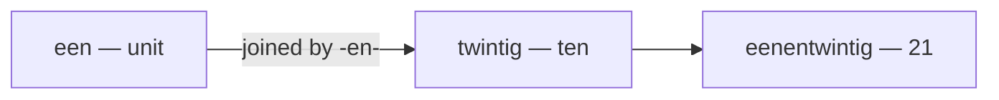

# Numbers (Getallen)

Cardinals count (*één, twee, drie*); ordinals rank (*eerste, tweede, derde*). The one habit to unlearn: in Dutch the **units come before the tens** — *eenentwintig* is literally "one-and-twenty", like the old rhyme "four-and-twenty blackbirds".

## Hoofd- en rangtelwoorden (cardinals & ordinals)

| Cijfer | Hoofdtelwoord | Rangtelwoord |
|---|---|---|
| 0 | nul | nulde |
| 1 | één | eerste |
| 2 | twee | tweede |
| 3 | drie | derde |
| 4 | vier | vierde |
| 5 | vijf | vijfde |
| 6 | zes | zesde |
| 7 | zeven | zevende |
| 8 | acht | achtste |
| 9 | negen | negende |
| 10 | tien | tiende |
| 11 | elf | elfde |
| 12 | twaalf | twaalfde |
| 13 | dertien | dertiende |
| 14 | veertien | veertiende |
| 15 | vijftien | vijftiende |
| 16 | zestien | zestiende |
| 17 | zeventien | zeventiende |
| 18 | achttien | achttiende |
| 19 | negentien | negentiende |
| 20 | twintig | twintigste |
| 21 | eenentwintig | eenentwintigste |
| 22 | tweeëntwintig | tweeëntwintigste |
| 30 | dertig | dertigste |
| 40 | veertig | veertigste |
| 50 | vijftig | vijftigste |
| 60 | zestig | zestigste |
| 70 | zeventig | zeventigste |
| 80 | tachtig | tachtigste |
| 90 | negentig | negentigste |
| 100 | honderd | honderdste |
| 1000 | duizend | duizendste |
| 1.000.000 | miljoen | miljoenste |

> **Watch the tens:** *veertig* (40, not "viertig"), *tachtig* (80, not "achttig"). *Zestig / zeventig* keep the *z-* of *zes / zeven*, and the *g* is the guttural /x/.

## Building bigger numbers

**Units before tens, joined by *-en-*,** written as one word:

- 21 = *eenentwintig*, 45 = *vijfenveertig*, 99 = *negenennegentig*.
- A trema marks a vowel clash: *twee**ë**ntwintig* (22), *drie**ë**nvijftig* (53) — but *vierenveertig* (44) needs none.

**Hundreds and thousands** stack straight on, with no *en* ("and"):

- 250 = *tweehonderdvijftig*, 3410 = *drieduizend vierhonderdtien*.
- English inserts "and" (*a hundred **and** five*); Dutch does not — *honderdvijf*.
- *honderd* and *duizend* stand alone (*honderd euro*, not ~~een honderd~~), but *een miljoen* does take *een*.

> Write numbers as one word up to 1000; above that, spacing is loose and figures are normal. 2024 = *tweeduizend vierentwintig*.

## Ordinals: *-de* or *-ste*

> Add **-de** to 1–19, **-ste** from 20 upward. Learn three irregulars: *eerste* (1st), *derde* (3rd), *achtste* (8th).

- *de **eerste** keer* — the first time
- *de **derde** verdieping* — the third floor
- *op de **eenentwintigste** juni* — on the 21st of June
- In figures: *1e, 2e, 3e … 20ste, 21ste*.

## Breuken & decimalen (fractions & decimals)

| Breuk | Naam |
|---|---|
| ½ | *een half* — noun *de helft* |
| ¼ | *een kwart* |
| ¾ | *driekwart* |
| ⅓ | *een derde* |
| 1½ | *anderhalf* |

Decimals are read with **komma**: *3,5 → drie komma vijf*; *0,75 → nul komma vijfenzeventig* (the decimal comma is covered in [Symbols](/#/grammar?doc=0-elements/00-symbols.md)). Before a noun, *half* inflects: *een **halve** appel*, *anderhalve* week.

## In het echt (in real life)

- [ ] Ik ben **vierentwintig** jaar oud.
- [ ] Dat kost **twaalf euro vijftig**.
- [ ] Het is vandaag **achttien** graden.
- [ ] Wij wonen op nummer **tweeënveertig**.
- [ ] Mijn oma is in **negentienvierentachtig** geboren.
- [ ] We zitten op de **derde** rij.

For clock time and dates, see [Calendar](/#/grammar?doc=0-elements/02-calendar.md).

## Common mistakes

- ❌ *twintig-één* → ✅ *eenentwintig* — the unit comes before the ten, joined by *-en-*.
- ❌ *honderd en vijf* → ✅ *honderdvijf* — Dutch numbers take no "and".
- ❌ *viertig* / *achttig* → ✅ *veertig* (40) / *tachtig* (80) — irregular spellings.
- ❌ *de twintigde* → ✅ *de twintigste* — from 20 up the ordinal ending is *-ste*.
- ❌ *een halve van de klas* → ✅ *de helft van de klas* — *helft* is the noun ("the half"), *halve* the adjective (*een halve dag*).
