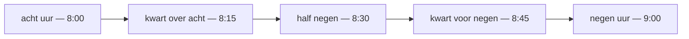

# Time and Calendar

## Time prepositions

| Dutch | English | Example |
|-------|---------|---------|
| `in` | in (month/year/season) | **In** januari sneeuwt het. |
| `op` | on (day/date) | **Op** maandag werk ik thuis. |
| `om` | at (clock time) | De film begint **om** acht uur. |
| `voordat` | before [occur] | Bel me **voordat** je **vertrekt**. |
| `nadat` | after [occur] | **Nadat** we **gegeten hadden**, gingen we wandelen. |
| `zodra` | as soon as [occur] | Bel me **zodra** je **aankomt**. |
| `totdat` | until [occur] | Wacht **totdat** ik **kom**. |
| `toen`  | when [past-period] | **Toen** ik klein **was**, woonde ik hier. |
| `terwijl`  | while [period] | Hij las **terwijl** ik **kookte**. |
| `tijdens` | during [period]| **Tijdens** de vergadering bel ik niet. |
| `sinds` | since [moment] | Ik woon hier **sinds** 2018. |
| `tot` / `totdat` | until [moment]| We blijven **tot** zeven uur. |
| `uiterlijk` | at the latest [deadline] | Kom **uiterlijk** om acht uur. |
| `vanaf` | from (a time on) [occur] | **Vanaf** maandag ben ik vrij. |
| `binnen` | within | Ik kom **binnen** een uur. |
| `over` | in (X from now) | Ik bel je **over** vijf minuten. |
| `geleden` | ago | Ik ben hier drie jaar **geleden** begonnen. |

> *over een uur* = in an hour (future) ↔ *een uur **geleden*** = an hour ago (**geleden** follows the time phrase). *binnen een uur* = any time within the next hour.
>
> **terwijl vs tijdens** (both "during"): **terwijl** is a conjunction + clause (*terwijl ik werk*); **tijdens** is a preposition + noun (*tijdens het werk*). See [Connectors](/#/grammar?doc=1-auxilaries/00-connectors.md).

## Time adverbs — when (no noun)

| Dutch | English | Example |
|-------|---------|---------|
| `nu` | now | Ik heb **nu** geen tijd. |
| `straks` | later today | Ik kom **straks** langs. |
| `zo meteen` / `dadelijk` | in a moment | Ik kom **zo meteen**. |
| `meteen` | immediately | Ik doe het **meteen**. |
| `net` | just now | Hij is **net** weg. |
| `pas` | only just / not until | Ik ben **pas** aangekomen. |
| `nog` | still / yet | Ben je **nog** hier? |
| `binnenkort` | soon | We zien elkaar **binnenkort**. |
| `al` | already | Ik heb **al** gegeten. |
| `tegenwoordig` | nowadays | **Tegenwoordig** werk ik thuis. |

## Day anchors: the *gisteren – vandaag – morgen* line

- [ ] drie dagen geleden
- [ ] eergisteren
- [ ] gisteren
- [ ] vandaag
- [ ] morgen
- [ ] overmorgen
- [ ] over drie dagen

> **morgen** has two meanings: as a standalone word it usually means **tomorrow**; combined into **vanmorgen** / **morgenochtend** it refers to morning. Context decides.

## Parts of the Day

- [ ] In de **ochtend** drink ik koffie.
- [ ] We eten 's **middags** warm.
- [ ] 's **Avonds** kijk ik tv.
- [ ] Ik lag de hele **nacht** wakker.

Combine with **van-** for *this* or anchor words for *that*:

| Today | Yesterday | Tomorrow |
|-------|-----------|----------|
| `vanochtend / vanmorgen` | `gisterochtend` | `morgenochtend` |
| `vanmiddag` | `gistermiddag` | `morgenmiddag` |
| `vanavond` | `gisteravond` | `morgenavond` |
| `vannacht` | `vannacht` (last night) | `morgennacht` (rare) |

## Days of the Week (de dagen van de week)

Lowercase in Dutch.

- [ ] Op **maandag** begint de week.
- [ ] Ik heb **dinsdag** een afspraak.
- [ ] **Woensdag** zijn de kinderen vrij.
- [ ] We sporten elke **donderdag**.
- [ ] **Vrijdag** ga ik vroeg naar huis.
- [ ] Op **zaterdag** doe ik boodschappen.
- [ ] **Zondag** slaap ik uit.

Use **op** before a day for "on Monday":

- ***Op** maandag werk ik thuis.* — On Mondays I work from home.

For weekly habits, you can also drop the preposition: ***Maandags** werk ik thuis.* — On Mondays …

Past/future days:

- *afgelopen maandag* — last Monday
- *aanstaande / komende maandag* — next Monday

## Months

- [ ] In **januari** is het koud.
- [ ] **Februari** is de kortste maand.
- [ ] In **maart** begint de lente.
- [ ] In **april** regent het vaak.
- [ ] Mijn verjaardag is in **mei**.
- [ ] In **juni** worden de dagen lang.
- [ ] We gaan in **juli** op vakantie.
- [ ] **Augustus** is meestal warm.
- [ ] In **september** begint de school weer.
- [ ] In **oktober** vallen de bladeren.
- [ ] **November** is een donkere maand.
- [ ] In **december** vieren we kerst.

Use **in** before a month: *in mei*, *in november*.

## Seasons (de seizoenen)

- [ ] In de **lente** bloeien de bloemen.
- [ ] In de **zomer** gaan we naar het strand.
- [ ] In de **herfst** waait het hard.
- [ ] In de **winter** sneeuwt het soms.

Use **in** before a season: *in de zomer*, *in de winter*.

## Telling Time (Klok Kijken)

Dutch tells time around the whole hour and the **half** hour, plus the two quarters. From about 20 past, you count *toward* the next hour — the source of the half-trap below.

- [ ] acht **uur**
- [ ] vijf **over** acht
- [ ] kwart **over** acht
- [ ] tien **voor half** negen
- [ ] vijf **voor half** negen
- [ ] **half** negen
- [ ] vijf **over half** negen
- [ ] tien **over half** negen
- [ ] kwart **voor** negen
- [ ] vijf **voor** negen

> ⚠️ **Half-trap:** *half negen* = **8:30**, not 9:30. Dutch counts toward the next hour.

For "at X o'clock" use **om**:

- *De vergadering begint **om** half drie.* — The meeting starts at 2:30.
- *Ik sta **om** zeven uur op.* — I get up at 7.

For 24-hour formal time (schedules, news): *14:30 → veertien uur dertig*.

> Note the present tense for ongoing duration: *Ik woon hier **al** vijf jaar* (= I have been living here for five years). English uses the present perfect here; Dutch stays in the present.

## Woordenschat — Vocabulary

- [ ] Ik heb geen **tijd** vandaag.
- [ ] De les duurt een **uur**.
- [ ] Wacht een **minuut**, alsjeblieft.
- [ ] Nog tien **seconden** en we beginnen.
- [ ] De **klok** aan de muur loopt voor.
- [ ] Mijn **horloge** is kapot.
- [ ] 's **ochtends** drink ik koffie.
- [ ] We eten warm in de **middag**.
- [ ] 's **avonds** kijk ik tv.
- [ ] Ik slaap acht uur per **nacht**.
- [ ] **Vandaag** is het zondag.
- [ ] **Morgen** ga ik werken.
- [ ] **Gisteren** regende het.
- [ ] Ik sport drie keer per **week**.
- [ ] In het **weekend** slaap ik uit.
- [ ] Ik sta altijd **vroeg** op.
- [ ] Het is al **laat**, ik ga naar bed.
- [ ] De trein is **op tijd**.

## Uitdrukkingen — Common phrases

- [ ] **Hoe laat is het** nu?
- [ ] **Het is half twee**, tijd voor de lunch.
- [ ] De film begint om **kwart over drie**.
- [ ] Ik ben klaar om **kwart voor vijf**.
- [ ] **Om hoe laat** begint de vergadering?
- [ ] Sorry, **ik heb haast**!
- [ ] Rustig aan, **neem de tijd**.
- [ ] **Tot straks**, tot vanavond!
- [ ] **Het is bijna tijd** om te gaan.
- [ ] **Sorry dat ik te laat ben**, er was file.

How to talk about *when* things happen — clock time, days, parts of the day, weeks, months, and seasons.

- [ ] Wat is de **datum** van vandaag?
- [ ] Volgende **week** ben ik vrij.
- [ ] In welke **maand** ben je jarig?
- [ ] Dit **jaar** ga ik naar Spanje.
- [ ] De feestdagen staan op de **kalender**.

## Common mistakes

- ❌ *half negen* = 9:30 → ✅ *half negen* = **8:30** — Dutch *half* counts toward the next hour.
- ❌ *op acht uur* → ✅ *om acht uur* — clock time takes *om*, not *op*.
- ❌ *tien over half negen* = 8:20 → ✅ = **8:40** — *over half* is already past the half hour.
- ❌ confusing *morgen* (tomorrow) with *'s morgens* (in the morning) — context decides.
- ❌ *ochtends drink ik koffie* → ✅ *'s ochtends…* — the *'s* (from old *des*) is required in *'s ochtends / 's middags / 's avonds*.
- ❌ *De les duurt voor een uur* → ✅ *De les duurt een uur* — drop the English "for".
