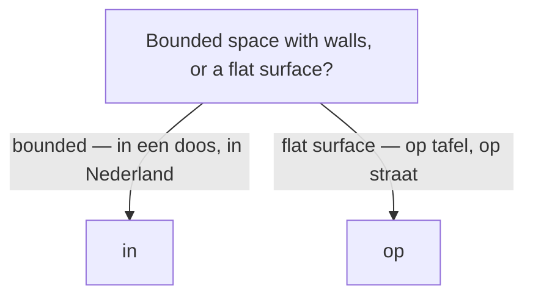

# Place & direction words

## Place prepositions

| Dutch | English | Example |
|-------|---------|---------|
| `in` | in (bounded space) | De boeken zitten **in** de tas. |
| `op` | on (flat surface) | De kop staat **op** tafel. |
| `aan` | on / at (attached, an edge) | Het schilderij hangt **aan** de muur. |
| `bij` | at / near (someone's place) | Ik ben **bij** de bakker. |
| `onder` | under | De kat ligt **onder** de stoel. |
| `boven` | above | De lamp hangt **boven** de tafel. |
| `voor` | in front of | De auto staat **voor** het huis. |
| `achter` | behind | De tuin ligt **achter** het huis. |
| `naast` | next to | Hij zit **naast** mij. |
| `tussen` | between | Het dorp ligt **tussen** twee bossen. |
| `tegenover` | opposite | De bakker is **tegenover** de school. |
| `rond` / `om` | around | We zaten **rond** het vuur. |

> **in vs op.** Something with walls → **in** (*in een doos*, *in Nederland*); a flat surface → **op** (*op tafel*, *op straat*). Learn the fixed *op*-cases: **op school, op het werk, op vakantie, op de fiets**, and islands (**op Texel, op Curaçao**).

## Direction prepositions

| Dutch | English | Example |
|-------|---------|---------|
| `naar` | to (most goals) | Ik ga **naar** Amsterdam. |
| `van` | from | Hij komt **van** kantoor. |
| `uit` | out of / from (origin) | Zij komt **uit** Spanje. |
| `door` | through | We lopen **door** het park. |
| `langs` | past / along | Rij **langs** de kerk. |
| `tot` | up to / until | Loop **tot** het einde. |
| `vanaf` | starting from | **Vanaf** hier is het dichtbij. |
| `richting` | toward(s) | We gaan **richting** centrum. |
| `heen` | to, away | We gaan **heen** centrum. |

> **uit vs van.** Permanent origin ("I'm *from* …") → **uit**: *Ik kom **uit** België.* Coming from a place right now → **van**: *Ik kom net **van** kantoor.*

*Naar huis*, *naar bed*, *naar school*, *naar werk* drop the article (fixed phrases). Some prepositions follow the noun as **postpositions** to show motion toward a goal: *de trap **op*** (up the stairs), *het bos **in*** (into the woods), *de stad **uit*** (out of the city) — compare location *op de trap*. See [Sentence structure](/#/grammar?doc=8-structures/00-sentence.md).

`table:/topic_direction?columns=name_en#Direction`

## Place & direction adverbs — where / which way

| Dutch | English | Example |
|-------|---------|---------|
| `hier` | here | Ik woon **hier**. |
| `daar` | there | **Daar** is de bus. |
| `ergens` | somewhere | Mijn sleutels liggen **ergens**. |
| `overal` | everywhere | Er ligt **overal** sneeuw. |
| `nergens` | nowhere | Ik kan het **nergens** vinden. |
| `buiten` / `binnen` | outside / inside | De kinderen spelen **buiten**. |
| `thuis` | at home | Ik blijf vandaag **thuis**. |
| `beneden` | below / downstairs | Mijn ouders zijn **beneden**. |
| `dichtbij` / `vlakbij` | nearby | De winkel is heel **dichtbij**. |
| `ver weg` | far away | Mijn ouders wonen **ver weg**. |
| `onderweg` | on the way / en route | Ik ben al **onderweg**. |
| `weg` | away / gone | Hij is een week **weg**. |
| `terug` | back | Ik ben zo **terug**. |
| `heen` / `naartoe` | there (to a goal) | Waar ga je **heen**? Ik ga er**heen**. |
| `linksaf` / `rechtsaf` | (turn) left / right | Ga bij de kerk **linksaf**. |
| `rechtdoor` | straight on | Loop **rechtdoor** tot de stoplichten. |

Giving directions chains imperatives, prepositions, and separable verbs:

- ***Loop** rechtdoor en **neem** de tweede straat rechts.*
- ***Ga** bij het stoplicht **linksaf** en **steek** de brug **over**.*
