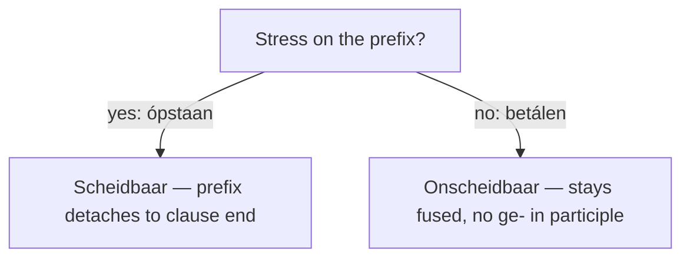

# Morfologie  *(A2)*

Dutch words are built from a **stam** (stem) plus optional **voorvoegsels** (prefixes), **achtervoegsels** (suffixes), and **flexies** (inflectional endings).

Knowing the building blocks lets you decode unfamiliar words and conjugate correctly.

```
  [voorvoegsel]  +  STAM  +  [achtervoegsel]  +  [flexie]
       on-           gelukkig       —              -e        →  ongelukkige
       ver-          koop           —              -t        →  verkoopt
        —            werk           -er            -s        →  werkers
```

## Voorvoegsels (Prefixes)

### Onscheidbare voorvoegsels (inseparable)

These fuse permanently with the stem.

| Prefix | Function | Voorbeeld | English gloss |
|:------:|:---------|:----------|:--------------|
| **be-** | makes verb transitive / "do to" | **be**talen, **be**spreken | *to pay*, *to discuss* |
| **ge-** | collective / past participle marker | **ge**bouw, **ge**werkt | *building*, *worked* |
| **ver-** | change of state, intensify, "away" | **ver**anderen, **ver**dwijnen | *to change*, *to disappear* |
| **ont-** | undo, begin, separate from | **ont**dekken, **ont**waken | *to discover*, *to wake up* |
| **her-** | re-, again | **her**halen, **her**bouwen | *to repeat*, *to rebuild* |
| **er-** | abstract / experiential | **er**varen, **er**kennen | *to experience*, *to recognize* |
| **mis-** | wrongly, badly | **mis**verstaan, **mis**lukken | *to misunderstand*, *to fail* |

> Verbs with these prefixes form their past participle **without** `ge-` (e.g. *betalen → betaald*, not *gebetaald*).

### Scheidbare voorvoegsels (separable)

In a main clause, the prefix **detaches** and moves to the end: *Ik **sta** om zeven uur **op**.*

| Prefix | Direction / sense | Voorbeeld | English gloss |
|:------:|:------------------|:----------|:--------------|
| **aan-** | toward, on | **aan**komen, **aan**doen | *to arrive*, *to put on* |
| **af-** | off, away, down | **af**maken, **af**halen | *to finish*, *to pick up* |
| **bij-** | along, near | **bij**voegen | *to add* |
| **in-** | into | **in**vullen, **in**stappen | *to fill in*, *to board* |
| **op-** | up, open | **op**staan, **op**bellen | *to get up*, *to call* |
| **uit-** | out | **uit**gaan, **uit**leggen | *to go out*, *to explain* |
| **mee-** | along (with) | **mee**gaan, **mee**nemen | *to come along*, *to bring* |
| **na-** | after | **na**denken, **na**kijken | *to ponder*, *to check* |
| **neer-** | down | **neer**leggen, **neer**zetten | *to lay down*, *to put down* |
| **om-** | around, over | **om**draaien, **om**kleden | *to turn around*, *to change clothes* |
| **over-** | over, across (separable here) | **over**stappen, **over**komen | *to transfer*, *to come over* |
| **terug-** | back | **terug**komen, **terug**geven | *to return*, *to give back* |
| **toe-** | toward, increase | **toe**voegen, **toe**nemen | *to add*, *to increase* |
| **voor-** | before, in front | **voor**stellen, **voor**lezen | *to introduce*, *to read aloud* |

> **Trick:** if you can put stress on the prefix in speech (**óp**staan), it's separable. If the stress falls on the stem (be**tá**len), it's inseparable.



### Modificerende voorvoegsels (negation / degree)

| Prefix | Function | Voorbeeld | English gloss |
|:------:|:---------|:----------|:--------------|
| **on-** | negation (like English *un-*) | **on**gelukkig, **on**mogelijk | *unhappy*, *impossible* |
| **wan-** | bad, wrong | **wan**hoop, **wan**orde | *despair*, *disorder* |
| **aarts-** | arch-, extreme | **aarts**lui, **aarts**vijand | *extremely lazy*, *arch-enemy* |
| **oer-** | original, primal | **oer**oud, **oer**woud | *ancient*, *primeval forest* |

## Achtervoegsels (Suffixes)

Suffixes change a word's **part of speech** or its **shade of meaning**.

### Zelfstandig naamwoord-vormend (noun-forming)

| Suffix | From | Meaning | Voorbeeld | English gloss |
|:------:|:-----|:--------|:----------|:--------------|
| **-heid** | adjective | quality, *-ness* | schoon**heid**, vrij**heid** | *beauty*, *freedom* |
| **-ing** | verb | action, result | open**ing**, regel**ing** | *opening*, *arrangement* |
| **-er** | verb | doer / agent | werk**er**, schrijv**er** | *worker*, *writer* |
| **-aar** | verb | doer (after *-l, -n, -r*) | leug**enaar**, hand**elaar** | *liar*, *trader* |
| **-schap** | noun | state, group | vriend**schap**, gezel**schap** | *friendship*, *company* |
| **-dom** | noun / adj. | state, domain | eigen**dom**, rijk**dom** | *property*, *wealth* |
| **-nis** | verb | result, state | ken**nis**, gebeurte**nis** | *knowledge*, *event* |
| **-isme** | noun | system, ideology | social**isme** | *socialism* |
| **-ist** | noun | adherent, profession | piano**ist**, special**ist** | *pianist*, *specialist* |

### Bijvoeglijk naamwoord-vormend (adjective-forming)

| Suffix | From | Meaning | Voorbeeld | English gloss |
|:------:|:-----|:--------|:----------|:--------------|
| **-lijk** | noun / verb | *-ly, -able, -ful* | vriende**lijk**, moge**lijk** | *friendly*, *possible* |
| **-ig** | noun | *having quality of* | zonn**ig**, gelukk**ig** | *sunny*, *happy* |
| **-baar** | verb | *-able* | leef**baar**, eet**baar** | *livable*, *edible* |
| **-loos** | noun | *-less* | hope**loos**, werk**loos** | *hopeless*, *unemployed* |
| **-achtig** | noun | *-like, -ish* | groen**achtig**, kinder**achtig** | *greenish*, *childish* |
| **-isch** | noun | *-ic* (often loanwords) | log**isch**, prakt**isch** | *logical*, *practical* |
| **-s** | noun | belonging to | Nederland**s**, Amsterdam**s** | *Dutch*, *Amsterdam-ish* |

### Werkwoord-vormend (verb-forming)

| Suffix | Function | Voorbeeld | English gloss |
|:------:|:---------|:----------|:--------------|
| **-en** | infinitive marker | werk**en**, lop**en** | *to work*, *to walk* |
| **-eren** | from loanwords / nouns | stud**eren**, telefon**eren** | *to study*, *to call* |

### Bijwoord-vormend (adverb-forming)

| Suffix | Function | Voorbeeld | English gloss |
|:------:|:---------|:----------|:--------------|
| **-s** | turns adj. → adverb | dagelijk**s**, onverwacht**s** | *daily*, *unexpectedly* |
| **-lijks** | recurring time | jaar**lijks**, weke**lijks** | *yearly*, *weekly* |

## Flexies (Inflections)

Inflectional endings attach to the very edge of a word and signal **grammatical role**.

| Use | Endings |
|:------:|:----|
| Naamwoorden — meervoud (noun plurals)| **-en**, **-s**, **-eren** |
| Naamwoorden — Verkleinwoorden (Diminutive)| **-je**, **-etje**, **-tje**, **-pje**, **-kje** |
| Bijvoeglijk naamwoord (adjective inflection)| **bare stem**, **-e** |
| Werkwoord (verb conjugation — present)| **bare stem**, **-t**, **-en**|
| Werkwoord — verleden tijd (past tense)| **-te** / **-ten**, **-de** / **-den**|
| Voltooid deelwoord (past participle) | **-t** / **-d**, **-en**|
| Vergelijking (comparative & superlative) | **-er**, **-st** |

Each inflection has its own home page: [noun plurals](/#/grammar?doc=2-nominatives/62-plurals.md), [diminutives](/#/grammar?doc=2-nominatives/60-diminutives.md), [adjective *-e*](/#/grammar?doc=3-bijworden/34-adjectives.md), [comparatives](/#/grammar?doc=3-bijworden/36-comparatives.md), [verb conjugation](/#/grammar?doc=4-verbs/19-verbs.md) and [participles](/#/grammar?doc=4-verbs/24-participles.md).

## Common mistakes

- ❌ *Ik opbel je* → ✅ *Ik bel je op* — a separable prefix moves to the end of a main clause.
- ❌ *gebetaald*, *geverkocht* → ✅ *betaald*, *verkocht* — verbs with *be-, ge-, ver-, ont-, her-, er-, mis-* take no extra *ge-* in the participle.
- ❌ *telefoneeren* → ✅ *telefoneren* — the verb suffix is *-eren* (one *e*).
- ❌ *hooploos* → ✅ *hopeloos* — the long vowel is written single in the open syllable (*ho-pe-loos*).
- ❌ *ontmogelijk* → ✅ *onmogelijk* — *on-* negates (adjectives); *ont-* is a verb prefix meaning "undo" (*ontdekken*).
