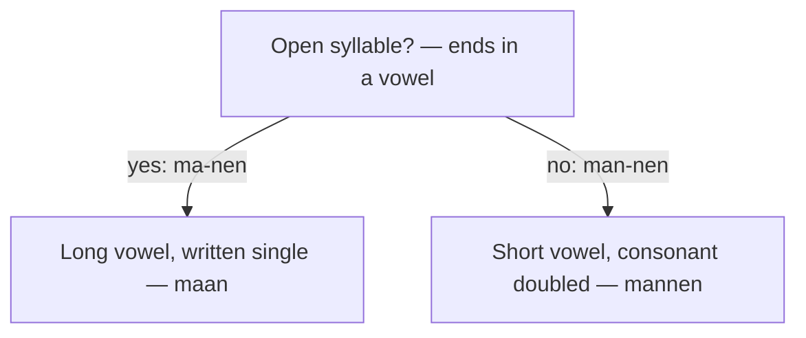

# Spelling - Uitspraak

Dutch spelling maps closely onto sound once you master two things: **short vs long vowels** (decided by the syllable) and a fixed set of **digraphs**. Get those and you can read almost any Dutch word aloud.

## Vowels (klinkers): kort vs lang

Dutch vowels come in **short** and **long** pairs.

The same letter sounds different depending on whether it's followed by one or two consonants (or doubled).

| Letter | Kort (short) | IPA | Lang (long) | IPA | English sample |
|:------:|:-------------|:----|:------------|:----|:---------------|
| **a** | m**a**n | /ɑ/ | m**aa**n | /aː/ | *"cup"* vs *"father"* |
| **e** | b**e**d | /ɛ/ | b**ee**n | /eː/ | *"bed"* vs *"they"* |
| **i** | p**i**t | /ɪ/ | (uses **ie**) b**ie**t | /i/ | *"bit"* vs *"see"* |
| **o** | b**o**s | /ɔ/ | b**oo**t | /oː/ | *"hot"* vs *"boat"* |
| **u** | b**u**s | /ʏ/ | v**uu**r | /y/ | French *"tu"* (short vs long) |

> In a closed syllable (ending in a consonant), a single vowel = short: *mannen* (double *n* keeps the *a* short).
> To make it long, **double the vowel**: *man* → *manen* (one *a*, but the syllable is open).

### Spelling shifts when you add a vowel-ending

Whenever a **vowel-initial ending** attaches — plural *-en*, adjective *-e*, comparative *-er*, a verb ending, a diminutive — the spelling shifts to **keep the vowel sound the same**:

| Shift | Rule | Examples |
|-------|------|----------|
| **Double the consonant** | short vowel + one consonant → double it (keeps the vowel short) | *man → **mannen***, *dik → **dikke*** |
| **Drop one vowel** | long double vowel (*aa, ee, oo, uu*) → single as the syllable opens | *naam → **namen***, *groot → **grote*** |
| **f → v, s → z** | a final *f / s* voices before the vowel | *huis → **huizen***, *lief → **lieve*** |

> The *f→v / s→z* shift keeps the consonant in a few words: *de elf → de elfen*, *de kaars → de kaarsen*. The same three shifts run through [Plurals](/#/grammar?doc=2-nominatives/62-plurals.md), [Adjectives](/#/grammar?doc=3-bijworden/34-adjectives.md), and [Comparatives](/#/grammar?doc=3-bijworden/36-comparatives.md).

## Tweeklanken & digraphs

These letter combinations represent **single sounds** that are not predictable from their parts.

| Combo | IPA | NL voorbeeld | English sample |
|:-----:|:----|:-------------|:---------------|
| **aa** | /aː/ | m**aa**n (moon) | long *"father"* |
| **ee** | /eː/ | z**ee** (sea) | *"they"* |
| **oo** | /oː/ | b**oo**t (boat) | *"boat"* |
| **uu** | /y/ | v**uu**r (fire) | French *"tu"* |
| **ie** | /i/ | d**ie**r (animal) | *"see"* |
| **oe** | /u/ | b**oe**k (book) | *"blue"* |
| **eu** | /ø/ | n**eu**s (nose) | French *"deux"* — no English equivalent |
| **ui** | /œy/ | h**ui**s (house) | unique — no English equivalent |
| **ei** | /ɛi/ | kl**ei**n (small) | *"day"* (the *"ay"* part) |
| **ij** | /ɛi/ | w**ij**n (wine) | same as **ei** — pronunciation identical |
| **au** | /ɔu/ | bl**au**w (blue) | *"how"* |
| **ou** | /ɔu/ | k**ou**d (cold) | same as **au** |
| **sch** | /sx/ | **sch**ool (school) | *s* + guttural *ch* |
| **ng** | /ŋ/ | di**ng** (thing) | *"king"* (the *ng* part) |
| **nj** | /ɲ/ | ora**nj**e (orange) | Spanish *"ñ"* |

- **oe** = /u/ as in *"blue"* (e.g. *boek* = book, *moeder* = mother)
- **ui** = unique Dutch diphthong /œy/, no direct English equivalent (e.g. *huis* = house)
- **ei / ij** = both /ɛi/, identical pronunciation (e.g. *klein* = small, *wijn* = wine). The only difference is spelling — *ij* is native Dutch, *ei* often comes from older Germanic roots. Dutch children learn to ask "lange ij of korte ei?" when writing — *ij* is the "lange ij", *ei* the "korte ei".

## Consonants

| Letter | NL voorbeeld | IPA (klank) | English sample |
|:------:|:-------------|:------------|:---------------|
| **B b** | **b**oek | /b/ | *"book"* |
| **C c** | **c**ent, **c**afé | /s/, /k/ | *"cent"* / *"café"* (loanwords only) |
| **D d** | **d**ag, hon**d** | /d/ → /t/ word-final | *"day"*; final-d sounds like *"hot"* |
| **F f** | **f**iets | /f/ | *"fish"* |
| **G g** | **g**oed | /ɣ/ or /x/ | guttural — Scottish *"loch"* |
| **H h** | **h**uis | /ɦ/ | *"house"* (slightly softer) |
| **J j** | **j**a | /j/ | *"yes"* |
| **K k** | **k**at | /k/ | *"cat"* (no aspiration) |
| **L l** | **l**amp | /l/ | *"lamp"* |
| **M m** | **m**an | /m/ | *"man"* |
| **N n** | **n**ee | /n/ | *"no"* |
| **P p** | **p**aard | /p/ | *"park"* (no aspiration) |
| **Q q** | **q**uiz | /k/ | rare — only in loanwords |
| **R r** | **r**ood | /r/, /ɾ/ or /ʀ/ | trilled, tapped, or guttural (regional) |
| **S s** | **s**chool | /s/ | *"school"* |
| **T t** | **t**afel | /t/ | *"table"* (no aspiration) |
| **V v** | **v**is | /v/ (often /f/) | between English *"v"* and *"f"* |
| **W w** | **w**ater | /ʋ/ | softer than English *"w"*, lips less rounded |
| **X x** | ta**x**i | /ks/ | *"taxi"* |
| **Y y** | bab**y**, **y**oghurt | /i/, /j/ | rare — only in loanwords |
| **Z z** | **z**ee | /z/ | *"zoo"* |

## Uitspraak Tips

- **g** / **ch** = guttural /ɣ/ or /x/, harder than English *h* (softer in the south, harsher in the north)
- **w** = /ʋ/, lips less rounded than English *w* — closer to a soft *v*
- **r** = varies by region: rolled tip-of-tongue, tapped, or French-style guttural — all are correct
- **p, t, k** are **unaspirated** — no puff of air like in English *"pat", "top", "kite"*. They sound closer to the *p* in English *"spin"*.
- Words ending in **-d** are pronounced **-t** (e.g. *hond* sounds like *"hont"*) — final consonants always devoice
- Words ending in **-en** often drop the *n* in casual speech (e.g. *lopen* sounds like *"lope"*)

## Common mistakes

- ❌ *manen* for the plural of *man* → ✅ *mannen* — double the consonant to keep the vowel short in a closed syllable.
- ❌ *hont* → ✅ *hond* — it sounds like /t/ (final devoicing) but is spelled *-d*; check the plural *honden*.
- ❌ pronouncing *wijn* and *wein* differently → they are both /ɛi/; only the spelling differs, and each word takes a fixed *ij* or *ei*.
- ❌ English *w* in *water* → ✅ Dutch *w* is /ʋ/, a soft *v* with the lips relaxed.
- ❌ hard English *g* in *goed* → ✅ the guttural /ɣ/~/x/, the "loch" sound.
- ❌ puffing *p, t, k* as in English *"top"* → ✅ unaspirated, like the *p* in *"spin"*.
