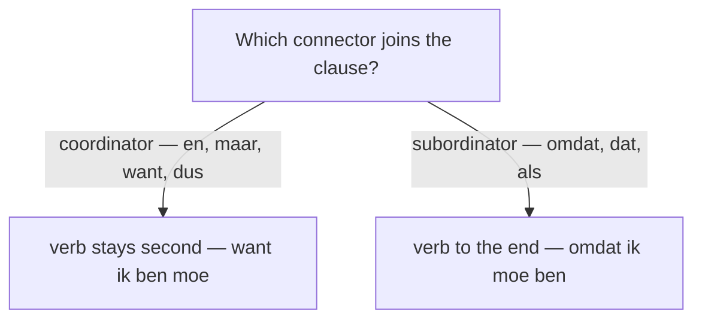

# Connectors  *(A2)*

Connectors join ideas. The one thing that matters most: **coordinators** keep normal word order (verb second), while **subordinators** send the conjugated verb to the **end** of their clause. Get that split right and the rest follows. For the full word-order mechanics, see [Coordinating](/#/grammar?doc=6-structures/02-coordinating.md) and [Subordinating](/#/grammar?doc=6-structures/03-subordinating.md).

## Coordinating conjunctions

They link two clauses of **equal** rank; word order stays normal (verb in second position). There are just five — memorize them as a set.

| Dutch | English | Example |
|-------|---------|---------|
| **en** | and | Ik werk **en** ik studeer. |
| **maar** | but | Ik wil komen, **maar** ik heb geen tijd. |
| **of** | or | Wil je koffie **of** thee? |
| **want** | for / because | Ik blijf thuis, **want** ik **ben** moe. |
| **dus** | so / therefore | Het regent, **dus** ik neem een paraplu. |

> After a coordinator the verb still comes **second**: *…, want ik **ben** moe* — never ~~*…want ik moe ben*~~.

## Subordinating conjunctions

They introduce a **dependent** clause, and the conjugated verb moves to the **end**.

| Dutch | English | Example |
|-------|---------|---------|
| **omdat** | because | Ik blijf thuis **omdat** ik ziek **ben**. |
| **dat** | that | Hij zegt **dat** hij morgen **komt**. |
| **als** | if / when | **Als** het regent, blijf ik thuis. |
| **toen** | when (past) | **Toen** ik klein **was**, woonde ik hier. |
| **terwijl** | while | Hij las **terwijl** ik **kookte**. |
| **of** | whether | Ik weet niet **of** hij **komt**. |
| **hoewel** | although | **Hoewel** het regende, gingen we toch. |
| **voordat** | before | Bel me **voordat** je **vertrekt**. |
| **nadat** | after | **Nadat** we **gegeten hadden**, gingen we wandelen. |
| **zodat** | so that | Spreek harder **zodat** ik je **versta**. |
| **tenzij** | unless | Ik kom **tenzij** het **regent**. |
| **zodra** | as soon as | Bel me **zodra** je **aankomt**. |
| **totdat** | until | Wacht **totdat** ik **kom**. |

> **indien** is a formal, written variant of **als** ("if"): *Neem contact op **indien** nodig.* In everyday speech use **als**.

## want vs omdat — the trap

Both mean "because", but they belong to opposite families and take opposite word order.

| Form | Family | Word order | Example |
|------|--------|------------|---------|
| **want** | coordinator | verb second | Ik blijf thuis, **want** ik **ben** moe. |
| **omdat** | subordinator | verb last | Ik blijf thuis **omdat** ik moe **ben**. |

> Use **want** to add a justification to a finished thought; use **omdat** to tie the cause in tightly. The same split hits **of**: *of* = "or" (coordinator) vs *of* = "whether" (subordinator).
>
> For a cause expressed as a **noun** rather than a clause, use the preposition **vanwege** + noun: *De trein reed niet **vanwege** het weer.* (compare *omdat het sneeuwde* + clause).

## Correlative pairs

A few connectors come in **two parts** that frame the sentence together.

| Dutch | English | Example |
|-------|---------|---------|
| **niet alleen … maar ook** | not only … but also | Hij spreekt **niet alleen** Nederlands, **maar ook** Duits. |
| **zo … dat** | so … that (result) | Het was **zo** koud **dat** ik bibberde. |

> **zo … dat** (result) is not **zodat** (purpose): *Het was **zo** koud **dat** ik bibberde* (result) vs *Spreek harder **zodat** ik je versta* (purpose).

## Linking adverbs

These connect sentences but are **adverbs**: put one in front and the verb still comes **second** (V2 inversion — the subject jumps behind the verb).

| Dutch | English | Example |
|-------|---------|---------|
| **daarom** | that's why | Hij was moe; **daarom ging hij** slapen. |
| **daarnaast** | besides | **Daarnaast is** er nog een probleem. |
| **bovendien** | moreover | Het is duur; **bovendien is** het ver. |
| **echter** | however | Hij kwam **echter** te laat. |
| **toch** | still / anyway | Het regende; **toch gingen we** wandelen. |
| **anders** | otherwise | Schiet op, **anders missen we** de trein. |

> Watch the inversion: *Daarom **ging hij**…*, not ~~*Daarom hij ging*~~.

## Sequencing

Order the steps of a story or explanation.

| Dutch | English | Example |
|-------|---------|---------|
| **eerst** | first | **Eerst** drink ik koffie, **dan** ga ik werken. |
| **dan** | then (present/future) | Eerst dit, **dan** dat. |
| **daarna** | after that | We eten; **daarna kijken we** een film. |
| **vervolgens** | next | **Vervolgens namen we** de fiets. |
| **toen** | then (past) | **Toen** was ik nog jong. |
| **eindelijk** | finally / at last | **Eindelijk** is de zomer er! |
| **ten slotte** / **uiteindelijk** | finally / lastly | **Uiteindelijk kwam** de trein aan. |

> **toen vs dan** (both "then"): use **toen** only for **past** events, **dan** for present/future and for sequencing.
>
> **eindelijk vs uiteindelijk**: *eindelijk* = "at last" (relief after a wait); *uiteindelijk* = "eventually / in the end" (the final outcome).

## Discourse markers

Small words that organize speech and keep a conversation flowing. Several overlap with the [Toners](/#/grammar?doc=1-auxilaries/16-toners.md).

| Dutch | English | Example |
|-------|---------|---------|
| **trouwens** | by the way | **Trouwens**, hoe gaat het? |
| **bijvoorbeeld** | for example | Ik hou van fruit, **bijvoorbeeld** appels. |
| **namelijk** | you see / namely | Ik kom niet; ik ben **namelijk** ziek. |
| **eigenlijk** | actually | Ik weet het **eigenlijk** niet. |
| **kortom** | in short | **Kortom**, het was een leuke dag. |
| **hoe dan ook** / **sowieso** | anyway / in any case | **Hoe dan ook**, ik kom morgen. |
| **weet je** | you know | **Weet je**, dat is echt waar. |
| **zeg maar** | so to speak | Het is, **zeg maar**, een mix. |

## Common mistakes

- ❌ *…want ik moe **ben*** → ✅ *…want ik **ben** moe* — *want* is a coordinator; keep the verb second.
- ❌ *…omdat ik **ben** moe* → ✅ *…omdat ik moe **ben*** — *omdat* sends the verb to the end.
- ❌ *Daarom **hij ging** slapen* → ✅ *Daarom **ging hij** slapen* — a front linking-adverb triggers V2 inversion.
- ❌ *Wil je thee of koffie?* vs *Ik weet niet of hij komt* mixed up → *of* = "or" (coordinator) vs "whether" (subordinator).
- ❌ *Toen ga ik naar huis* (present) → ✅ *Dan ga ik naar huis* — *toen* is past-only; use *dan* for present/future.
