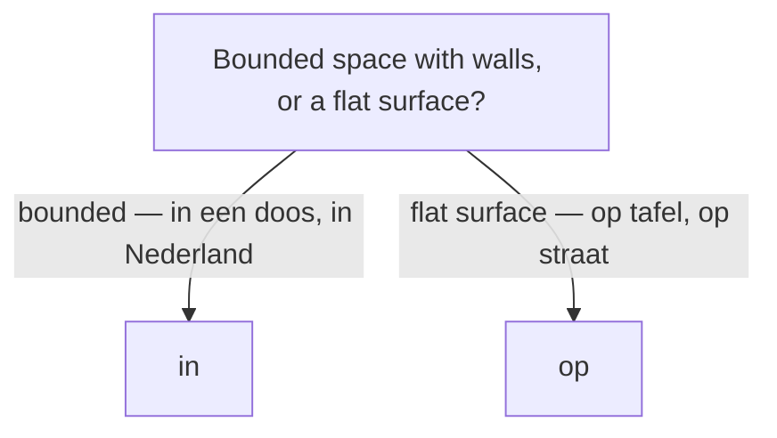

# Place & direction words

## Place prepositions

| Dutch | English | Example |
|-------|---------|---------|
| `note:in` | in (bounded space) | De boeken zitten **in** de tas. |
| `note:op` | on (flat surface) | De kop staat **op** tafel. |
| `note:aan` | on / at (attached, an edge) | Het schilderij hangt **aan** de muur. |
| `note:bij` | at / near (someone's place) | Ik ben **bij** de bakker. |
| `note:onder` | under | De kat ligt **onder** de stoel. |
| `note:boven` | above | De lamp hangt **boven** de tafel. |
| `note:voor` | in front of | De auto staat **voor** het huis. |
| `note:achter` | behind | De tuin ligt **achter** het huis. |
| `note:naast` | next to | Hij zit **naast** mij. |
| `note:tussen` | between | Het dorp ligt **tussen** twee bossen. |
| `note:tegenover` | opposite | De bakker is **tegenover** de school. |
| `note:rond` / `note:om` | around | We zaten **rond** het vuur. |

## Direction prepositions

| Dutch | English | Example |
|-------|---------|---------|
| `note:naar` | to (most goals) | Ik ga **naar** Amsterdam. |
| `note:van` | from | Hij komt **van** kantoor. |
| `note:uit` | out of / from (origin) | Zij komt **uit** Spanje. |
| `note:door` | through | We lopen **door** het park. |
| `note:langs` | past / along | Rij **langs** de kerk. |
| `note:tot` | up to / until | Loop **tot** het einde. |
| `note:vanaf` | starting from | **Vanaf** hier is het dichtbij. |
| `note:richting` | toward(s) | We gaan **richting** centrum. |
| `note:heen` | to, away | We gaan **heen** centrum. |

*Naar huis*, *naar bed*, *naar school*, *naar werk* drop the article (fixed phrases). Some prepositions follow the noun as **postpositions** to show motion toward a goal: *de trap **op*** (up the stairs), *het bos **in*** (into the woods), *de stad **uit*** (out of the city) — compare location *op de trap*. See [Sentence structure](/#/grammar?doc=8-structures/00-sentence.md).

`table:/topic_direction?columns=name_en#Direction`

## Place & direction adverbs — where / which way

| Dutch | English | Example |
|-------|---------|---------|
| `note:hier` | here | Ik woon **hier**. |
| `note:daar` | there | **Daar** is de bus. |
| `note:ergens` | somewhere | Mijn sleutels liggen **ergens**. |
| `note:overal` | everywhere | Er ligt **overal** sneeuw. |
| `note:nergens` | nowhere | Ik kan het **nergens** vinden. |
| `note:buiten` / `note:binnen` | outside / inside | De kinderen spelen **buiten**. |
| `note:thuis` | at home | Ik blijf vandaag **thuis**. |
| `note:beneden` | below / downstairs | Mijn ouders zijn **beneden**. |
| `note:dichtbij` / `note:vlakbij` | nearby | De winkel is heel **dichtbij**. |
| `note:ver-weg` | far away | Mijn ouders wonen **ver weg**. |
| `note:onderweg` | on the way / en route | Ik ben al **onderweg**. |
| `note:weg` | away / gone | Hij is een week **weg**. |
| `note:terug` | back | Ik ben zo **terug**. |
| `note:heen` / `note:naartoe` | there (to a goal) | Waar ga je **heen**? Ik ga er**heen**. |
| `note:linksaf` / `note:rechtsaf` | (turn) left / right | Ga bij de kerk **linksaf**. |
| `note:rechtdoor` | straight on | Loop **rechtdoor** tot de stoplichten. |

Giving directions chains imperatives, prepositions, and separable verbs:

- ***Loop** rechtdoor en **neem** de tweede straat rechts.*
- ***Ga** bij het stoplicht **linksaf** en **steek** de brug **over**.*
