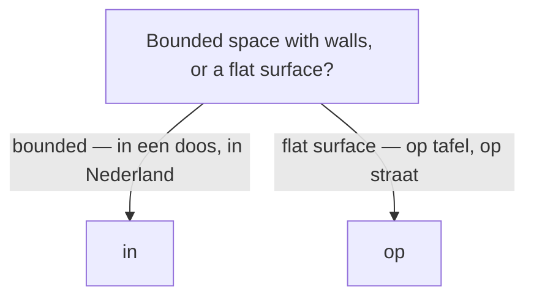

# Prepositions & place/time words  *(A2)*

Prepositions are used to:

- bind **means**, **accompaniment**, and **reference**.
- locate things in **space** , **time**,
- Many verbs also take a **verb-fixed** preposition (*denken **aan***, *wachten **op***).

## Logical Relations — means & reference

Beyond space and time, a handful of prepositions cover **means**, **accompaniment**, and **reference**.

| Dutch | English | Example |
|-------|---------|---------|
| **met** | with [component] | Ik ga **met** de trein. |
| **zonder** | without [component] | Koffie **zonder** suiker. |
| **per** | by / per [unit-of-measure]| Ik kom **per** trein. |
| **over** | about [reference] | Een boek **over** geschiedenis. |
| **tegen** | against / to [opposite] | Hij praat **tegen** zijn baas. |
| **volgens** | according to [authority]| **Volgens** mij heb je gelijk. |
| **dankzij** | thanks to [helper] | **Dankzij** jou is het gelukt. |
| **ondanks** | despite [obstackle]| **Ondanks** de regen was het leuk. |

> **over** here = "about" (*een boek over geschiedenis*), a different sense from the time *over* ("in X from now", *over vijf minuten*). **ondanks** takes a **noun** (*ondanks de regen*); for a full clause use **hoewel** (*hoewel het regende*) — see [Connectors](/#/grammar?doc=1-auxilaries/00-connectors.md).

## Place — where

| Dutch | English | Example |
|-------|---------|---------|
| **in** | in (bounded space) | De boeken zitten **in** de tas. |
| **op** | on (flat surface) | De kop staat **op** tafel. |
| **aan** | on / at (attached, an edge) | Het schilderij hangt **aan** de muur. |
| **bij** | at / near (someone's place) | Ik ben **bij** de bakker. |
| **onder** | under | De kat ligt **onder** de stoel. |
| **boven** | above | De lamp hangt **boven** de tafel. |
| **voor** | in front of | De auto staat **voor** het huis. |
| **achter** | behind | De tuin ligt **achter** het huis. |
| **naast** | next to | Hij zit **naast** mij. |
| **tussen** | between | Het dorp ligt **tussen** twee bossen. |
| **tegenover** | opposite | De bakker is **tegenover** de school. |
| **rond** / **om** | around | We zaten **rond** het vuur. |

> **in vs op.** Something with walls → **in** (*in een doos*, *in Nederland*); a flat surface → **op** (*op tafel*, *op straat*). Learn the fixed *op*-cases: **op school, op het werk, op vakantie, op de fiets**, and islands (**op Texel, op Curaçao**).

## Direction — motion

| Dutch | English | Example |
|-------|---------|---------|
| **naar** | to (most goals) | Ik ga **naar** Amsterdam. |
| **van** | from | Hij komt **van** kantoor. |
| **uit** | out of / from (origin) | Zij komt **uit** Spanje. |
| **door** | through | We lopen **door** het park. |
| **langs** | past / along | Rij **langs** de kerk. |
| **tot** | up to / until | Loop **tot** het einde. |
| **vanaf** | starting from | **Vanaf** hier is het dichtbij. |
| **richting** | toward(s) | We gaan **richting** centrum. |

> **uit vs van.** Permanent origin ("I'm *from* …") → **uit**: *Ik kom **uit** België.* Coming from a place right now → **van**: *Ik kom net **van** kantoor.*

*Naar huis*, *naar bed*, *naar school*, *naar werk* drop the article (fixed phrases). Some prepositions follow the noun as **postpositions** to show motion toward a goal: *de trap **op*** (up the stairs), *het bos **in*** (into the woods), *de stad **uit*** (out of the city) — compare location *op de trap*. See [Sentence structure](/#/grammar?doc=6-structures/00-sentence.md).

## Time — when

| Dutch | English | Example |
|-------|---------|---------|
| **in** | in (month/year/season) | **In** januari sneeuwt het. |
| **op** | on (day/date) | **Op** maandag werk ik thuis. |
| **om** | at (clock time) | De film begint **om** acht uur. |
| **voordat** | before [occur] | Bel me **voordat** je **vertrekt**. |
| **nadat** | after [occur] | **Nadat** we **gegeten hadden**, gingen we wandelen. |
| **zodra** | as soon as [occur] | Bel me **zodra** je **aankomt**. |
| **totdat** | until [occur] | Wacht **totdat** ik **kom**. |
| **toen**  | when [past-period] | **Toen** ik klein **was**, woonde ik hier. |
| **terwijl**  | while [period] | Hij las **terwijl** ik **kookte**. |
| **tijdens** | during [period]| **Tijdens** de vergadering bel ik niet. |
| **sinds** | since [moment] | Ik woon hier **sinds** 2018. |
| **tot** / **totdat** | until [moment]| We blijven **tot** zeven uur. |
| **vanaf** | from (a time on) [occur] | **Vanaf** maandag ben ik vrij. |
| **binnen** | within | Ik kom **binnen** een uur. |
| **over** | in (X from now) | Ik bel je **over** vijf minuten. |
| **geleden** | ago | Ik ben hier drie jaar **geleden** begonnen. |

> *over een uur* = in an hour (future) ↔ *een uur **geleden*** = an hour ago (**geleden** follows the time phrase). *binnen een uur* = any time within the next hour.
>
> **terwijl vs tijdens** (both "during"): **terwijl** is a conjunction + clause (*terwijl ik werk*); **tijdens** is a preposition + noun (*tijdens het werk*). See [Connectors](/#/grammar?doc=1-auxilaries/00-connectors.md).

## Time adverbs — when (no noun)

| Dutch | English | Example |
|-------|---------|---------|
| **nu** | now | Ik heb **nu** geen tijd. |
| **straks** | later today | Ik kom **straks** langs. |
| **zo meteen** / **dadelijk** | in a moment | Ik kom **zo meteen**. |
| **meteen** | immediately | Ik doe het **meteen**. |
| **net** | just now | Hij is **net** weg. |
| **al** | already | Ik heb **al** gegeten. |
| **nog** | still / yet | Ben je **nog** hier? |
| **pas** | only just / not until | Ik ben **pas** aangekomen. |
| **binnenkort** | soon | We zien elkaar **binnenkort**. |
| **tegenwoordig** | nowadays | **Tegenwoordig** werk ik thuis. |

## Place & direction adverbs — where / which way

| Dutch | English | Example |
|-------|---------|---------|
| **hier** | here | Ik woon **hier**. |
| **daar** | there | **Daar** is de bus. |
| **ergens** | somewhere | Mijn sleutels liggen **ergens**. |
| **overal** | everywhere | Er ligt **overal** sneeuw. |
| **nergens** | nowhere | Ik kan het **nergens** vinden. |
| **buiten** / **binnen** | outside / inside | De kinderen spelen **buiten**. |
| **thuis** | at home | Ik blijf vandaag **thuis**. |
| **beneden** | below / downstairs | Mijn ouders zijn **beneden**. |
| **dichtbij** / **vlakbij** | nearby | De winkel is heel **dichtbij**. |
| **ver weg** | far away | Mijn ouders wonen **ver weg**. |
| **onderweg** | on the way / en route | Ik ben al **onderweg**. |
| **weg** | away / gone | Hij is een week **weg**. |
| **terug** | back | Ik ben zo **terug**. |
| **heen** / **naartoe** | there (to a goal) | Waar ga je **heen**? Ik ga er**heen**. |
| **linksaf** / **rechtsaf** | (turn) left / right | Ga bij de kerk **linksaf**. |
| **rechtdoor** | straight on | Loop **rechtdoor** tot de stoplichten. |

Giving directions chains imperatives, prepositions, and separable verbs:

- ***Loop** rechtdoor en **neem** de tweede straat rechts.*
- ***Ga** bij het stoplicht **linksaf** en **steek** de brug **over**.*

## Common mistakes

- ❌ *op de tas* (a bag has walls) → ✅ *in de tas* — bounded space takes *in*.
- ❌ *in de fiets* → ✅ *op de fiets* — a fixed *op*-expression.
- ❌ *Ik kom van Spanje* (origin) → ✅ *Ik kom **uit** Spanje* — permanent origin is *uit*.
- ❌ *Ik bel je in vijf minuten* → ✅ *Ik bel je **over** vijf minuten* — "in X from now" is *over*.
- ❌ *over drie jaar* meaning "ago" → ✅ *drie jaar **geleden*** — "ago" is *geleden*, after the time phrase.
- ❌ *tijdens ik werk* → ✅ *terwijl ik werk* (+ clause) / *tijdens het werk* (+ noun).
- ❌ *Waar ga je?* → ✅ *Waar ga je **heen/naartoe**?* — direction needs *heen/naartoe*.
