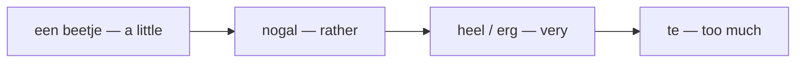

# Modifiers & Intensifiers  *(A2)*

Modifiers scale or qualify another word — **how strong**, **how often**, **how exact**. A degree word goes **directly before** the adjective or adverb it scales: *heel mooi*, *te duur*, *nogal druk*.

## Degree — how strong

| Dutch | English | Example |
|-------|---------|---------|
| **heel** | very | Het is **heel** mooi. |
| **erg** | very | Het is **erg** mooi. |
| **zeer** | very (formal/written) | Wij zijn **zeer** tevreden. |
| **zo** | so (this much) | Deze tas is **zo** zwaar! |
| **te** | too (excessive) | Dat is **te** duur. |
| **veel te** | far too | Het is **veel te** duur. |
| **helemaal** | completely | Ik ben het **helemaal** vergeten. |
| **bijna** | almost | Ik ben **bijna** klaar. |
| **behoorlijk** | considerably | Het is **behoorlijk** koud. |
| **vooral** | especially / above all | Het is **vooral** 's ochtends druk. |
| **alleen** | only / just | Ik drink **alleen** water. |

**Softeners** (downtoners) turn the volume *down*:

| Dutch | English | Example |
|-------|---------|---------|
| **een beetje** | a little | Ik ben **een beetje** moe. |
| **wat** | a bit | Ik ben **wat** moe. |
| **nogal** | rather | Het is **nogal** druk in de stad. |
| **best** | quite / pretty | De film was **best** goed. |
| **tamelijk** | fairly | Dat is **tamelijk** duur. |
| **redelijk** | reasonably | Het was **redelijk** druk. |
| **vrij** | fairly / rather | Dat is **vrij** goed. |

> **wat vs nog wat**: *wat* = "a bit" (*Ik ben **wat** moe*); **nog wat** = "a bit more / some more" (*Wil je **nog wat** koffie?* — Would you like some more coffee?).
>
> *alleen* also works as an adjective meaning **alone**: *Ik woon **alleen***.
>
> **heel = erg = zeer = "very".** *heel* and *erg* are everyday and interchangeable; *zeer* is formal/written. None of them inflect: *erg mooi*, never ~~*erge mooi*~~.
>
> **te ≠ very.** *te* means "too" (excessive): *te duur* = *too* expensive, not *very* expensive.

Degree words form an intensity ladder:

A rough scale of quantity: *niets → bijna niets → **weinig** → genoeg → veel → heel veel → te veel → veel te veel*.

## Equality — as … as

> Use **als** (not *dan*!) for equality. *dan* is only for **in**equality — see [Comparatives](/#/grammar?doc=3-bijworden/36-comparatives.md).

| Pattern | English | Example |
|---------|---------|---------|
| **zo … als** | as … as | Hij is **zo** groot **als** ik. |
| **even … als** | (just) as … as | Zij loopt **even** snel **als** hij. |
| **net zo … als** | just as … as | Dit is **net zo** duur **als** dat. |
| **zoals** | like / such as | Talen **zoals** Nederlands en Duits. |
| **als** | as (in the role of) | Hij werkt **als** docent. |

## Frequency — how often

| Dutch | English | Example |
|-------|---------|---------|
| **altijd** | always | Ik drink **altijd** koffie 's ochtends. |
| **meestal** | usually | Ik werk **meestal** thuis. |
| **vaak** / **dikwijls** | often | Ik ga **vaak** naar de markt. |
| **regelmatig** | regularly | Ik sport **regelmatig**. |
| **telkens** | every time | Hij komt **telkens** te laat. |
| **elke dag** / **elke keer** | every day / time | Ik drink **elke dag** thee. |
| **soms** | sometimes | **Soms** regent het. |
| **af en toe** | now and then | Ik drink **af en toe** wijn. |
| **weleens** | ever / occasionally | Ben je **weleens** in Parijs geweest? |
| **zelden** | rarely | Hij komt **zelden** op tijd. |
| **bijna nooit** | almost never | Hij belt **bijna nooit**. |
| **nooit** | never | Ik ben **nooit** in Parijs geweest. |
| **alweer** | again (already) | Ben je **alweer** te laat? |
| **nog eens** / **nogmaals** | once more | Doe het **nog eens**. |

## Approximation — roughly

| Dutch | English | Example |
|-------|---------|---------|
| **precies** | exactly | Dat is **precies** wat ik bedoel. |
| **ongeveer** | approximately | Het duurt **ongeveer** een uur. |
| **circa** / **ca.** | approx. (formal) | De reis kost **circa** 200 euro. |
| **rond** | around (time/number) | Ik kom **rond** acht uur. |
| **zo'n** | about (informal) | Er waren **zo'n** twintig mensen. |
| **een stuk of** | about (countable) | Geef me **een stuk of** vijf. |
| **ruim** | a little over | Het duurde **ruim** een uur. |
| **krap** | just under | We hebben **krap** een week. |

## Common mistakes

- ❌ *Het is **te** mooi* (meaning "very") → ✅ *Het is **heel/erg** mooi* — *te* = "too" (excessive), not "very".
- ❌ *Hij is groter **als** ik* → ✅ *groter **dan** ik* — *dan* for inequality; *als* only for equality (*even groot **als** ik*).
- ❌ *Zij loopt even snel **dan** hij* → ✅ *even snel **als** hij*.
- ❌ *een **erge** mooie dag* → ✅ *een **heel/erg** mooie dag* — degree adverbs don't inflect.
- ❌ *Er waren **zo** twintig mensen* → ✅ *Er waren **zo'n** twintig mensen* — approximate "about" is *zo'n*.
