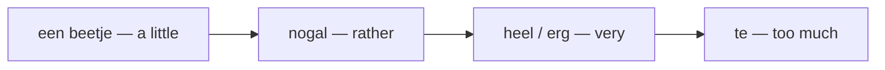

# Modifiers

Modifiers scale or qualify another word — **how strong**, **how often**, **how exact**.

## Degree and Intensifiers

A degree word goes **directly before** the adjective or adverb it scales: *heel mooi*, *te duur*, *nogal druk*.

| Dutch | English | Example |
|-------|---------|---------|
| `note:heel` | very | Het is **heel** mooi. |
| `note:erg` | very | Het is **erg** mooi. |
| `note:zeer` | very (formal/written) | Wij zijn **zeer** tevreden. |
| `note:zo` | so (this much) | Deze tas is **zo** zwaar! |
| `note:te` | too (excessive) | Dat is **te** duur. |
| `note:veel-te` | far too | Het is **veel te** duur. |
| `note:helemaal` | completely | Ik ben het **helemaal** vergeten. |
| `note:bijna` | almost | Ik ben **bijna** klaar. |
| `note:behoorlijk` | considerably | Het is **behoorlijk** koud. |
| `note:vooral` | especially / above all | Het is **vooral** 's ochtends druk. |
| `note:alleen` | only / just | Ik drink **alleen** water. |
| `note:een-beetje` | a little | Ik ben **een beetje** moe. |
| `note:wat` | a bit | Ik ben **wat** moe. |
| `note:nog-wat` | a bit more / some more | Wil je **nog wat** koffie? |
| `note:nogal` | rather | Het is **nogal** druk in de stad. |
| `note:best` | quite / pretty | De film was **best** goed. |
| `note:tamelijk` | fairly | Dat is **tamelijk** duur. |
| `note:redelijk` | reasonably | Het was **redelijk** druk. |
| `note:vrij` | fairly / rather | Dat is **vrij** goed. |

---

Degree words form an intensity ladder:

```mermaid
flowchart LR
  A["een beetje — a little"] --> B["nogal — rather"] --> C["heel / erg — very"] --> D["te — too much"]
```

A rough scale of quantity: *niets → bijna niets → **weinig** → genoeg → veel → heel veel → te veel → veel te veel*.

## Frequency — how often

| Dutch | English | Example |
|-------|---------|---------|
| `note:altijd` | always | Ik drink **altijd** koffie 's ochtends. |
| `note:meestal` | usually | Ik werk **meestal** thuis. |
| `note:vaak` / `note:dikwijls` | often | Ik ga **vaak** naar de markt. |
| `note:regelmatig` | regularly | Ik sport **regelmatig**. |
| `note:telkens` | every time | Hij komt **telkens** te laat. |
| `note:elke-dag` / `note:elke-keer` | every day / time | Ik drink **elke dag** thee. |
| `note:soms` | sometimes | **Soms** regent het. |
| `note:af-en-toe` | now and then | Ik drink **af en toe** wijn. |
| `note:alweer` | again (already) | Ben je **alweer** te laat? |
| `note:nog-eens` / `note:nogmaals` | once more | Doe het **nog eens**. |
| `note:weleens` | ever / occasionally | Ben je **weleens** in Parijs geweest? |
| `note:zelden` | rarely | Hij komt **zelden** op tijd. |
| `note:bijna-nooit` | almost never | Hij belt **bijna nooit**. |
| `note:niet-eens` | not even | Hij heeft het **niet eens** geprobeerd. |
| `note:nooit` | never | Ik ben **nooit** in Parijs geweest. |

## Approximation — roughly

| Dutch | English | Example |
|-------|---------|---------|
| `note:precies` | exactly | Dat is **precies** wat ik bedoel. |
| `note:ongeveer` | approximately | Het duurt **ongeveer** een uur. |
| `note:circa` / `note:ca` | approx. (formal) | De reis kost **circa** 200 euro. |
| `note:rond` | around (time/number) | Ik kom **rond** acht uur. |
| `note:zo'n` | about (informal) | Er waren **zo'n** twintig mensen. |
| `note:een-stuk-of` | about (countable) | Geef me **een stuk of** vijf. |
| `note:ruim` | a little over | Het duurde **ruim** een uur. |
| `note:krap` | just under | We hebben **krap** een week. |

## Common mistakes

- ❌ *Het is **te** mooi* (meaning "very") → ✅ *Het is **heel/erg** mooi* — *te* = "too" (excessive), not "very".
- ❌ *Hij is groter **als** ik* → ✅ *groter **dan** ik* — *dan* for inequality; *als* only for equality (*even groot **als** ik*).
- ❌ *Zij loopt even snel **dan** hij* → ✅ *even snel **als** hij*.
- ❌ *een **erge** mooie dag* → ✅ *een **heel/erg** mooie dag* — degree adverbs don't inflect.
- ❌ *Er waren **zo** twintig mensen* → ✅ *Er waren **zo'n** twintig mensen* — approximate "about" is *zo'n*.
