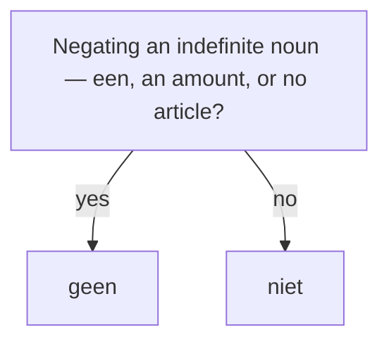

# Negation: niet & geen  *(A2)*

Dutch negates with two words: **niet** (not) and **geen** (no / not a / not any). *Which* one is rule-based; *where* **niet** goes is the trickier skill.

> **No "do"-support.** English inserts *do/does/don't*; Dutch does not. *I don't work* → *Ik werk **niet***, never ~~*Ik doe niet werken*~~.

## niet vs geen — the basic choice

Use **geen** only before an **indefinite** noun (one with *een*, an amount, or no article at all). Everything else takes **niet**.

| Use **geen** before … | Use **niet** for … |
|-----------------------|--------------------|
| an indefinite noun: *een auto*, *auto's*, *brood* | a definite noun: *de/het …*, a demonstrative, a possessive |
| an uncountable noun with no article: *tijd*, *geld* | a verb, adjective, adverb, or the whole sentence |

| Positive | Negated |
|----------|---------|
| Ik heb **een** auto. | Ik heb **geen** auto. |
| Ik heb **de** auto. | Ik heb **de auto niet**. |
| Ik heb tijd. | Ik heb **geen** tijd. |
| Hij is **mijn** vriend. | Hij is **mijn vriend niet**. |
| Het is mooi. | Het is **niet** mooi. |
| Ik werk vandaag. | Ik werk vandaag **niet**. |

> **Quick test:** could you say "no X" / "not a X" in English (no article)? → **geen**. Is there a *de*/*het*, possessive, or demonstrative? → **niet**.

## Placing niet

**niet** negates the *whole clause* from the **end**, but jumps *forward* to sit directly before a single element it targets. Two rules cover almost everything.

### Rule 1 — niet before the word it negates

Put **niet** directly in front of an adjective, adverb, prepositional phrase, or predicate noun.

| Target | Example |
|--------|---------|
| adjective | Het is **niet** lekker. |
| adverb | Hij rijdt **niet** snel. |
| prepositional phrase | Ik ga **niet** naar huis. |
| predicate noun | Dat is **niet** mijn tas. |

### Rule 2 — niet at the end for the whole predicate

With no single target, **niet** lands at the very end — but *after* definite objects, pronouns, and time/place adverbs, and *before* any participle, infinitive, or separable prefix.

| Example | Note |
|---------|------|
| Ik werk **niet**. | plain verb → end |
| Ik zie hem **niet**. | pronoun object comes first |
| Ik vind de sleutels **niet**. | definite object comes first |
| Ik kom morgen **niet**. | time adverb comes first |
| Ik heb hem **niet** gezien. | before the participle |
| Ik wil **niet** komen. | before the infinitive |
| Hij staat **niet** op. | before the separable prefix |

> **Rule of thumb:** *de/het*-objects, pronouns, and time/place words go **before niet**; participles, infinitives, and prefixes go **after** it.

## Other negative words

These replace *niet + …* with a single word — one negator per clause is enough.

| Dutch | English | Example |
|-------|---------|---------|
| **niets** | nothing | Ik zie **niets**. |
| **niemand** | nobody | **Niemand** belt me. |
| **nergens** | nowhere | Ze is **nergens** te vinden. |
| **nooit** | never | Hij komt **nooit** te laat. |
| **geen … meer** | no more / no longer | Ik heb **geen geld meer**. |
| **niet meer** | no longer | Ik werk daar **niet meer**. |
| **nog niet** | not yet | Hij is **nog niet** klaar. |
| **niet eens** | not even | Hij heeft het **niet eens** geprobeerd. |
| **helemaal niet** | not at all | Dat is **helemaal niet** waar. |
| **bijna niet** | hardly | Ik kan je **bijna niet** verstaan. |

> **No double negatives.** English "I don't know nothing" does *not* carry over. Dutch uses one negator: ✅ *Ik weet **niets*** ("I know nothing").

## Answering a negative question: jawel

When a **negative** question is answered with "yes, actually" (a contradiction), Dutch uses **jawel**, not *ja*.

- — *Heb je geen tijd?* (Don't you have time?)
- — ***Jawel**, ik kom zo.* (Yes I do, I'm coming.)
- — ***Nee**, ik heb geen tijd.* (confirming the negative)

> **jawel** pairs with **wel**, the positive counterpart of **niet**: *Ik kom **wel***. — see [Toners](/#/grammar?doc=1-auxilaries/16-toners.md).

## Common mistakes

- ❌ *Ik heb **niet** een auto* → ✅ *Ik heb **geen** auto* — indefinite noun takes *geen*.
- ❌ *Ik zie **geen de** auto* → ✅ *Ik zie **de auto niet*** — a definite noun takes *niet*.
- ❌ *Ik zie **niet** hem* → ✅ *Ik zie hem **niet*** — pronoun objects come before *niet*.
- ❌ *Ik heb gezien **niet*** → ✅ *Ik heb **niet** gezien* — *niet* comes before the participle.
- ❌ *Ik werk **niet meer daar*** → ✅ *Ik werk daar **niet meer*** — the place word comes first.
- ❌ *Ik **doe niet** werken* → ✅ *Ik werk **niet*** — no *do*-support in Dutch.
- ❌ *Heb je geen tijd? — **Ja*** → ✅ ***Jawel*** — use *jawel* to contradict a negative question.
