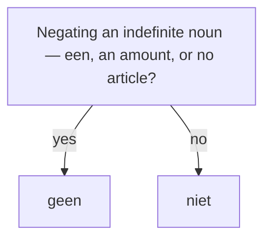

# Negations

Dutch negates with two words: **niet** (not) and **geen** (no / not a / not any).

## niet vs geen — the basic choice

Use **geen** only before an **indefinite** noun (one with *een*, an amount, or no article at all).
Everything else takes **niet**.

```mermaid
flowchart TD
  A["Negating an indefinite noun — een, an amount, or no article?"] -->|"yes"| B["geen"]
  A -->|"no"| C["niet"]
```

| Use **geen** before … | Use **niet** for … |
|-----------------------|--------------------|
| an indefinite noun: *een auto*, *auto's*, *brood* | a definite noun: *de/het …*, a demonstrative, a possessive |
| an uncountable noun with no article: *tijd*, *geld* | a verb, adjective, adverb, or the whole sentence |

| Positive | Negated |
|----------|---------|
| Ik heb **een** auto. | Ik heb **geen** auto. |
| Ik heb **de** auto. | Ik heb **de auto niet**. |
| Ik heb tijd. | Ik heb **geen** tijd. |
| Hij is **mijn** vriend. | Hij is **mijn vriend niet**. |
| Het is mooi. | Het is **niet** mooi. |
| Ik werk vandaag. | Ik werk vandaag **niet**. |

## Other negative words

These replace *niet + …* with a single word — one negator per clause is enough.

| Dutch | English | Example |
|-------|---------|---------|
| `note:niets` | nothing | Ik zie **niets**. |
| `note:niemand` | nobody | **Niemand** belt me. |
| `note:nergens` | nowhere | Ze is **nergens** te vinden. |
| `note:nooit` | never | Hij komt **nooit** te laat. |
| `note:geen-meer` | no more / no longer | Ik heb **geen geld meer**. |
| `note:niet-meer` | no longer | Ik werk daar **niet meer**. |
| `note:nog-niet` | not yet | Hij is **nog niet** klaar. |
| `note:niet-eens` | not even | Hij heeft het **niet eens** geprobeerd. |
| `note:helemaal-niet` | not at all | Dat is **helemaal niet** waar. |
| `note:bijna-niet` | hardly | Ik kan je **bijna niet** verstaan. |
