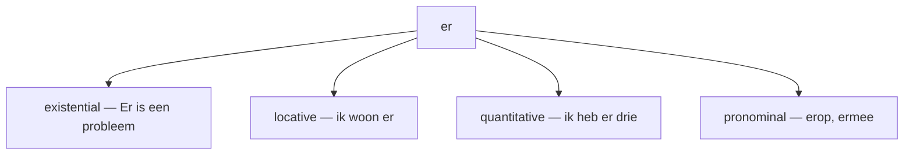

# The word er and er-words  *(B1)*

Unstressed **er** is one of the most versatile — and trickiest — words in Dutch. It plays four distinct roles: **existential**, **locative**, **quantitative**, and **pronominal** (fused with a preposition).

## Existential er — "there is / there are"

Introduces a new, **indefinite** noun into the conversation. It sits at or near the front and **cannot be dropped**.

| Dutch | English |
|-------|---------|
| **Er is** een probleem met mijn computer. | There is a problem with my computer. |
| **Er zijn** vandaag veel mensen op straat. | There are a lot of people out today. |
| **Er was** eens een koning. | Once upon a time there was a king. |
| **Er** wordt hier niet **gerookt**. | No smoking here. (lit. "there is not smoked here") |

> Without it the sentence is ungrammatical: ~~*Is een probleem.*~~ → ***Er** is een probleem.*

## Locative er — "there" (a place)

Replaces a place already mentioned. This is the *unstressed* "there".

| Dutch | English |
|-------|---------|
| Ik woon in Amsterdam; ik woon **er** al tien jaar. | … I've lived there for ten years. |
| Ben je in Parijs geweest? Ja, ik ben **er** vorig jaar geweest. | … Yes, I was there last year. |
| Ga je naar de markt? Ik ga **er** elke zaterdag heen. | … I go there every Saturday. |

> For a *stressed*, pointing "there", use **daar**: *Daar woon ik.* ("*That's* where I live.")

## Quantitative er — "of them" (with a number)

When a counted noun is dropped (already known), **er** holds its place next to the number or amount.

| Dutch | English |
|-------|---------|
| Hoeveel appels heb je? — Ik heb **er** drie. | … I have three (of them). |
| Van die acteurs ken ik **er** maar één. | Of those actors I only know one. |
| De aardbeien waren goedkoop, dus ze kocht **er** veel. | … so she bought a lot of them. |

> Existential *and* quantitative together doubles the **er**: *Er waren tien koekjes en nu zijn **er** nog vijf.* (first *er* = existential, second = quantitative).

## Pronominal er-words (er + preposition)

The most important use. To refer back to a **thing** (not a person) after a preposition, Dutch fuses **er + preposition** into one word — an **er-word**.

Two prepositions change shape: **met → mee**, **tot → toe** (so *ermee*, *ertoe*).

| Preposition | Er-word | Example |
|-------------|---------|---------|
| op | **erop** | De sleutels liggen **erop**. — on it |
| in | **erin** | Doe het **erin**. — put it in it |
| aan | **eraan** | Ik denk **eraan**. — I'm thinking about it |
| over | **erover** | We praten **erover**. — we're talking about it |
| voor | **ervoor** | Hij betaalt **ervoor**. — he pays for it |
| met → mee | **ermee** | Ik werk **ermee**. — I work with it |
| door | **erdoor** | Ze rijden **erdoor**. — they drive through it |
| uit | **eruit** | Hij stapt **eruit**. — he gets out of it |
| naast | **ernaast** | Ze woont **ernaast**. — she lives next to it |
| onder | **eronder** | Het ligt **eronder**. — it's under it |
| tegen | **ertegen** | Ik ben **ertegen**. — I'm against it |
| af | **eraf** | Haal het label **eraf**. — take the label off it |
| om → omheen | **eromheen** | Er staat een hek **eromheen**. — around it |

The er-word *eruit* also forms the fixed verb **eruitzien** ("to look / appear"): *Je ziet er moe uit.* (You look tired.)

> **Person vs. thing.** Er-words replace only **things**. For a person, keep preposition + pronoun:
>
> - *Ik denk aan **hem**.* — about **him** (person) ✓
> - *Ik denk **eraan**.* — about **it** (thing) ✓ — never ~~*ik denk eraan*~~ for a person.

## Splitting er-words

Er-words **split** when anything (an adverb, negation, an object) comes between the two parts. The split form is the norm in speech; the unsplit form sounds bookish.

| Unsplit | Split |
|---------|-------|
| Ik denk eraan. | Ik denk er vaak **aan**. |
| Ik reken erop. | Ik reken er echt **op**. |
| Hij houdt ervan. | Hij houdt er niet **van**. |
| Ik ben ermee klaar. | Ik ben er bijna **mee** klaar. |

## Demonstrative daar-words

Swap **er** for **daar** and you get the stressed, pointing version — "in *that*", "for *that*". Same formation, more emphasis.

| Daar-word | English | Example |
|-----------|---------|---------|
| **daarin** | in that | Leg het **daarin**. |
| **daarvoor** | for that / before that | Ik heb **daarvoor** betaald. — also *de dag **daarvoor*** (the day before). |
| **daarvan** | of that | Ik heb **daarvan** gehoord. |

> **daarom** (therefore) and **daarna** (after that) belong to the same family — *daar* + preposition, frozen into a fixed adverb.
>
> To *ask* about an er-word, swap *er* for **waar**: *Waaraan* denk je? See [Question words](/#/grammar?doc=1-auxilaries/40-vraag-worden.md). The same pattern with *hier/daar* is covered under [Adverbs](/#/grammar?doc=3-bijworden/35-adverbs.md).

## Common mistakes

- ❌ *Ik denk aan **het*** (a thing) → ✅ *Ik denk **eraan*** — thing + preposition fuses into an er-word.
- ❌ *Ik denk **eraan*** (meaning a person) → ✅ *Ik denk aan **hem*** — people keep preposition + pronoun.
- ❌ *Ik ben klaar **ermee*** → ✅ *Ik ben **ermee** klaar* / *Ik ben er bijna **mee** klaar* — the er-word sits in the middle field, not at the end.
- ❌ *Is een probleem* → ✅ ***Er** is een probleem* — existential *er* can't be dropped.
- ❌ *Ik heb drie* (answering "how many?") → ✅ *Ik heb **er** drie* — quantitative *er* is required with a bare number.
- ❌ *ermet* → ✅ ***ermee*** — *met* becomes *mee* (and *tot* becomes *toe*).
