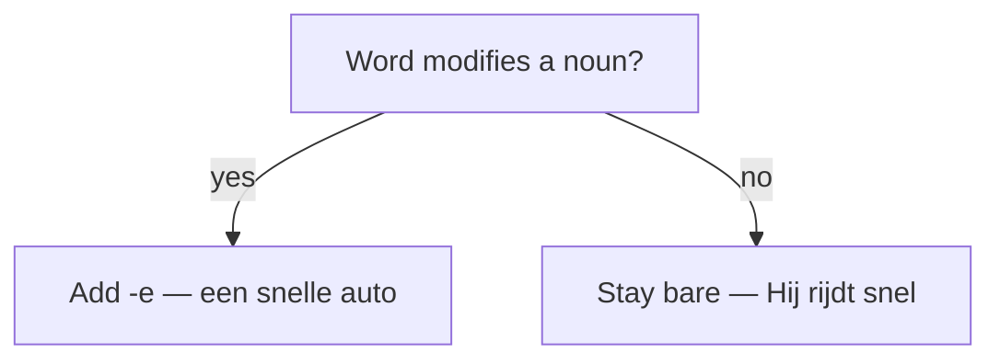

# Adverbs in Dutch  *(A2)*

An adverb modifies a verb, an adjective, another adverb, or a whole sentence. The headline for English speakers: **a Dutch adverb is just the bare adjective — there is no -ly ending**, and it never inflects.

## Adverb = bare adjective (no -ly)

English adds *-ly* (*quick → quickly*). Dutch adds **nothing**: the adjective does double duty. Watch the same word *snel* do three jobs:

| Sentence | Job | Form |
|----------|-----|------|
| *Hij is **snel**.* | adjective, predicative | bare |
| *een **snelle** auto* | adjective, before a noun | +e |
| *Hij rijdt **snel**.* | **adverb** (modifies *rijdt*) | bare |

> **Rule of thumb:** modifying a noun → add **-e**; modifying anything else → leave it **bare**.

More of the same: *Zij zingt **mooi*** (sings beautifully), *Hij werkt **hard*** (works hard), *Praat niet zo **luid*** (don't talk so loud).

## Common mistakes

- ❌ *Hij rijdt **snelle*** → ✅ *Hij rijdt **snel*** — an adverb never inflects; there is no -ly.
- ❌ *Ik ga naar huis snel gisteren* → ✅ *Ik ga **gisteren snel naar huis*** — Time–Manner–Place, not English Place–Manner–Time.
- ❌ *Hij loopt **meer snel*** → ✅ *Hij loopt **sneller*** — short adverbs take *-er*, not *meer*.
- ❌ *Ik denk aan het* → ✅ *Ik denk **eraan*** — for a thing, use an er-word, not *preposition + het*.
- ❌ *Ik heel graag koffie drink* → ✅ *Ik **drink** heel graag koffie* — a main clause keeps the verb in second position (V2).
