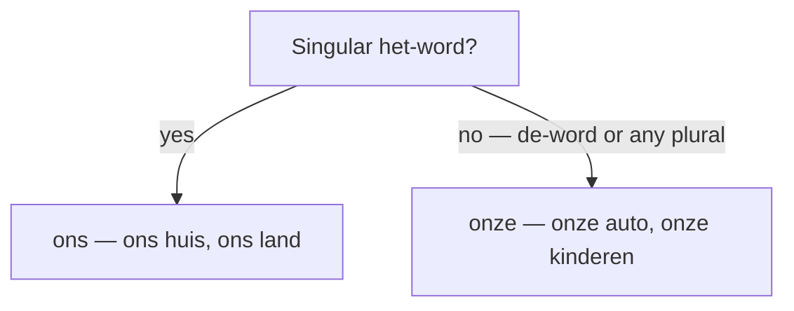

# The Possessive Pronouns  *(A1)*

Possessives show **ownership**. Dutch has forms that sit in front of a noun (*mijn boek*) and standalone forms used without one (*dat boek is van mij*). Only one of them changes shape by gender — **ons vs onze** — so that is the rule to nail.

## The possessives

| Person | Possessive | English |
|--------|------------|---------|
| 1st sg | **mijn** | my |
| 2nd sg informal | **jouw** / je | your |
| 2nd formal | **uw** | your |
| 3rd sg masc/neuter | **zijn** | his / its |
| 3rd sg fem | **haar** | her |
| 1st pl | **ons / onze** | our |
| 2nd pl | **jullie** | your |
| 3rd pl | **hun** | their |

All of them are invariable **except *ons/onze***. In colloquial speech *mijn/zijn/haar* often reduce to *m'n/z'n/'r*, but write them out in full.

### ons vs onze (our)

This is the one possessive that agrees with gender:

- **ons** before a singular **het**-word: *ons huis*, *ons land*
- **onze** before a **de**-word and **all plurals**: *onze auto*, *onze boeken*, *onze kinderen*

> Same logic as the article: *het* huis → **ons** huis; *de* auto → **onze** auto. If you'd say *de*, say *onze*.

### jouw vs je (stressed vs unstressed)

- **jouw** is the full, **stressed** form, for emphasis or contrast: *Is dit **jouw** boek?* — Is this *your* book (…or mine?)
- **je** is the reduced, **unstressed** form, the neutral default: *Is dit **je** boek?* — Is this your book?

The same stress principle runs through the pronouns: *je* vs *jij*, *ze* vs *zij*. See [Pronouns](/#/grammar?doc=2-nominatives/50-pronouns.md).

## Standalone possessives ("mine, yours, his…")

When the possessive *is* the noun (nothing follows it), Dutch uses one of two structures.

### Pattern A — van + object pronoun (spoken)

- *Dit boek is **van mij**.* — This book is mine.
- *Die auto is **van haar**.* — That car is hers.
- *Is deze jas **van jou**?* — Is this coat yours?

### Pattern B — de/het + possessive + -e (formal, written)

- *Dit is mijn boek. **Het jouwe** ligt daar.* — This is my book. Yours is over there.
- *Mijn auto is rood. **De hare** is blauw.* — My car is red. Hers is blue.

The article matches the noun's gender: *het* boek → **het** jouwe; *de* auto → **de** hare.

## X's Y: van + noun

To say *X's Y*, turn it around as *Y van X*:

- *de auto **van** mijn vader* — my father's car
- *het huis **van** Anna* — Anna's house
- *de fiets **van** mijn buurman* — my neighbour's bike

> The 's genitive survives with names: **consonant-final** names just add *-s* (*Jans boek*, *Piets fiets*); **vowel-final** names take *'s* (*Anna's huis*, *Otto's auto*); **s-final** names take a bare apostrophe (*Kees' jas*). But *van + name* is the everyday spoken choice.

## Body parts and clothing

With body parts and clothing, when the owner is obvious Dutch often prefers the **article** over a possessive:

| English | Dutch |
|---------|-------|
| She broke her arm. | *Ze brak **haar / de** arm.* (both fine; *de* is common in the news) |
| Put your coat on. | *Doe **je** jas aan.* |

## Common mistakes

- ❌ *onze huis* → ✅ *ons huis* — *huis* is a het-word, so it takes *ons*.
- ❌ *ons auto* → ✅ *onze auto* — de-words (and all plurals) take *onze*.
- ❌ *jullies boek* → ✅ *jullie boek* — *jullie* never adds *-s*.
- ❌ *Anna en zijn moeder* → ✅ *Anna en **haar** moeder* — a female owner takes *haar*.
- ❌ *mijne ligt daar* → ✅ *de mijne / het mijne* — the *-e* standalone form needs an article.
- ❌ *een vriend van mijn* → ✅ *een vriend van **mij*** — "of mine" uses the object pronoun *mij*.
