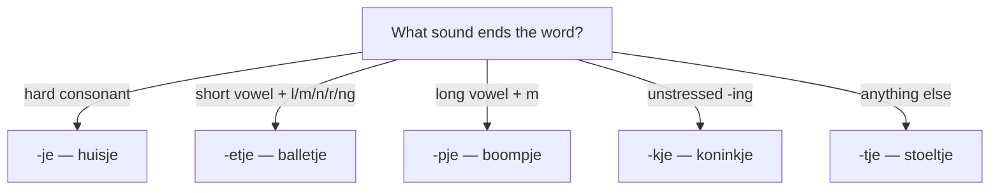

# Verkleinwoorden (Diminutive)  *(A2)*

The diminutive is a hallmark of Dutch — it signals small size, affection, or softens a request (*een biertje, alstublieft*). Two facts make it easy to control before you even learn the endings:

> **Every diminutive is a het-word, and its plural is always -s.** *de tuin* → **het** tuintje → *de* tuintje**s**.

The base ending is **-je**, but its shape adapts to the sound right before it: *-je, -tje, -etje, -pje, -kje*.

## Choosing the ending

Look at the **sound just before the end** of the word:

| The word ends in… | Suffix | Examples |
|-------------------|:------:|----------|
| a hard consonant (*b, d, f, g, ch, k, p, s, t*) | **-je** | *huis* → huis**je**, *boek* → boek**je**, *kat* → kat**je** |
| a **vowel**, or *l/n/r* after a **long** vowel/diphthong or *-el/-en/-er* | **-tje** | *stoel* → stoel**tje**, *deur* → deur**tje**, *tafel* → tafel**tje**, *ei* → ei**tje** |
| *l, m, n, r, ng* after a **short, stressed** vowel | **-etje** | *bal* → bal**letje**, *kom* → kom**metje**, *man* → man**netje**, *ster* → ster**retje**, *ding* → ding**etje** |
| *m* after a **long** vowel, diphthong, or *-em* | **-pje** | *boom* → boom**pje**, *raam* → raam**pje**, *arm* → arm**pje**, *bezem* → bezem**pje** |
| unstressed **-ing** | **-kje** | *koning* → konin**kje**, *woning* → wonin**kje** |

> **Decision shortcut:** hard consonant → **-je**; short vowel + *l/m/n/r/ng* → **-etje** (double the consonant); long vowel + *m* → **-pje**; unstressed *-ing* → **-kje**; everything else → **-tje**.

### Watch the spelling

- After a single **long-vowel letter**, double it before *-tje*: *auto* → aut**oo**tje, *oma* → om**aa**tje, *sla* → sl**aa**tje. (Not ~~autotje~~.)
- After **-etje** the short vowel stays short, so the consonant **doubles**: *bal* → bal**letje**, *kar* → kar**retje**. The one exception is *-ng*, which never doubles: *ring* → ring**etje**.
- Words ending in *-y* take an apostrophe before *-tje*: *baby* → baby**'tje**, *hobby* → hobby**'tje**.

## Irregular diminutives

A few nouns lengthen or change their vowel first:

| Base | Diminutive |
|------|------------|
| *glas* | gl**aa**sje |
| *gat* | g**aa**tje |
| *blad* | bl**aa**dje |
| *pad* | p**aa**dje |
| *schip* | sch**ee**pje |
| *jongen* | jonge**tje** |

> Meaning can split: *bloem* → **bloempje** (a small flower) but **bloemetje** (a bunch of flowers). *Een biertje* is a glass of beer — the diminutive turns the uncountable *bier* into something countable.

## Grammar of diminutives

- Gender is **always het**, whatever the base was: *de man* → *het mannetje*, *de bloem* → *het bloempje*.
- The plural is **always -s**: *de huisjes*, *de autootjes*, *de mannetjes*. See [Plurals](/#/grammar?doc=2-nominatives/62-plurals.md).
- Because it's a het-word, an attributive adjective follows the het-word rule: *een **klein** huisje* (no *-e*), *het **kleine** huisje* (*-e*). See [Adjectives](/#/grammar?doc=3-bijworden/34-adjectives.md).

## Try it

- [ ] Wil je een **kopje** koffie? — Would you like a cup of coffee?
- [ ] Wat een schattig **hondje**! — What a cute little dog!
- [ ] Ze wonen in een klein **huisje**. — They live in a little house.
- [ ] Doe even een **raampje** open. — Just open a little window.
- [ ] Er zit een **mannetje** in de maan. — There's a little man in the moon.

## Common mistakes

- ❌ *de huisje* → ✅ *het huisje* — every diminutive is a het-word.
- ❌ *de huisjen* → ✅ *de huisjes* — the diminutive plural is always *-s*.
- ❌ *autotje* → ✅ *autootje* — double the long vowel before *-tje*.
- ❌ *boometje* → ✅ *boompje* — long vowel + *m* takes *-pje*, not *-etje*.
- ❌ *manje* → ✅ *mannetje* — short vowel + *n* takes *-etje* and doubles the *n*.
- ❌ *koningetje* → ✅ *koninkje* — unstressed *-ing* takes *-kje*.
