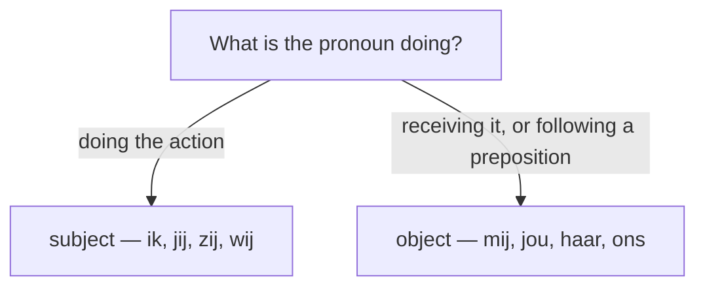

# Pronouns in Dutch  *(A1)*

A pronoun stands in for a noun.

Dutch sorts them by job — subject, object, reflexive, indefinite — and many have **two forms**: a **full (stressed)** one for emphasis and a **reduced (unstressed)** one for everyday speech. The reduced form is what you actually hear; the full form is for contrast.

## Subject pronouns (who does it)

| Person | Full | Reduced | English |
|--------|------|---------|---------|
| 1st sg | **ik** | 'k | I |
| 2nd sg informal | **jij** | je | you |
| 2nd formal | **u** | — | you (polite) |
| 3rd sg masc | **hij** | ie | he |
| 3rd sg fem | **zij** | ze | she |
| 3rd sg neuter | **het** | 't | it |
| 1st pl | **wij** | we | we |
| 2nd pl | **jullie** | je | you (plural) |
| 3rd pl | **zij** | ze | they |

> Use the **reduced** form by default (*Ik denk dat **ze** komt*). Switch to the **full** form only to stress or contrast: ***Jij** doet het, niet ik.* — You do it, not me.

## Object pronouns (who receives it)

Used after a verb or a preposition (*voor mij*, *met haar*).

| Person | Full | Reduced | English |
|--------|------|---------|---------|
| 1st sg | **mij** | me | me |
| 2nd sg informal | **jou** | je | you |
| 2nd formal | **u** | — | you (polite) |
| 3rd sg masc | **hem** | 'm | him |
| 3rd sg fem | **haar** | 'r / d'r | her |
| 3rd sg neuter | **het** | 't | it |
| 1st pl | **ons** | — | us |
| 2nd pl | **jullie** | — | you |
| 3rd pl | **hen / hun** | ze | them |

### hen vs hun vs ze

Traditional written rule:

- **hen** — direct object and after a preposition: *Ik zie **hen*** / *voor **hen*** (for them).
- **hun** — indirect object (no preposition): *Ik geef **hun** een boek* (I give them a book).

> In everyday speech almost everyone just says **ze** for both, and the *hen/hun* split is fading. Learn to recognise it; use *ze* when unsure. Note *hun* is also the possessive "their" — don't use it as a subject: ~~*Hun komen*~~.

## Reflexive pronouns

Used when the subject and object are the same person. Dutch uses **zich** for the third person and formal *u*; the others reuse the object pronoun.

| Person | Reflexive | English |
|--------|-----------|---------|
| 1st sg | **me / mezelf** | myself |
| 2nd sg informal | **je / jezelf** | yourself |
| 2nd formal | **zich / uzelf** | yourself |
| 3rd sg / pl | **zich / zichzelf** | himself, herself, itself, themselves |
| 1st pl | **ons / onszelf** | ourselves |
| 2nd pl | **je / jezelf** | yourselves |

> The **-zelf** form adds emphasis: *Hij waste **zich*.** (he washed) vs. *Hij waste **zichzelf*.** (he washed *himself*, not someone else).

Many Dutch verbs are reflexive where English isn't — the *zich* is obligatory, not a translation of "-self":

- *zich herinneren* — to remember
- *zich vergissen* — to make a mistake
- *zich voelen* — to feel (*Ik voel **me** goed.*)
- *zich voorstellen* — to introduce oneself / to imagine

## Indefinite pronouns

These stand alone (no noun follows).

| Dutch | English | Example |
|-------|---------|---------|
| **alles** | everything | ***Alles** is klaar.* |
| **iedereen** | everyone | ***Iedereen** is welkom.* |
| **allemaal** | all (of them) | *Ze zijn er **allemaal**.* |
| **iemand** | someone | *Er staat **iemand** voor de deur.* |
| **iets** / **wat** | something | *Ik wil **iets** drinken.* |
| **elkaar** | each other | *Ze helpen **elkaar**.* |
| **niets** / niks | nothing | *Er is **niets** gebeurd.* |
| **niemand** | no one | ***Niemand** wist het antwoord.* |
| **wie / wat dan ook** | anyone / anything at all | *Vraag het aan **wie dan ook**.* |

## Common mistakes

- ❌ *Hun hebben een hond* → ✅ ***Zij/Ze** hebben een hond* — *hun* is never a subject.
- ❌ *Is dit jou boek?* → ✅ *Is dit **jouw** boek?* — object *jou* vs. possessive *jouw*.
- ❌ *Ga met ik mee* → ✅ *Ga met **mij** mee* — after a preposition use the object form.
- ❌ *Hij herinnert dat niet* → ✅ *Hij herinnert **zich** dat niet* — *zich herinneren* is reflexive.
- ❌ *Ik geef het aan zij* → ✅ *Ik geef het aan **hen/haar**.* — *zij* is subject-only.
