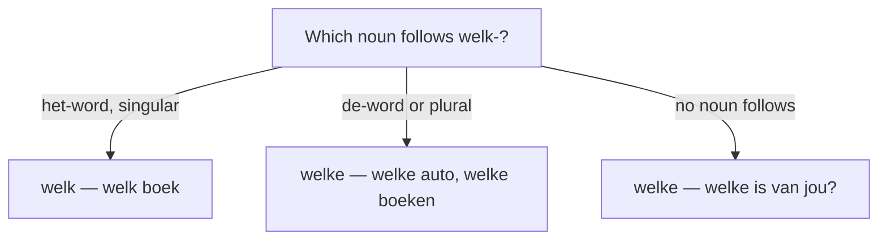

# Question words (vraagwoorden)  *(A2)*

The words that open an information question. This page is the **word inventory**; for sentence shape — inversion, yes/no questions, embedded questions — see [Questions](/#/grammar?doc=7-modes/05-interrogatives.md).

| Dutch | English | Asks for | Example |
|-------|---------|----------|---------|
| `wie` | who | a person | **Wie** belt? |
| `wat` | what | a thing / action | **Wat** zie je? |
| `welk(e)` | which | a choice | **Welke** trein neem je? |
| `wat voor (een)` | what kind of | a type | **Wat voor** muziek luister je? |
| `waar` | where | a place | **Waar** woon je? |
| `wanneer` | when | a time | **Wanneer** kom je terug? |
| `hoe` | how | manner / state | **Hoe** gaat het? |
| `waarom` | why | a reason | **Waarom** huil je? |
| `hoeveel` | how much / many | a quantity | **Hoeveel** kost dit? |
| `hoelang` | how long | a duration | **Hoelang** blijf je? |

> **wanneer** pairs with a preposition to bound the time: **sinds wanneer** (since when — *Sinds wanneer woon je hier?*) and **tot wanneer** (until when — *Tot wanneer blijf je?*).

## wie — people

| Function | Example |
|----------|---------|
| Subject | **Wie** belt? |
| Object | **Wie** zie je? |
| After a preposition | **Met wie** ga je? |
| Possessive ("whose") | **Van wie** is dit boek? |

> For a person, the preposition stays a separate word before **wie**: *met wie*, *voor wie*, *over wie*.

## wat — things & actions

| Use | Example |
|-----|---------|
| What thing? | **Wat** is dat? |
| What activity? | **Wat** doe je? |
| Exclamation | **Wat een** mooie dag! |

> **Never *wat* after a preposition** for a thing. Use a **waar**-word instead: ~~*op wat*~~ → **waarop** / **waar … op** (see below).

## welk vs welke — agreement

**welke** behaves like an adjective: it agrees with the noun.

| Noun type | Form | Example |
|-----------|------|---------|
| de-word (sg/pl) | **welke** | **Welke** auto? / **Welke** boeken? |
| het-word (sg) | **welk** | **Welk** boek? |

> With no noun following, use **welke** for both: *Er staan twee fietsen — **welke** is van jou?*

## hoe + adjective

**hoe** combines with an adjective to ask "how big / old / far …": *hoe + adjective + verb + subject?*

| Combo | English | Example |
|-------|---------|---------|
| **hoe oud** | how old | **Hoe oud** ben je? |
| **hoe laat** | what time | **Hoe laat** is het? |
| **hoe ver** | how far | **Hoe ver** is het? |
| **hoe lang** | how long | **Hoe lang** duurt het? |
| **hoe vaak** | how often | **Hoe vaak** sport je? |
| **hoe groot** | how big | **Hoe groot** is je huis? |
| **hoe duur** | how expensive | **Hoe duur** is dat? |

## waar — places & waar-words

For places, **waar** takes a directional particle; for *things* after a preposition, it fuses with the preposition (a **waar**-word — the question form of an [er-word](/#/grammar?doc=2-pronouns/70-er-word.md)).

| Combo | English | Example |
|-------|---------|---------|
| **waar** | where | **Waar** is hij? |
| **waar … vandaan** | where from | **Waar** kom je **vandaan**? |
| **waar … heen** / **naartoe** | where to | **Waar** ga je **heen**? |
| **waarmee** / **waar … mee** | what … with | **Waarmee** schrijf je? |
| **waarover** / **waar … over** | what … about | **Waar** praat je **over**? |

> Same shape-changes as er-words: **met → mee**, **tot → toe**. The split form (*Waar wacht je **op**?*) is more natural in speech than the joined *Waarop wacht je?*

## waarom & cousins

| Form | Tone | Example |
|------|------|---------|
| **waarom** | neutral, default | **Waarom** kom je niet? |
| **hoezo** | "how come?" (mildly skeptical) | **Hoezo** niet? |
| **waardoor** | "because of what?" (cause) | **Waardoor** is dat gebeurd? |
| **waarvoor** | "for what purpose?" | **Waarvoor** heb je dat nodig? |

## Fixed expressions

| Pattern | English | Example |
|---------|---------|---------|
| **wat voor (een)** + noun | what kind of | *Wat voor film vind je leuk?* |
| **wat een** + noun | what a … (exclamation) | *Wat een mooi huis!* |
| **waar dan ook** | wherever | *We vinden je waar dan ook.* |
| **wat dan ook** | whatever | *Ik eet wat dan ook.* |

## Common mistakes

- ❌ *Op wat wacht je?* → ✅ ***Waarop** wacht je?* / *Waar wacht je **op**?* — no *wat* after a preposition for things.
- ❌ *welke huis* → ✅ *welk huis*; ❌ *welk auto* → ✅ *welke auto* — agree with de/het.
- ❌ *Wat tijd is het?* → ✅ *Hoe laat is het?* — "what time" is *hoe laat*.
- ❌ *Wie's boek is dit?* → ✅ *Van wie is dit boek?* — "whose" is *van wie*, no possessive 's.
- ❌ *Waar kom je?* (origin) → ✅ *Waar kom je **vandaan**?* — origin needs *vandaan*.
- ❌ *Hoe ben je?* → ✅ *Hoe gaat het?* — "how are you?" is not translated word-for-word.
