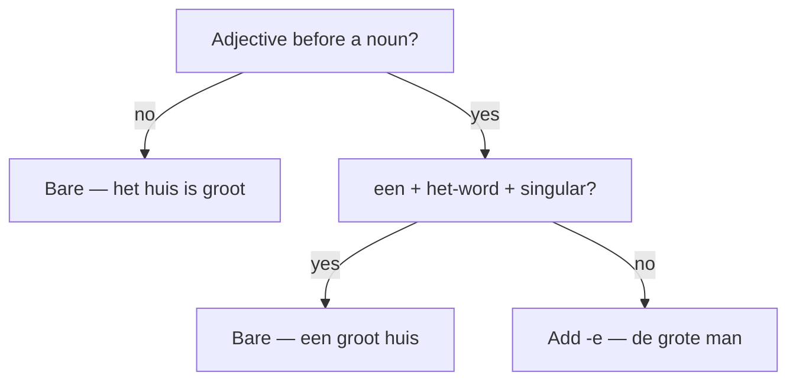

# Adjectives in Dutch  *(A2)*

An adjective describes a noun (*een **groot** huis*). One rule carries this whole topic: an adjective **before** a noun almost always adds **-e** — except before a singular, indefinite **het**-word, where it stays bare.

## Predicative vs attributive

The "do I add -e?" question only applies **before** the noun (attributive). After a linking verb (predicative), the adjective is always bare.

| Position | Where | Ending | Example |
|----------|-------|--------|---------|
| **Predicative** | after *zijn, worden, blijven, lijken* | never -e | *Het huis is **groot**.* |
| **Attributive** | directly before the noun | usually -e | *een **groot** huis* · *het **grote** huis* |

## The -e rule

Before a noun, **add -e** — for every de-word, every plural, and every definite het-word.

| Phrase | English |
|--------|---------|
| de **grote** auto | the big car |
| het **mooie** huis | the beautiful house |
| een **leuke** vrouw | a nice woman |
| de **kleine** kinderen | the small children |
| die **rode** appel | that red apple |

### The exception: singular indefinite het-word

**No -e** when **all three** are true — the noun is a **het**-word, **singular**, and **indefinite** (after *een, geen, elk, ieder, welk, zo'n*, or no article):

| Phrase | Noun | -e? |
|--------|------|-----|
| een **groot** huis | het-word, sg, indefinite | bare |
| het **grote** huis | het-word, but **definite** | -e |
| **grote** huizen | het-word, but **plural** | -e |
| een **grote** auto | **de**-word | -e |

> **Mnemonic:** *een + het-word + singular* → bare adjective. Change any one of those three and the **-e** comes back.

Not sure whether a noun is *de* or *het*? That gender is the trigger for this whole rule — see [Determiners](/#/grammar?doc=2-nominatives/14-determiners.md).

## Spelling when you add -e

The normal spelling rules apply when the ending opens a syllable:

| Positive | + e | Why |
|----------|-----|-----|
| groot | **grote** | long vowel: *oo → o* in an open syllable |
| dik | **dikke** | short vowel: double the consonant |
| lief | **lieve** | *f → v* before the vowel |
| vies | **vieze** | *s → z* before the vowel |
| vrij | **vrije** | no change |

## Adjectives that never take -e

Adjectives of **material**, formed with *-en*, are frozen — no -e, ever, even before a de-word:

- *een **houten** tafel* — a wooden table
- *de **gouden** ring* — the gold ring
- *een **wollen** trui* — a wool sweater
- *het **stenen** huis* — the stone house

> They answer *"made of what?"* — *houten, gouden, zilveren, wollen, glazen, stenen* — and stay bare in every position.

## Stacking adjectives

When several adjectives modify one noun, Dutch orders them roughly **opinion → size → age → shape → colour → origin/material → purpose** — the same intuition as English:

- *een **mooi groot oud Nederlands** huis* — a beautiful big old Dutch house

> Two-adjective stacks (*mooi groot*, *snel rood*) are everyday; three or more feel literary and are rare in speech.

Stacking changes nothing about the endings — each adjective still follows the **-e** rule above. Here they all stay bare because *huis* is a singular indefinite het-word.

## After iets / niets / wat: add -s

After *iets*, *niets*, *wat*, *veel*, *weinig*, an adjective takes **-s**, not -e:

- *iets **leuks*** — something nice
- *niets **nieuws*** — nothing new
- *wat **lekkers*** — something tasty

## Adjectives used as nouns

Add **-e** for a person, *het + -e* for an abstract idea:

- *de **oude*** — the old one · *een **zieke*** — a sick person · *de **rijken*** — the rich
- *het **goede*** — the good · *het **mooie*** — the beautiful

## Practice

Add -e, or leave it bare?

- [ ] Dat is een **oud** huis. — That's an old house.
- [ ] Ik woon in het **oude** huis. — I live in the old house.
- [ ] Zij heeft een **oude** auto. — She has an old car.
- [ ] Wij kochten een **houten** tafel. — We bought a wooden table.
- [ ] Het is een **mooi** schilderij. — It's a beautiful painting.
- [ ] Ik hou van **oude** films. — I love old films.

## Common mistakes

- ❌ *een grote huis* → ✅ *een **groot** huis* — a singular indefinite het-word takes no -e.
- ❌ *het groot huis* → ✅ *het **grote** huis* — *het* makes it definite, so the -e comes back.
- ❌ *een goudene ring* → ✅ *een **gouden** ring* — material adjectives in *-en* never add -e.
- ❌ *Het huis is grote* → ✅ *Het huis is **groot*** — predicative adjectives stay bare.
- ❌ *iets leuk* → ✅ *iets **leuks*** — after *iets / niets / wat*, add -s.
