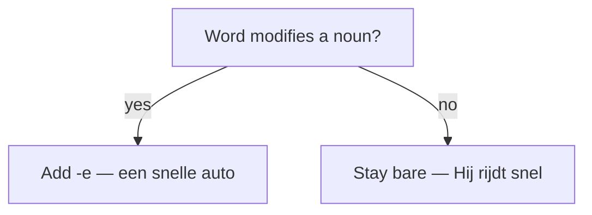

# Adverbs in Dutch  *(A2)*

An adverb modifies a verb, an adjective, another adverb, or a whole sentence. The headline for English speakers: **a Dutch adverb is just the bare adjective — there is no -ly ending**, and it never inflects.

## Adverb = bare adjective (no -ly)

English adds *-ly* (*quick → quickly*). Dutch adds **nothing**: the adjective does double duty. Watch the same word *snel* do three jobs:

| Sentence | Job | Form |
|----------|-----|------|
| *Hij is **snel**.* | adjective, predicative | bare |
| *een **snelle** auto* | adjective, before a noun | +e |
| *Hij rijdt **snel**.* | **adverb** (modifies *rijdt*) | bare |

> **Rule of thumb:** modifying a noun → add **-e**; modifying anything else → leave it **bare**.

More of the same: *Zij zingt **mooi*** (sings beautifully), *Hij werkt **hard*** (works hard), *Praat niet zo **luid*** (don't talk so loud).

## Comparing adverbs

Adverbs compare exactly like adjectives — *-er* / *het -st* — and share the same irregulars (*goed → beter → best*, *graag → liever → liefst*):

- *Zij loopt **sneller** dan ik, maar hij loopt **het snelst**.*
- *Ik drink **liever** thee.* — I'd rather drink tea.

For the full paradigm and the *dan* vs *als* trap, see [Comparatives](/#/grammar?doc=3-bijworden/36-comparatives.md).

## Word order: time – manner – place

Adverbs sit in the **middle field**, between the finite verb and the verbs at the end. With several, Dutch prefers **Time → Manner → Place** — the mirror image of English:

- *Ik ga **morgen** **met de trein** **naar Amsterdam**.* — I'm going to Amsterdam (place) by train (manner) tomorrow (time).

Move one adverb to the front for emphasis; V2 then pushes the subject after the verb:

- *Morgen **ga ik** met de trein naar Amsterdam.* — fronted time forces inversion.

For the full slot model, see [Sentence structure](/#/grammar?doc=6-structures/00-sentence.md).

## Degree, frequency and particles

These adverb families have their own pages — go there rather than guess:

- **Degree & frequency** — *heel, erg, zeer, best, nogal, vaak, altijd, soms*: [Modifiers](/#/grammar?doc=1-auxilaries/14-modifiers.md).
- **Modal particles** — *toch, even, maar, wel, hoor, gewoon*: [Toners](/#/grammar?doc=1-auxilaries/16-toners.md). Spoken Dutch leans on these; *Doe het **even*** sounds far warmer than a bare *Doe het*.

## Pronominal adverbs: er / daar / waar / hier + preposition

When a preposition points at a **thing** (not a person), Dutch fuses it with *er / daar / waar / hier*: *eraan, daarover, waarop, hierin*. The pieces may split: *Ik wacht **erop*** = *Daar wacht ik **op***.

> *met → mee* and *tot → toe* in these combos: *ermee, daarmee, ertoe*. Full treatment: [The word er](/#/grammar?doc=1-auxilaries/30-er-word.md).

## Common mistakes

- ❌ *Hij rijdt **snelle*** → ✅ *Hij rijdt **snel*** — an adverb never inflects; there is no -ly.
- ❌ *Ik ga naar huis snel gisteren* → ✅ *Ik ga **gisteren snel naar huis*** — Time–Manner–Place, not English Place–Manner–Time.
- ❌ *Hij loopt **meer snel*** → ✅ *Hij loopt **sneller*** — short adverbs take *-er*, not *meer*.
- ❌ *Ik denk aan het* → ✅ *Ik denk **eraan*** — for a thing, use an er-word, not *preposition + het*.
- ❌ *Ik heel graag koffie drink* → ✅ *Ik **drink** heel graag koffie* — a main clause keeps the verb in second position (V2).
