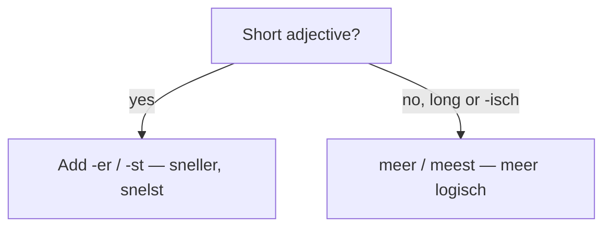

# Comparatives & superlatives  *(A2)*

To compare, add **-er** (comparative) and **-st** (superlative): *snel → sneller → snelst*. Use *het + -st* for the predicative superlative (*het snelst*) and *de/het + -ste* before a noun (*de snelste*). "Than" is **dan** — never *als*.

## Forming them

| Positive | Comparative (-er) | Superlative (-st) | Spelling note |
|----------|-------------------|-------------------|---------------|
| klein | kleiner | kleinst | regular |
| groot | groter | grootst | long vowel: *oo → o* |
| dik | dikker | dikst | short vowel: double the consonant |
| mooi | mooier | mooist | regular |
| oud | ouder | oudst | regular |
| duur | duurder | duurst | *-r* stem → insert **d** |
| lekker | lekkerder | lekkerst | *-r* stem → insert **d** |

> Adjectives ending in **-r** insert a **d** before *-er*: *duur → duur**d**er*, *ver → ver**d**er*, *zwaar → zwaar**d**er*, *lekker → lekker**d**er*.

Attributive superlatives add **-e** and take an article: *de **grootste** stad*, *het **kleinste** huis*. Predicative superlatives use *het + -st*: *In juli is het **het warmst***.

## Irregular

Four everyday words break the pattern — memorise them:

| Positive | Comparative | Superlative | Example |
|----------|-------------|-------------|---------|
| **goed** | beter | best | *Zij speelt **beter** dan ik; hij speelt **het best**.* |
| **veel** | meer | meest | *Ik weet **meer**, maar jij weet **het meest**.* |
| **weinig** | minder | minst | *Dit kost **minder**; dat kost **het minst**.* |
| **graag** | liever | liefst | *Ik drink **liever** thee, maar koffie **het liefst**.* |

## Long and -isch adjectives: use meer / meest

Adjectives ending in **-isch**, and many long or participle adjectives, don't take *-er / -st*. Put **meer** / **meest** in front instead:

- *Dit is **meer logisch**.* — This is more logical. (not ~~logischer~~)
- *een **meer geïnteresseerde** lezer* — a more interested reader
- *de **meest typische** fout* — the most typical mistake

## dan vs als

> **"Than" = *dan*.** *Hij is **groter dan** ik.* Never *groter als*.

*als* is for **equality**, not difference: *even groot **als*** / *net zo groot **als*** (as big as) — see [Modifiers](/#/grammar?doc=1-auxilaries/14-modifiers.md).

> **Register:** *groter als* is very common in casual speech, but non-standard. Write and say **dan** in exams and formal Dutch.

## Comparing adverbs

Adverbs compare with the same endings and the same irregulars:

- [ ] *Zij loopt **sneller** dan ik, maar hij loopt **het snelst**.*
- [ ] *Hij komt nu **vaker**, maar jij komt **het vaakst**.*
- [ ] *Hij praat **harder**, maar zij schreeuwt **het hardst**.*
- [ ] *Hij legt het **duidelijker** uit; zij doet het **het duidelijkst**.*
- [ ] *Vandaag speelt hij **slechter** dan gisteren.*

## Common mistakes

- ❌ *groter **als** ik* → ✅ *groter **dan** ik* — "than" is *dan*; *als* is only for equality (*even groot als*).
- ❌ *meer **groot*** → ✅ *groter* — short adjectives take *-er*, not *meer*.
- ❌ *duur**er*** → ✅ *duur**der*** — an *-r* stem inserts a *d*.
- ❌ *meer **goed*** / *goeder* → ✅ *beter* — *goed* is irregular.
- ❌ *Hij loopt het **snelste*** → ✅ *Hij loopt het **snelst*** — the predicative/adverbial superlative has no -e.
