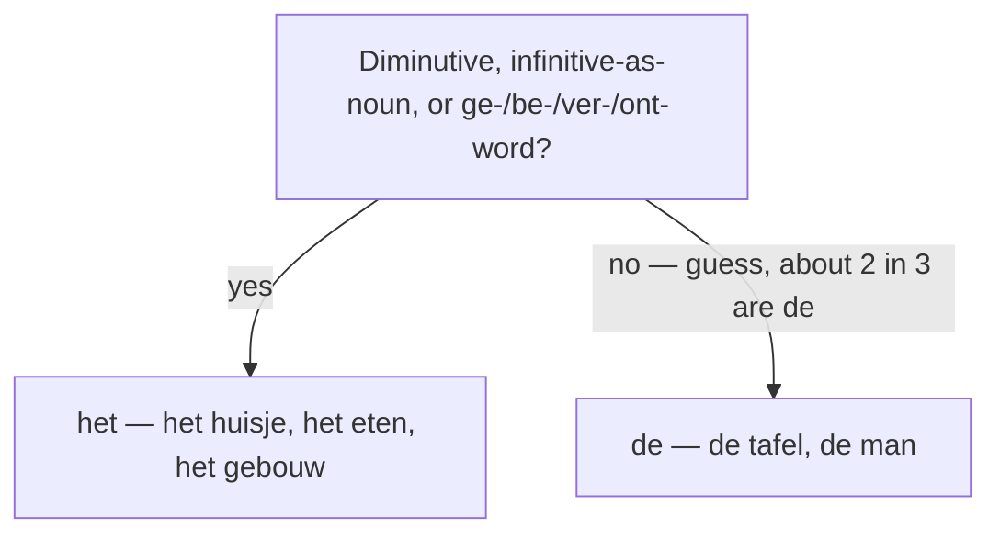

# Nouns  *(A1)*

Every Dutch noun has a **gender**, shown by its definite article: **de** or **het**. Gender is the single biggest A1 hurdle, because it also decides which demonstrative (*deze/die* vs *dit/dat*), which possessive (*ons* vs *onze*) and which adjective ending you use. There is no perfect rule, so learn each noun *with* its article — store *het boek*, never bare *boek*.

## de or het? (the noun's gender)

Dutch has two genders:

- **de** — common gender, roughly **two-thirds** of all nouns: *de tafel*, *de man*, *de stad*
- **het** — neuter, the remaining third: *het boek*, *het kind*, *het huis*

> **When in doubt, guess *de*** — you'll be right about two out of three times. Then switch to *het* for the six het-groups below.

### Guess `het` for these

| Group | Examples |
|-------|----------|
| Diminutives (any *-je*) | *het huisje*, *het meisje*, *het autootje* |
| Infinitives used as nouns | *het eten*, *het zwemmen*, *het roken* |
| Words with *ge-/be-/ver-/ont-* (2 syllables) | *het gebouw*, *het bewijs*, *het verbod*, *het ontbijt* |
| Languages, colours, compass points | *het Nederlands*, *het rood*, *het noorden* |
| Metals and materials | *het goud*, *het ijzer*, *het glas*, *het hout* |
| Endings *-isme, -ment, -sel, -um* | *het toerisme*, *het moment*, *het deksel*, *het museum* |

### Otherwise it's usually `de`

| Group | Examples |
|-------|----------|
| All **plurals** (even of het-words) | *de boeken*, *de huizen* |
| Most people and professions | *de vrouw*, *de leraar*, *de buurman* |
| Fruits, trees, plants | *de appel*, *de boom*, *de bloem* |
| Numbers, letters, seasons | *de drie*, *de a*, *de zomer* |
| Endings *-ing, -heid, -teit, -ie, -tie, -ij* | *de opleiding*, *de vrijheid*, *de kwaliteit*, *de familie* |

> Two het-words to memorise because they name people: **het kind** and **het meisje**. (They are het because *-je* wins, and *kind* is just an old neuter.)

## The indefinite article: `een`

Dutch has one indefinite article, **een** ("a/an"), used for a singular noun that is new or non-specific. The great thing: **it ignores gender** — de-words and het-words both take *een*, so you never need to know the gender to use it.

- *een tafel* — a table (de-word)
- *een boek* — a book (het-word)

*Een* is **dropped**:

- in the **plural**: *een boek* → *boeken*, *een appel* → *appels*
- with **uncountable (mass)** nouns: *water*, *geld*, *muziek*

> Don't confuse **een** (the article, unstressed, sounds like "un" /ən/) with **één** (the number "one", stressed /eːn/). The accents mark it in writing: *een appel* — an apple; *één appel* — one apple.

## Naming what someone is (drop the article)

Unlike English, Dutch **leaves out the article** when stating a profession, nationality, or belief after *zijn/worden*:

- *Zij is **lerares**.* — She is **a** teacher.
- *Hij wordt **arts**.* — He is becoming **a** doctor.
- *Ik ben **Nederlander**.* — I am **a** Dutchman.

The article returns as soon as an adjective is added: *Zij is **een goede** lerares.*

Country and city names normally take **no article** either: *Nederland is mooi* (not ~~het Nederland~~). *Het* only appears when the name is modified: *het mooie Nederland*.

## Try it

Which article — **de** or **het**?

- [ ] Ik lees **het** boek. — I'm reading the book.
- [ ] **De** appel is rood. — The apple is red.
- [ ] Waar is **het** museum? — Where is the museum?
- [ ] **De** opleiding duurt vier jaar. — The course takes four years.
- [ ] **Het** meisje speelt buiten. — The girl is playing outside.

> Gender drives more than the article: see [Determiners](/#/grammar?doc=3-nouns/14-determiners.md) for *deze/dit*, [Possessives](/#/grammar?doc=3-nouns/54-possesives.md) for *ons/onze*, and [Adjectives](/#/grammar?doc=4-bijworden/34-adjectives.md) for the *-e* ending.

## Common mistakes

- ❌ *het tafel* → ✅ *de tafel* — most nouns are de-words; guess *de* when unsure.
- ❌ *de museum* → ✅ *het museum* — words in *-um* are het.
- ❌ *de meisje* → ✅ *het meisje* — every diminutive (*-je*) is a het-word.
- ❌ *Zij is een lerares* → ✅ *Zij is lerares* — drop *een* before a bare profession.
- ❌ *het Nederland is mooi* → ✅ *Nederland is mooi* — country names take no article.
- ❌ *één boek* for "a book" → ✅ *een boek* — *één* means the number one.
