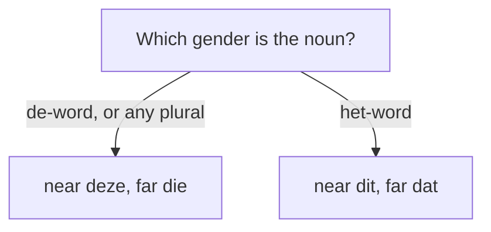

# Determiners — marking the noun  *(A1)*

A determiner sits in front of a noun and pins down *which* or *how much*: articles (*de/het/een*), demonstratives (*deze/die/dit/dat*), and quantifiers (*elke, veel, geen*). The articles are covered under [Nouns](/#/grammar?doc=3-nouns/02-nouns.md); this page handles the rest. Most determiners follow the same de/het split as the article, so knowing a noun's gender pays off again here.

## Demonstrative determiners

Dutch splits demonstratives two ways at once: **near** vs. **far**, and **de-word** vs. **het-word**.

| | d**e**-word | he**t**-word |
|------|---------|----------|
| **Near** (this) | dez**e** man | di**t** kind |
| **Far** (that) | di**e** vrouw | da**t** huis |

> Mnemonic: the demonstrative echoes the article — d**e** → dez**e**/di**e**, he**t** → di**t**/da**t**.

English has four words (this/that/these/those); Dutch has four too, but the split is gender + distance, not singular + plural. **In the plural, everything behaves like a de-word:** *deze mannen*, *die huizen* — never *dit/dat*.

### As standalone pronouns

*die* and *dat* also refer back to a noun already mentioned, like English "that one":

- *Ik zag een film. **Die** was geweldig.* — I saw a film. That one was great.
- *Hij kocht een huis. **Dat** staat in Amsterdam.* — He bought a house. It's in Amsterdam.

### degene / diegene

*Degene* (de-word) / *diegene* means "the one who", pointing at a person whose identity or gender is left open. It is followed by a relative clause with *die*:

- Singular: ***Degene** die het laatst vertrekt, doet het licht uit.* — Whoever leaves last turns off the light.
- Plural: ***Degenen** die nog geen kaartje hebben, kunnen achteraan aansluiten.* — Those without a ticket can join the back of the queue.

## Same / such / other

| Dutch | English | Example |
|-------|---------|---------|
| `dezelfde` / `hetzelfde` | the same (de / het word) | *Dit boek is **hetzelfde** als dat.* |
| `andere` / `note:ander` | other / another | *de **andere** mensen* / *een **ander** boek* |
| `enige` | only, sole | *Hij is de **enige** die het weet.* |
| `note:zo'n` | such a (singular) | *Ik wil ook **zo'n** auto.* |
| `note:zulk` (zulke) | such (plural / mass) | *Ik hou niet van **zulke** films.* |
| `note:dergelijk` | such, similar (formal) | ***Dergelijke** problemen komen vaker voor.* |

## Quantity

**A lot:**

| Dutch | English | Example |
|-------|---------|---------|
| `elk` / `elke` | every | ***Elke** dag lees ik de krant.* |
| `ieder` / `iedere` | each | ***Iedere** ochtend drink ik koffie.* |
| `alle` | all | ***Alle** kinderen spelen buiten.* |
| `beide` | both | ***Beide** kinderen zijn ziek.* |
| `veel` | much / many | *Ik heb **veel** werk.* |
| `meerdere` | several | ***Meerdere** landen deden mee.* |
| `allerlei` | all sorts of, various | *Er zijn **allerlei** redenen.* |

**A little / a few:**

| Dutch | English | Example |
|-------|---------|---------|
| `sommige` | some (certain ones) | ***Sommige** mensen houden niet van kaas.* |
| `enkele` | a few | ***Enkele** studenten kwamen te laat.* |
| `note:paar` | a couple, a few | *Ik heb **een paar** vragen.* |
| `een beetje` | a little (uncountable) | *Ik wil **een beetje** melk.* |
| `weinig` | few, little | ***Weinig** mensen weten dat.* |

> *elk / ieder* take **-e** before de-words (*elke dag*) and drop it before singular het-words (*elk kind*). Modern Dutch increasingly uses *elke/iedere* for both.

## Predeterminers — *al*, *heel*, *allebei*

A few totality words sit **before** another determiner (an article or a possessive), not in its place:

| Dutch | English | Example |
|-------|---------|---------|
| `al` + de/het/mijn… | all (the) | *al **de** mensen*, *al **mijn** boeken*, *al **het** werk* |
| `allebei` / `alle twee` | both (of two) | ***Allebei** de kinderen zijn ziek.* |
| `heel` | the whole, all of | *heel **de** dag*, *heel **Nederland*** |

> *heel* stays bare **before** a determiner (*heel de dag*) but inflects to **hele** **after** one: *de **hele** dag*, *het **hele** boek*. Both are correct; *de hele dag* is the more common.

## Comparing amounts

| Dutch | English | Example |
|-------|---------|---------|
| `note:genoeg` | enough | *Ik heb **genoeg** tijd.* |
| `meer` | more | *Ik wil **meer** koffie.* |
| `minder` | less / fewer | *Hij werkt **minder** uren.* |

## The negative determiner: geen

**geen** means "no / not any". It replaces *een* (or a bare mass/plural noun) to negate the whole noun:

- *Ik heb **een** auto.* → *Ik heb **geen** auto.* — I have no car.
- *Ik heb tijd.* → *Ik heb **geen** tijd.* — I have no time.

> Use **geen** for indefinite nouns, **niet** for definite ones (*de auto*, *mijn auto*). Full rules on the [Negation](/#/grammar?doc=1-auxilaries/24-negators.md) page.

## Determiners and adjective endings

After most determiners the adjective takes **-e** (*de **grote** man*, *deze **grote** man*). The exception is a singular het-word after *een, geen, elk, ieder, zo'n* or no article: *een **groot** huis*. See [Adjectives](/#/grammar?doc=4-bijworden/34-adjectives.md).

## Common mistakes

- ❌ *dit man* → ✅ *deze man* — *man* is a de-word, so it takes *deze/die*.
- ❌ *dit huizen* → ✅ *deze huizen* — plurals always behave like de-words.
- ❌ *een ander mensen* → ✅ *andere mensen* — plural takes the *-e* form.
- ❌ *Ik heb niet tijd* → ✅ *Ik heb **geen** tijd* — negate an indefinite noun with *geen*, not *niet*.
- ❌ *zo een auto* → ✅ ***zo'n** auto* — *zo'n* is the fixed contraction of *zo een*.
- ❌ *alle de mensen* → ✅ *al de mensen* — before another determiner use *al*, not *alle*.
