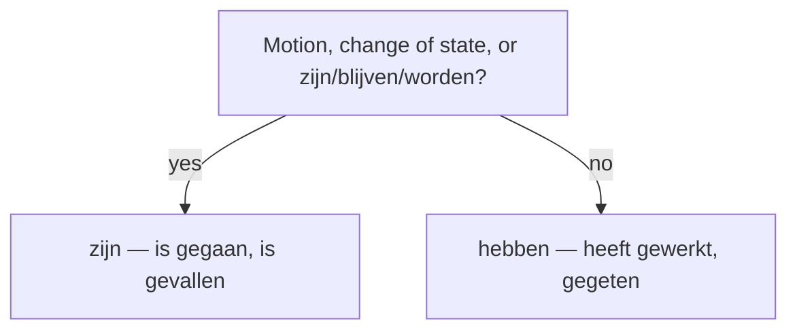

# The Perfectum  *(A2)*

The **perfectum** (*voltooid tegenwoordige tijd*, VTT) is Dutch's present perfect — and the **default way to talk about the past in speech**. Build it from two pieces:

> **auxiliary** (*hebben* or *zijn*, in the V2 slot) + **past participle** (at the very end of the clause).

- *Ik **heb** een boek **gelezen**.* — I read / have read a book.
- *Zij **is** naar Parijs **gegaan**.* — She has gone to Paris.

## Choosing the auxiliary — *hebben* or *zijn*

Most verbs take **hebben**. Take **zijn** for verbs of **motion or change of state**, plus *zijn*, *blijven* and *worden* themselves.

| Auxiliary | Which verbs | Example |
|-----------|-------------|---------|
| **hebben** | the default — transitives and most intransitives | *Ik **heb gewerkt / gegeten / geslapen**.* |
| **zijn** | motion / change of state; *zijn, blijven, worden* | *Hij **is gegaan / gekomen / gevallen / gebleven**.* |

- *gaan, komen, vertrekken, aankomen, verhuizen, vallen, sterven, gebeuren, worden, blijven, beginnen* → **zijn**.
- A motion verb takes *hebben* when **no direction** is stated: *Ik **heb** een uur **gelopen*** (activity) vs *Ik **ben** naar huis **gelopen*** (direction).

## Building the past participle

### Weak verbs — *ge-* + stem + *-t / -d*

Same **'t kofschip** split as the [imperfectum](/#/grammar?doc=4-verbs/25-imperfectum.md): a stem-final **t, k, f, s, ch, p** → **-t**, otherwise **-d**.

| Verb | Stem | Participle |
|------|------|------------|
| **werken** | werk | ge**werk**t |
| **koken** | kook | ge**kook**t |
| **wonen** | woon | ge**woon**d |
| **spelen** | speel | ge**speel**d |
| **studeren** | studeer | ge**studeer**d |

> Same **voicing trap**: *v / z* (written *f / s*) take **-d**: *leven → **geleefd***, *reizen → **gereisd***. And *-eren* loanwords **do** keep *ge-*: *gestudeerd*, *gereserveerd*, ***gefeliciteerd***.

### Strong verbs — *ge-* + stem + *-en*

Strong participles end in **-en**, usually with a changed vowel: *eten → **gegeten***, *lezen → **gelezen***, *drinken → **gedronken***, *schrijven → **geschreven***, *zien → **gezien***. See the [verbs](/#/grammar?doc=4-verbs/19-verbs.md) principal-parts list.

### No *ge-* with inseparable prefixes

Verbs beginning with the unstressed prefixes **be-, ge-, ver-, ont-, her-, er-, mis-** take **no** *ge-*:

- *betalen → **betaald*** · *verkopen → **verkocht*** · *ontmoeten → **ontmoet***
- *herhalen → **herhaald*** · *vergeten → **vergeten*** · *gebeuren → **gebeurd***

(Full prefix list: [morfologie](/#/grammar?doc=0-elements/06-morfologie.md).)

### Separable verbs wrap around *ge-*

The *ge-* slots **between** the prefix and the stem, written as one word:

- *opbellen → **opgebeld*** · *aankomen → **aangekomen*** · *uitleggen → **uitgelegd*** · *meenemen → **meegenomen***

## Worked example

*Ik **heb** mijn moeder gisteren **opgebeld**.* — "I called my mother yesterday."

- *heb* = auxiliary *hebben* in the V2 slot (calling is not motion → *hebben*).
- *opgebeld* = participle of the separable verb *opbellen*: prefix *op-* + *ge-* + stem *bel* + *-d*, sitting at the end of the clause.
- Word order: *heb* second, *opgebeld* last — everything else fits in between.

> **Perfectum or imperfectum?** Perfectum = single completed events, and the default in speech; imperfectum = narration, description, habits. The discourse rule lives in [past narratives](/#/grammar?doc=5-modes/03-past_narrative.md).

## Oefen — practice

- [ ] Ik heb je bericht **gelezen**.
- [ ] Hij is te laat **gekomen**.
- [ ] We hebben lekker **gegeten**.
- [ ] Zij is naar huis **gegaan**.

## Common mistakes

- ❌ *Ik heb **werkt*** → ✅ *Ik heb **gewerkt*** — a weak participle needs *ge-*.
- ❌ *Ik **heb** naar huis gegaan* → ✅ *Ik **ben** naar huis gegaan* — motion verbs take *zijn*.
- ❌ *Ik heb het **gebetaald*** → ✅ *Ik heb het **betaald*** — no *ge-* after *be-, ge-, ver-, ont-, her-, er-, mis-*.
- ❌ *Ik heb haar **geopbeld*** → ✅ *Ik heb haar **opgebeld*** — the *ge-* goes **inside** a separable verb.
- ❌ *Ik heb **geleeft*** → ✅ *Ik heb **geleefd*** — the *f* comes from *v*, so the participle ends in *-d*.
