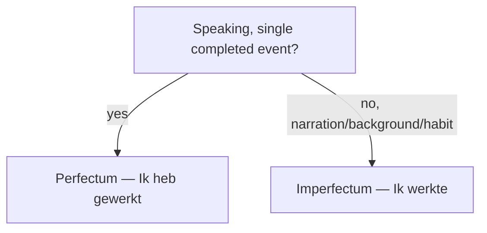

# Past narratives  *(B1)*

**Which past tense you use in Dutch is mostly a matter of register, not meaning.** In everyday **speech**, Dutch defaults to the **perfectum** (*Ik heb gewerkt*) for single past events — even ordinary ones with no lingering result. In **writing** and connected **narrative**, Dutch switches to the **imperfectum** (*Ik werkte*) to carry the storyline. The imperfectum is also the everyday choice — spoken or written — for **background, states, and habits** (*Het was koud; vroeger woonde ik in Den Haag*).

The core choice, at a glance:

> This page is about *when to use which* tense. For how to *form* them — endings, participles, *hebben* vs. *zijn* — see [imperfectum](/#/grammar?doc=4-verbs/25-imperfectum.md) and [perfectum](/#/grammar?doc=4-verbs/26-perfectum.md).

| Use | Tense | Example |
|-----|-------|---------|
| Single past event, in speech | **perfectum** (VTT) | *Ik **heb** gisteren **gewerkt**.* |
| Storyline in a written narrative | **imperfectum** (OVT) | *Ik **liep** naar buiten en **zag** hem.* |
| Background / state in a story | **imperfectum** | *De zon **scheen** en de vogels **zongen**.* |
| Habit / repeated past action | **imperfectum** | *Vroeger **woonde** ik in Den Haag.* |

*OVT = onvoltooid verleden tijd (imperfectum); VTT = voltooid tegenwoordige tijd (perfectum); VVT = voltooid verleden tijd (pluperfect, below).*

> **English contrast:** English chooses past tenses by meaning ("I worked" vs. "I have worked"). Dutch chooses largely by **register** — *Ik heb gisteren gewerkt* is the normal spoken way to say "I worked yesterday", even though it looks like an English present perfect.

## *toen* vs *als* vs *wanneer* — three words for "when"

This is the single biggest source of mistakes in Dutch narration. English "when" covers all three, so learners reach for the wrong one.

| Word | Use | Tense | Example |
|------|-----|-------|---------|
| **toen** | a single event in the past | past | ***Toen** ik klein **was**, woonde ik in Den Haag.* |
| **als** | habitual past ("whenever") *or* future condition ("if/when") | past or present | ***Als** ik klein was, gingen we elke zomer kamperen.* / ***Als** ik tijd heb, kom ik.* |
| **wanneer** | asking "when?" — direct or indirect question | any | ***Wanneer** kom je?* / *Ik weet niet **wanneer** hij komt.* |

> **Memorise:** *toen* = once, in the past. *als* = whenever / if. *wanneer* = the question word "when?".

All three are subordinators, so they send the verb to the **end** of their clause (see [subordinating conjunctions](/#/grammar?doc=6-structures/03-subordinating.md)).

## Connecting clauses in time

Time subordinators (*toen, terwijl, voordat, nadat, zodra, totdat, sinds*) send the conjugated verb to the **end** of the clause they introduce:

- ***Toen** ik thuis**kwam**, was hij al weg.*
- *Bel me **zodra** je **aankomt**.*
- ***Nadat** we **gegeten hadden**, gingen we wandelen.* (pluperfect for the earlier event)

Adverbs also move a story forward — and, unlike subordinators, they trigger **V2 inversion** when they open the clause: *plotseling / opeens* (suddenly), *ineens* (all at once), *op een dag* (one day), *kort daarna* (shortly after), *uren later* (hours later).

- ***Ineens** begon het te regenen.* · ***Op een dag** kreeg ik een brief.*

## The pluperfect (*voltooid verleden tijd*, VVT)

For an event that happened **before** another past event — English "had + past participle".

Form: imperfectum of *hebben* (**had / hadden**) or *zijn* (**was / waren**) + past participle.

- *Toen ik aankwam, **was** hij al **vertrokken**.* — When I arrived, he had already left.
- *Ze **had** het boek al **gelezen** voordat ik het haar gaf.* — She had already read the book before I gave it to her.

The pluperfect is essential for flashbacks and prior events inside a past timeline.

## A worked example: mini-story

***Vorige week** ging ik naar Amsterdam.
**Toen** ik daar **aankwam**, **regende** het hard.
Ik **had** mijn paraplu **vergeten**, dus ik **rende** naar het dichtstbijzijnde café.
**Daar** dronk ik een warme chocolademelk **terwijl** de regen **viel**.
**Even later** kwam de zon weer en **vervolgde** ik mijn wandeling.
**Uiteindelijk** kwam ik **'s avonds** moe maar tevreden thuis.*

Watch:

- *Vorige week* opens the clause → V2 inversion → *ging ik*.
- *Toen ik daar aankwam* is subordinate → verb final.
- *had … vergeten* is pluperfect → the forgetting happened *before* the rain.
- *terwijl de regen viel* is subordinate → verb final.
- The spine is all **imperfectum** (*ging, regende, rende, dronk, vervolgde*) — that's written narrative.
- Discourse markers (*Daar*, *Even later*, *Uiteindelijk*) sequence the story and keep it moving; fronting one triggers V2 inversion (*Even later **kwam** de zon*).

## Practice

- [ ] *Gisteren **heb** ik mijn fiets **gerepareerd**.* — spoken past → perfectum.
- [ ] *Vroeger **speelde** ik elke dag buiten.* — habit → imperfectum.
- [ ] ***Toen** ik jong was, woonde ik in België.* — single past event → *toen*.
- [ ] *Het **regende** en het **was** koud.* — background → imperfectum.
- [ ] *Ze **had** al **gegeten** toen ik binnenkwam.* — earlier event → pluperfect.

## Common mistakes

- ❌ *Als ik klein was, brak ik mijn arm* → ✅ ***Toen** ik klein was, brak ik mijn arm* — a single past event takes *toen*, not *als*.
- ❌ *Toen hij **kwam aan*** → ✅ *Toen hij **aankwam*** — subordinate clauses are verb-final, so the separable prefix rejoins the verb.
- ❌ *Ik heb naar huis **gegaan*** → ✅ *Ik **ben** naar huis gegaan* — verbs of motion take *zijn* (see [perfectum](/#/grammar?doc=4-verbs/26-perfectum.md)).
- Mixing perfectum and imperfectum at random → pick one tense as the spine of your story.
- ❌ *Toen ik aankwam, **heeft** hij al gegeten* (for "had eaten") → ✅ *… **had** hij al gegeten* — "had done" is the **pluperfect**, not the perfectum.
