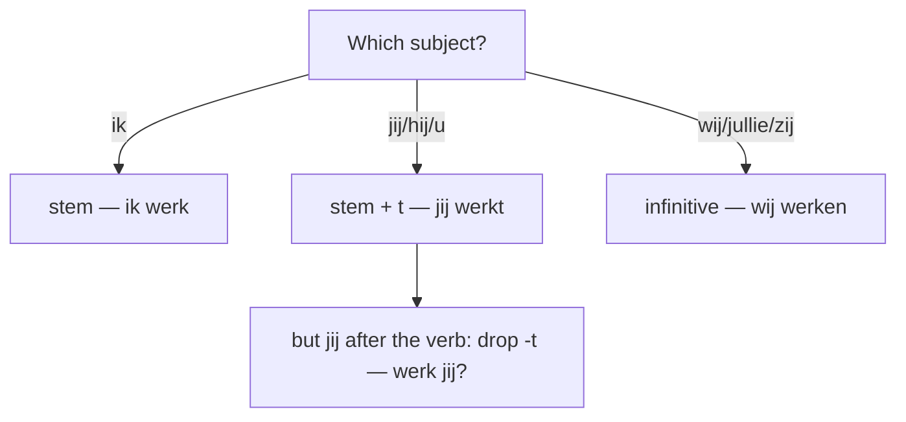

# Verbs  *(A2)*

Every Dutch verb has a **stem** and a set of endings. Find the stem — the **infinitive minus -en** — then add the present-tense ending. Master this one move and you can conjugate the great majority of Dutch verbs.

## Present tense — regular (weak) verbs

| Person | Ending | *werken* (to work) |
|--------|--------|--------------------|
| *ik* | stem | ik **werk** |
| *jij / je*, *hij / zij / het*, *u* | stem + **t** | jij **werkt**, hij **werkt** |
| *wij / jullie / zij* | infinitive | wij **werken** |

> **Inversion drops the -t:** when *jij / je* comes *after* its verb, the **-t** disappears: *Werk **jij** hier?* (not ~~werkt jij~~), *Waar woon **je**?* This affects *jij / je* only, and only the *-t* ending — never *ik* or the plural.

### Spelling tweaks

The stem obeys normal Dutch spelling, so it is not always just "infinitive minus -en":

- Final **-v / -z** are written **-f / -s**: *leven → ik **leef***, *reizen → ik **reis***.
- Short vowel + single consonant **doubles** before *-en*, so the stem keeps one: *zitten → ik **zit**, wij **zitten***.
- Long vowel written double in a closed syllable: *lopen → ik **loop***, *maken → ik **maak***.
- A stem already ending in **-t** takes no second one: *heten → hij **heet*** (not ~~heett~~).

See [spelling](/#/grammar?doc=0-elements/20-spelling.md) for the vowel-length logic behind these.

### Worked example

*Waarom **luister** je niet?* — "Why aren't you listening?"

- *luister* = stem of *luisteren* (*luisteren* − *en*).
- *je* follows the verb (inversion after *waarom … V2*), so the ending is the **bare stem, no -t**: *luister je*, not ~~luistert je~~.

## Strong (irregular) verbs

Strong verbs **change the stem vowel** in the past and end their participle in **-en**. There is no rule — learn the three principal parts (infinitive, past, participle) as a unit. This table is the reference the [imperfectum](/#/grammar?doc=5-verbs/25-imperfectum.md) and [perfectum](/#/grammar?doc=5-verbs/26-perfectum.md) pages point back to.

| Infinitive | English | Past sg | Past pl | Participle | Perfect aux |
|------------|---------|---------|---------|------------|-------------|
| **eten** | to eat | at | aten | gegeten | hebben |
| **slapen** | to sleep | sliep | sliepen | geslapen | hebben |
| **schrijven** | to write | schreef | schreven | geschreven | hebben |
| **lezen** | to read | las | lazen | gelezen | hebben |
| **drinken** | to drink | dronk | dronken | gedronken | hebben |
| **lopen** | to walk | liep | liepen | gelopen | beide |
| **rijden** | to drive | reed | reden | gereden | beide |
| **vinden** | to find | vond | vonden | gevonden | hebben |
| **zien** | to see | zag | zagen | gezien | hebben |
| **gaan** | to go | ging | gingen | gegaan | zijn |
| **komen** | to come | kwam | kwamen | gekomen | zijn |
| **zijn** | to be | was | waren | geweest | zijn |
| **hebben** | to have | had | hadden | gehad | hebben |

- *Ik **at** een appel.* — I ate an apple.
- *Wij **dronken** koffie.* — We drank coffee.
- *Hij **is** naar huis **gelopen**.* — He walked home.

> The **perfect aux** column shows which helper the [perfectum](/#/grammar?doc=5-verbs/26-perfectum.md) uses. *Lopen* and *rijden* take *zijn* only when a direction is given (*Ik ben naar huis gelopen*), otherwise *hebben* (*Ik heb een uur gelopen*).

## Verb + fixed preposition

Many Dutch verbs demand a specific preposition that English does not share (*wachten **op***, *denken **aan***, *houden **van*** …). Learn them as units — the full list with examples lives on its own page: [Verbs with fixed prepositions](/#/grammar?doc=5-verbs/22-verb-with-prepositions.md).

## Separable verbs (*scheidbare werkwoorden*)

Some verbs have a stressed prefix that **detaches** in a main clause and moves to the end: *opstaan → Ik **sta** om zeven uur **op**.* The prefix rejoins the verb in a subordinate clause (*…dat ik **opsta***) and wraps around *te* and *ge-*:

- around *te*: *Ik probeer **op te staan*** — see [te + infinitive](/#/grammar?doc=5-verbs/27-te-infinitive.md).
- in the participle: *opbellen → **opgebeld*** — see [perfectum](/#/grammar?doc=5-verbs/26-perfectum.md).

Inseparable prefixes (*be-, ge-, ver-, ont-, her-, er-, mis-*) never detach. Full prefix inventory: [morfologie](/#/grammar?doc=0-elements/06-morfologie.md).

## Oefen — practice

- [ ] Ik **werk** in Amsterdam.
- [ ] **Woon** jij in Nederland?
- [ ] Hij **leest** elke avond.
- [ ] Wij **luisteren** naar muziek.
- [ ] **Spreek** je Nederlands?
- [ ] Zij **fietst** naar school.

## Common mistakes

- ❌ *Werkt jij?* → ✅ *Werk jij?* — inversion drops the *-t* after *jij / je*.
- ❌ *ik leev* → ✅ *ik **leef*** — a stem-final *v/z* is written *f/s*.
- ❌ *Ik **opbel** hem* → ✅ *Ik **bel** hem **op*** — a separable prefix detaches to the end in a main clause.
- ❌ *Ik **ken** zwemmen* → ✅ *Ik **kan** zwemmen* — *kennen* = to know (a person/thing); *kunnen* = can, be able to.
- ❌ *Ik weet hem* → ✅ *Ik **ken** hem* — *kennen* for people/places you're familiar with; *weten* for facts.
