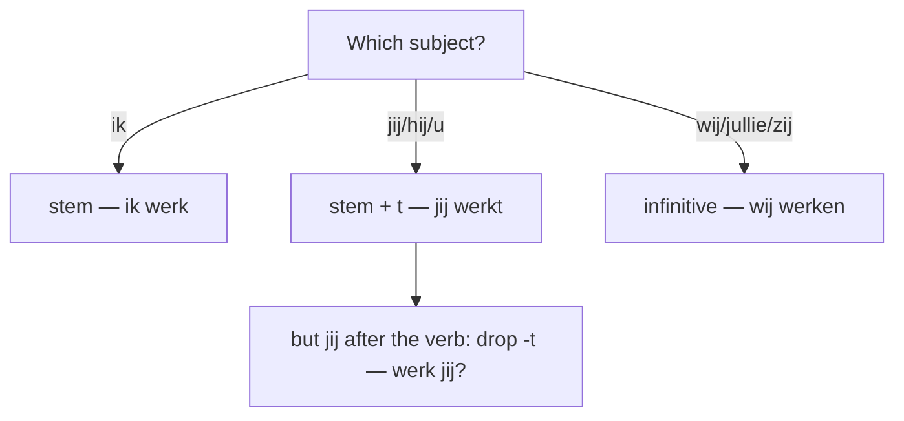

# Verbs  *(A2)*

Every Dutch verb has a **stem** and a set of endings. Find the stem — the **infinitive minus -en** — then add the present-tense ending. Master this one move and you can conjugate the great majority of Dutch verbs.

### Present tense — regular (weak) verbs

| Person | Ending | *werken* (to work) |
|--------|--------|--------------------|
| *ik* | stem | ik **werk** |
| *jij / je*, *hij / zij / het*, *u* | stem + **t** | jij **werkt**, hij **werkt** |
| *wij / jullie / zij* | infinitive | wij **werken** |

> **Inversion drops the -t:** when *jij / je* comes *after* its verb, the **-t** disappears: *Werk **jij** hier?* (not ~~werkt jij~~), *Waar woon **je**?* This affects *jij / je* only, and only the *-t* ending — never *ik*, *u* or the plural.

```mermaid
flowchart TD
  A["Which subject?"] -->|"ik"| B["stem — ik werk"]
  A -->|"jij/hij/u"| C["stem + t — jij werkt"]
  A -->|"wij/jullie/zij"| D["infinitive — wij werken"]
  C --> E["but jij after the verb: drop -t — werk jij?"]
```

### Spelling tweaks

The stem obeys normal Dutch spelling, so it is not always just "infinitive minus -en":

- Final **-v / -z** are written **-f / -s**: *leven → ik **leef***, *reizen → ik **reis***.
- Short vowel + single consonant **doubles** before *-en*, so the stem keeps one: *zitten → ik **zit**, wij **zitten***.
- Long vowel written double in a closed syllable: *lopen → ik **loop***, *maken → ik **maak***.
- A stem already ending in **-t** takes no second one: *heten → hij **heet*** (not ~~heett~~).

See [spelling](/#/grammar?doc=0-elements/20-spelling.md) for the vowel-length logic behind these.

### Separable verbs (*scheidbare werkwoorden*)

Some verbs have a stressed prefix that **detaches** in a main clause and moves to the end: *opstaan → Ik **sta** om zeven uur **op**.* The prefix rejoins the verb in a subordinate clause (*…dat ik **opsta***) and wraps around *te* and *ge-*:

- around *te*: *Ik probeer **op te staan*** — see [te + infinitive](/#/grammar?doc=5-verbs/27-te-infinitive.md).
- in the participle: *opbellen → **opgebeld*** — see [perfectum](/#/grammar?doc=5-verbs/26-perfectum.md).

Inseparable prefixes (*be-, ge-, ver-, ont-, her-, er-, mis-*) never detach.
Full prefix inventory: [morfologie](/#/grammar?doc=0-elements/06-morfologie.md).
