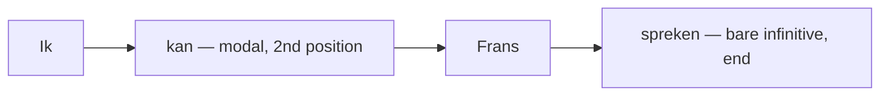

# Modal verbs  *(A2)*

Modal verbs (*modale werkwoorden*) express ability, permission, obligation, desire, and prediction. Dutch has **five core modals** — *kunnen, moeten, mogen, willen, zullen* — plus the semi-modal *hoeven*. They share one signature pattern:

> **Modal + bare infinitive**, with the infinitive at the **end** of the clause: *Ik **moet** nog even **werken**.*

| Dutch | English | Core meaning |
|-------|---------|--------------|
| `kunnen` | can, to be able to | ability, possibility |
| `moeten` | must, to have to | necessity, obligation |
| `mogen` | may, to be allowed to | permission |
| `willen` | to want | desire, intention |
| `zullen` | shall, will | future, prediction, offer |
| `hoeven` | (not) to need to | absence of necessity |

For which modal expresses which *meaning* (and the non-modal alternatives), see [modalities](/#/grammar?doc=7-modes/01-modalities.md).

## Conjugation

Modals are irregular in the present singular: *ik* and *hij* share one form, and it is **not** the bare stem.

| Infinitive | ik / hij | jij / u | wij / jullie / zij | Past sg | Past pl | Participle |
|------------|----------|---------|--------------------|---------|---------|------------|
| **kunnen** | kan | kunt / kan | kunnen | kon | konden | gekund |
| **moeten** | moet | moet | moeten | moest | moesten | gemoeten |
| **mogen** | mag | mag | mogen | mocht | mochten | gemogen |
| **willen** | wil | wilt / wil | willen | wilde / wou | wilden | gewild |
| **zullen** | zal | zult / zal | zullen | zou | zouden | — |
| **hoeven** | hoef | hoeft | hoeven | hoefde | hoefden | gehoefd |

- *jij kan / jij wil* (no *-t*) are common in speech; *jij kunt / jij wilt* are the written norm.
- *wou / wouden* (past of *willen*) is colloquial; *wilde / wilden* is standard.
- *zou(den)* — the past of *zullen* — is the everyday **conditional**: *Ik **zou** graag komen* (I'd love to come).

## Word order — the infinitive lands at the end

The modal takes the V2 slot; everything else, the main verb included, piles up at the end.

- *Ik **kan** Frans **spreken**.* — I can speak French.
- *Zij **moet** vandaag het rapport **afmaken**.* — She has to finish the report today.

A modal can also stand alone with just an object, no infinitive: *Ik **wil** koffie.* — I want coffee.

*Hoeven* is the odd one out: it takes *te + infinitive* and only ever appears with a negation — see [te + infinitive](/#/grammar?doc=5-verbs/27-te-infinitive.md).

## Perfect tense — double infinitive (IPP)

When a modal is used in the perfect **together with a main verb**, the modal's participle is replaced by its **infinitive** — the *Infinitivus pro Participio* (IPP). Both verbs end up as infinitives:

- *Ik **heb** dat niet **kunnen lezen**.* — I couldn't read that. *(not ~~gekund~~)*
- *Zij **heeft moeten vertrekken**.* — She had to leave. *(not ~~gemoeten~~)*

### Worked example

*Ik **heb** de hele dag **moeten werken**.* — "I had to work all day."

- *heb* = perfect auxiliary in the V2 slot. Modals take *hebben*.
- *moeten* = the modal, in **infinitive** form (IPP), not the participle *gemoeten*.
- *werken* = the main verb, a bare infinitive, at the very end.

The participles (*gekund, gemoeten, gemogen, gewild*) surface only when the modal stands **alone**: *Ik heb het niet **gewild**.* — I didn't want it.

*Zullen* has no participle; past modality runs through *zou(den)* instead: *Ik **zou** het gelezen hebben.* — I would have read it.

## Oefen — practice

- [ ] Ik **kan** goed zwemmen.
- [ ] **Mag** ik hier zitten?
- [ ] We **moeten** nu vertrekken.
- [ ] **Wil** je een kopje koffie?
- [ ] **Zullen** we samen eten?
- [ ] Je **hoeft** niet te komen.

## Common mistakes

- ❌ *Ik moet **te** werken.* → ✅ *Ik moet **werken**.* — modals take a bare infinitive, no *te*. See [te + infinitive](/#/grammar?doc=5-verbs/27-te-infinitive.md).
- ❌ *Ik heb dat niet **gekund** lezen.* → ✅ *Ik heb dat niet **kunnen lezen**.* — use the infinitive (IPP), not the participle, next to a main verb.
- ❌ *Ik kan **spreken** Frans.* → ✅ *Ik kan Frans **spreken**.* — the infinitive goes to the **end**.
- ❌ *Ik **ken** zwemmen.* → ✅ *Ik **kan** zwemmen.* — *kunnen* = can / be able to; *kennen* = to know (someone or something).
- ❌ *Ik moet niet komen* (for "I don't have to") → ✅ *Ik **hoef** niet **te** komen.* — the negative of *moeten* is *hoeven niet + te*.
