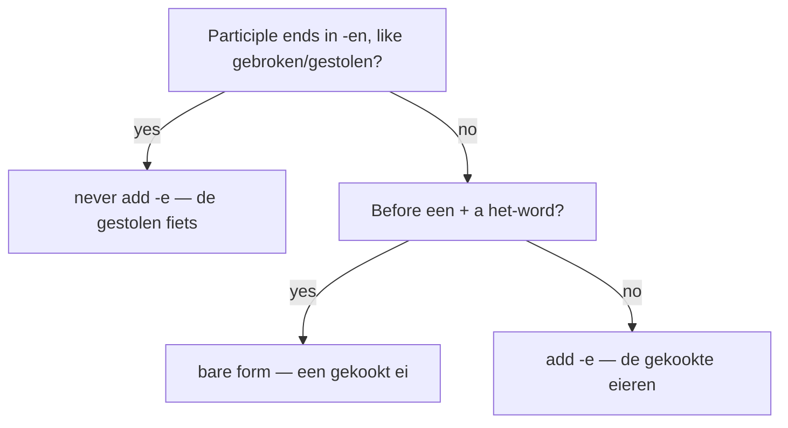

# Participles as adjectives and nouns  *(B2)*

Dutch has two participles

- the **past participle** (*gekookt*, *gelezen*, *gegeten*)
- and the **present participle** (*lopend*, *slapend*).

Beyond their verbal use in tenses, both serve as **adjectives** and can be **nominalized**. The infinitive too can be turned into a neuter noun.

For the verbal use of participles (perfect tenses, passive), see [perfectum](/#/grammar?doc=5-verbs/26-perfectum.md) and [passive](/#/grammar?doc=5-verbs/29-passive.md).

## Past participle as adjective

A past participle (*gekookt*, *gebroken*, *vergeten*) can sit before a noun as an attributive adjective, taking the regular -e ending.

| Phrase | English |
|--------|---------|
| *gekookt water* | boiled water (with *een*/no article) |
| *het gekookte water* | the boiled water |
| *een gebroken been* | a broken leg |
| *de gebroken arm* | the broken arm |
| *een gestolen fiets* | a stolen bike |
| *de gesloten deur* | the closed door |
| *vergeten woorden* | forgotten words |

> The -e rule is the same as for any adjective: bare form after *een + het*-word (*een gekookt ei*), -e everywhere else (*de gekookte eieren*, *het gekookte ei*). See [adjectives](/#/grammar?doc=4-bijworden/34-adjectives.md).

These participles can also sit predicatively, where they look like a passive:

- *De deur is **gesloten**.* — The door is closed. (state — see *zijn*-passive)
- *Het glas is **gebroken**.* — The glass is broken.

## Past participle as noun

Past participles substantivize freely, mostly with the definite article and an -e ending.

| Form | Meaning |
|------|---------|
| **de gewonde** | the wounded person |
| **de gevangene** | the prisoner |
| **de overledene** | the deceased |
| **de gestorvenen** *(plural)* | the dead |
| **het verleden** | the past |
| **het gebeurde** | what happened |
| **het verlorene** | the lost (thing) |

> Person-nominals (*de gewonde*) take -en in the plural: *de gewonden*. Neuter abstracts (*het verleden*) don't.

## Present participle

Form: take the infinitive and add **-d**.

- *lopen* → **lopend** (walking)
- *slapen* → **slapend** (sleeping)
- *huilen* → **huilend** (crying)
- *lachen* → **lachend** (laughing)
- *zijn* → **zijnde** (being — only in stiff/formal contexts)
- *hebben* → **hebbend** (having)

## Present participle as adjective

The present participle becomes an attributive adjective with the regular -e:

| Phrase | English |
|--------|---------|
| *een **lopende** band* | a conveyor belt (lit. "walking band") |
| *de **slapende** honden* | the sleeping dogs |
| ***huilende** kinderen* | crying children |
| *een **groeiende** stad* | a growing city |
| *de **komende** week* | the coming/next week |
| *de **bestaande** regels* | the existing rules |

> Some present participles have lexicalized as everyday adjectives: *komende*, *bestaande*, *lopende*, *zittende*, *staande*. Learners encounter these long before the rule that produced them.

## Present participle as adverb

Without -e, the present participle works as an adverb of manner:

- *Hij liep **huilend** weg.* — He walked away crying.
- *Ze keek me **lachend** aan.* — She looked at me laughing/smiling.
- *Het kind kwam **rennend** binnen.* — The child came running in.

This use is roughly equivalent to English *-ing* adverbials. It's compact and slightly literary; in speech a coordinate clause is more common (*Hij liep weg en huilde*).

## Substantivized infinitive (the *het*-noun infinitive)

Any Dutch infinitive can become a neuter noun by prefixing *het*. The noun means "the act of X-ing" or "X-ing in general."

| Infinitive-as-noun | English |
|--------------------|---------|
| *het lopen* | walking |
| *het zwemmen* | swimming |
| *het lezen* | reading |
| *het koken* | cooking |
| *het roken* | smoking |

- *Het lopen doet me goed.* — Walking does me good.
- *Het roken is hier verboden.* — Smoking is forbidden here.
- *Ik hou van **het koken** met verse kruiden.* — I love cooking with fresh herbs.

> Note the contrast: *het roken* = smoking-in-general (the activity); *te roken* / *roken* = the act in a specific clause. Compare *Hij stopte met **roken*** (he quit smoking) vs. *Het roken is verboden* (smoking is forbidden).

This is Dutch's closest equivalent to the English gerund, but it's more bookish — daily speech often uses an *om te* construction or a full clause instead.

## Reduced relative clauses

A present or past participle phrase can shorten a relative clause:

- *de man **die op de bank slaapt*** → *de **op de bank slapende** man* — the man sleeping on the bench
- *het boek **dat door Jan geschreven werd*** → *het **door Jan geschreven** boek* — the book written by Jan

> The reduced form sounds **formal or literary**. Spoken Dutch keeps the full relative clause. Learners should recognize the pattern in writing but not over-produce it.

The participle phrase grows leftward from the noun, with all its modifiers stacked before the participle — sometimes producing very long pre-modifiers in journalistic prose.

## Common mistakes

- ❌ *het **gekookt** water* → ✅ *het **gekookte** water* — attributive participles in *-t* (like normal adjectives) take -e in this context.
- ❌ *de **gestolene** fiets* → ✅ *de **gestolen** fiets* — past participles ending in *-en* (*gestolen, gebroken, gesloten, vergeten*) never take an extra -e in attributive position, regardless of de/het or article.
- ❌ *Hij liep **huilende** weg.* → ✅ *Hij liep **huilend** weg.* — adverbs don't inflect; -e is for the attributive adjective use only.
- ❌ *De **roken** is hier verboden.* → ✅ *Het **roken** is hier verboden.* — substantivized infinitives are *het*-words.
- ❌ *Ik hou van **te zwemmen**.* → ✅ *Ik hou van **zwemmen**.* / *Ik hou ervan **te zwemmen**.* — after *van* a thing, use the substantivized infinitive (no *te*); to keep the verbal sense, use the er-word + *te*-infinitive form.
- ❌ Using reduced relative clauses (*de op de bank slapende man*) in casual speech → ✅ Keep the full *die / dat* clause; reduced forms read as formal/journalistic.
