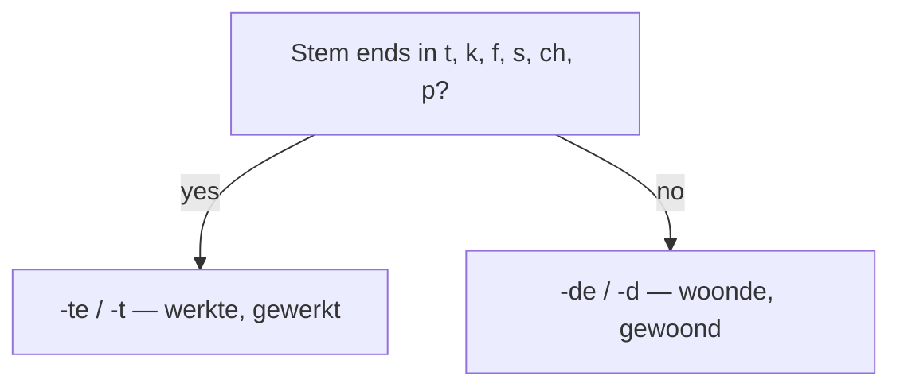

# The Imperfectum  *(A2)*

The **imperfectum** (*onvoltooid verleden tijd*, OVT) is the simple past — one word, like English *worked*, *walked*, *ate*. Weak verbs add an ending to the stem; strong verbs change their vowel.

## Weak verbs — stem + *-te(n)* / *-de(n)*

Take the **stem**, then add **-te / -ten** or **-de / -den**. Which one? The mnemonic decides:

> **'t kofschip** ("the merchant ship"). If the stem ends in one of **t, k, f, s, ch, p**, add **-te(n)**. Otherwise add **-de(n)**. (Same consonants in the alternative mnemonics **'t fokschaap** and the English **soft ketchup**.)

| Stem ends in | Ending | Example | English |
|--------------|--------|---------|---------|
| **t, k, f, s, ch, p** | **-te(n)** | *werken → **werkte*** | worked |
| anything else (vowels, *b, d, g, l, m, n, r, v, z*) | **-de(n)** | *wonen → **woonde*** | lived |

Conjugation is easy: **every singular person shares one form**; the plural just adds **-n**.

| Person | *werken* (te) | *wonen* (de) |
|--------|---------------|--------------|
| *ik / jij / hij / zij / het / u* | **werkte** | **woonde** |
| *wij / jullie / zij* | **werkten** | **woonden** |

More weak verbs:

- *koken → **kookte*** (cooked) · *praten → **praatte*** (talked) · *fietsen → **fietste*** (cycled)
- *luisteren → **luisterde*** (listened) · *leren → **leerde*** (learned) · *bellen → **belde*** (called)

> **Voicing trap:** base the choice on the consonant in the **infinitive**, not on the devoiced stem. Stems written with *-f / -s* that come from *v / z* still take **-de**: *leven → **leefde***, *reizen → **reisde***, *verhuizen → **verhuisde***.

## Strong verbs — vowel change

Strong verbs do **not** use *-te / -de*. They change the stem vowel (ablaut) and keep one form across the whole singular; the plural adds **-en** (often with a second vowel again).

| Infinitive | Past sg | Past pl | English |
|------------|---------|---------|---------|
| **eten** | at | aten | ate |
| **lopen** | liep | liepen | walked |
| **drinken** | dronk | dronken | drank |
| **zien** | zag | zagen | saw |
| **gaan** | ging | gingen | went |

- *Wij **dronken** koffie en **aten** taart.* — We drank coffee and ate cake.

The full principal-parts list lives on the [verbs](/#/grammar?doc=5-verbs/19-verbs.md) page — strong verbs have to be memorised one by one.

## Worked example

*Vroeger **woonde** ik in Utrecht en **fietste** ik elke dag naar mijn werk.*
— "I used to live in Utrecht and cycled to work every day."

- *woonde* = *wonen*, stem *woon*, ends in *-n* → **-de**.
- *fietste* = *fietsen*, stem *fiets*, ends in *-s* (in 't kofschip) → **-te**.
- *vroeger* ("formerly") flags a habitual past — the imperfectum's home turf.

> **Imperfectum or perfectum?** The imperfectum narrates and describes (habits, background); the perfectum reports single completed events and dominates in speech. The full choice lives in [past narratives](/#/grammar?doc=7-modes/03-past_narrative.md).

## Oefen — practice

- [ ] Vroeger **woonde** ik in Gent.
- [ ] Gisteren **werkte** hij de hele dag.
- [ ] We **dronken** thee in de tuin.
- [ ] Zij **ging** elke zomer naar zee.

## Common mistakes

- ❌ *leven → leefte* → ✅ *leven → **leefde*** — the *f* comes from *v*, so it takes *-de*.
- ❌ *wij **werkte*** → ✅ *wij **werkten*** — the plural adds *-n*.
- ❌ *ik **gingde** / **liepte*** → ✅ *ik **ging** / **liep*** — strong verbs change the vowel; they never take *-te / -de*.
- ❌ testing 't kofschip on the infinitive ending → ✅ test the **stem's** last consonant: *praten → stem praat → **praatte***.
