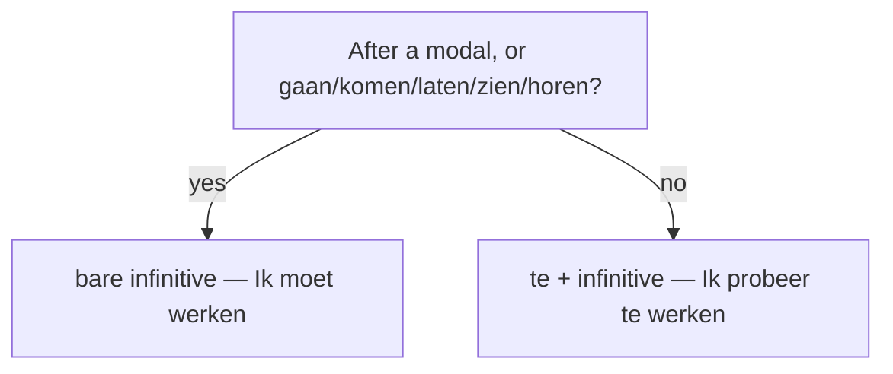

# The *te + infinitive* construction  *(B1)*

Dutch links two verbs in many ways. One of the most common is `te + infinitive`:

- *Hij probeert **te slapen**.* — He's trying to sleep.
- *Ik hoop je morgen **te zien**.* — I hope to see you tomorrow.

This page covers when *te* is required, when it's forbidden, and the four sub-constructions that wrap *te* in a connector (*om te*, *door te*, *zonder te*, *na te hebben*).

## The basic pattern

```
[main clause] ...   te [infinitive] .
```

The *te + infinitive* sits at the end of the clause, in the verb pile.

- *Ik probeer **te slapen**.* — I'm trying to sleep.
- *Hij weigert **te luisteren**.* — He refuses to listen.
- *Het begint **te regenen**.* — It's starting to rain.

With a separable verb, *te* goes **between** the prefix and the stem, written as three separate elements:

- *opstaan* → *Hij probeert **op te staan**.* — He's trying to get up.
- *aanbieden* → *Ze hoopt het **aan te bieden**.* — She hopes to offer it.

> Never glue *te* onto the verb: ❌ *opte staan* / *aante bieden*.

### Worked example

*Ze probeert de wekker **uit te zetten**.* — "She's trying to turn off the alarm."

- *uitzetten* is separable, so *te* splits it: prefix *uit* + *te* + stem *zetten*, three written words.
- The whole cluster *uit te zetten* sits at the **end** of the clause; *probeert* holds the V2 slot.

## Verbs that take *te + infinitive*

Most verbs that combine with another verb take *te*. Common ones:

| Verb | Example |
|------|---------|
| **proberen** | *Ik probeer het **te begrijpen**.* |
| **hopen** | *Ik hoop je **te zien**.* |
| **beloven** | *Hij belooft **te komen**.* |
| **weigeren** | *Ze weigert **te helpen**.* |
| **vergeten** | *Ik vergeet altijd **te bellen**.* |
| **besluiten** | *Hij besluit **te blijven**.* |
| **durven** | *Ik durf het niet **te zeggen**.* |
| **beginnen** | *Het begint **te sneeuwen**.* |
| **leren** | *Ze leert **te zwemmen**.* (also without *te*, see below) |

Also adjectives + *te*:

- *Ik ben blij je **te zien**.* — I'm happy to see you.
- *Het is moeilijk **te begrijpen**.* — It's hard to understand.

And impersonal expressions:

- *Het is tijd **te gaan**.* — It's time to go.
- *Er is niets meer **te doen**.* — There's nothing more to do.

## Verbs that do NOT take *te*

A small but high-frequency group takes a bare infinitive instead.



| Verb | Example |
|------|---------|
| **modals** (kunnen, moeten, mogen, willen, zullen) | *Ik **kan zwemmen**.* |
| **gaan** | *Ik ga **werken**.* |
| **komen** | *Hij komt **eten**.* |
| **blijven** | *Ze blijft **staan**.* |
| **laten** | *Hij laat me **wachten**.* |
| **doen** | *Dat doet me **denken** aan...* |
| **zien** | *Ik zie hem **komen**.* |
| **horen** | *Ik hoor het kind **huilen**.* |
| **voelen** | *Ik voel mijn hart **kloppen**.* |
| **leren** | *Ik leer hem **zwemmen**.* (also with *te*) |
| **helpen** | *Ik help je **koken**.* (also with *te*) |

> **Modal verbs** stack in long verb piles without *te*: *Ik **moet kunnen werken**.* — I must be able to work. See [modal verbs](/#/grammar?doc=5-verbs/23-modal_verbs.md).

### The *hoeven* exception

*Hoeven* always takes *te*. It's only ever used with *niet*, *geen*, or *nauwelijks* — there is no positive form.

- *Je **hoeft niet** **te komen**.* — You don't need to come.
- *Ik **hoef** alleen maar **te wachten**.* — I just need to wait.

*Hoeven* is the negative counterpart of *moeten*. *Moeten* takes a bare infinitive; *hoeven* takes *te*:

- *Ik moet **werken**.* — I must work.
- *Ik hoef niet **te werken**.* — I don't have to work.

## *om ... te + infinitive* — purpose

For purpose ("in order to"), Dutch uses *om ... te + infinitive*:

- *Ik ga naar de winkel **om brood te kopen**.* — I'm going to the shop to buy bread.
- *Hij belt **om hulp te vragen**.* — He's calling to ask for help.

The *om*-clause can stand at the front for emphasis:

- ***Om je te helpen**, ben ik gekomen.* — To help you, I came.

After certain words (*genoeg, te + adj, tijd, kans, reden*), *om ... te* is required even though English uses bare "to":

- *Hij is **te moe om te werken**.* — He's too tired to work.
- *Ik heb geen **tijd om te koken**.* — I have no time to cook.
- *Ze heeft een **reden om te lachen**.* — She has a reason to laugh.
- *Dat is een **kans om te leren**.* — That's a chance to learn.

> Many learners drop *om* in these — it sounds wrong: ❌ *Ik heb tijd te koken.* The Dutch is consistent: *om ... te* is the default when there's a purpose, a reason, or a "too X to Y" frame.

## *door / zonder / in plaats van ... te + infinitive*

Three more connectors that wrap *te*:

| Connector | Meaning | Example |
|-----------|---------|---------|
| **door ... te** | by (means of) | *Hij leert **door** veel **te lezen**.* — He learns by reading a lot. |
| **zonder ... te** | without | *Ze ging weg **zonder** iets **te zeggen**.* — She left without saying anything. |
| **in plaats van ... te** | instead of | *Hij sliep **in plaats van te werken**.* — He slept instead of working. |
| **alvorens te** *(formal)* | before -ing | *Alvorens **te beslissen**, wilde hij meer weten.* |

## *na te hebben + participle* — after having done

For "after having done X", Dutch uses *na + te + hebben/zijn + participle*. This is formal — in speech, a subordinate clause with *nadat* is more common.

- ***Na het boek te hebben gelezen**, gaf hij zijn mening.* — After having read the book, he gave his opinion.
- ***Na te zijn aangekomen**, ging hij meteen slapen.* — After arriving, he went to sleep immediately.

Spoken equivalent: *Nadat hij het boek had gelezen, gaf hij zijn mening.*

## Common mistakes

- ❌ *Ik moet **te werken**.* → ✅ *Ik moet werken.* — modals take a bare infinitive.
- ❌ *Ik hoef werken.* → ✅ *Ik hoef niet **te werken**.* — *hoeven* always takes *te*, always with negation.
- ❌ *Ik ben moe **te werken**.* → ✅ *Ik ben **te moe om te werken**.* — "too X to Y" needs *om ... te*.
- ❌ *Hij probeert **opte staan**.* → ✅ *Hij probeert **op te staan**.* — *te* splits the separable verb; three written elements.
- ❌ *Ik ga te werken.* → ✅ *Ik ga werken.* — *gaan* takes a bare infinitive.
- ❌ *Ze leerde me te zwemmen* (only) → ✅ *Ze leerde me zwemmen.* — *leren* prefers the bare form when teaching/learning a skill.
- ❌ *Hij belde **te vragen** om hulp.* → ✅ *Hij belde **om hulp te vragen**.* — purpose needs *om ... te*.
- ❌ *Hij ging weg **zonder zeggen**.* → ✅ *Hij ging weg **zonder iets te zeggen**.* — *zonder* + *te* + infinitive.
