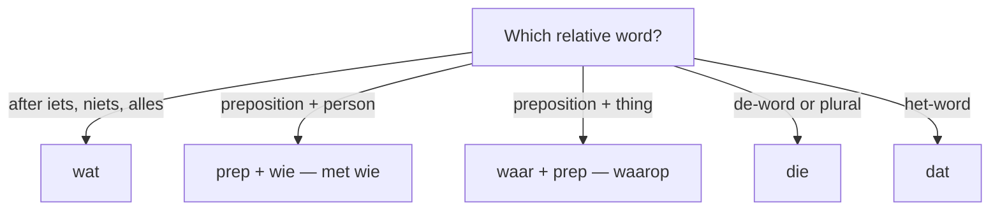

# Relative Clauses: **die**, **dat**, **waar-**, **wie**  *(B1)*

A **relative clause** attaches extra information to a noun (the *antecedent*). In Dutch, the relative pronoun is chosen by the noun's **gender** (de-word vs. het-word), not by its grammatical role in the clause. Like all subordinate clauses, the verb goes to the **end**.

A relative clause attaches after the noun and is verb-final inside:

- *de vrouw **die naast me woont*** — the woman who lives next to me
- *het huis **dat we kochten*** — the house that we bought
- *de stad **waar ik woon*** — the city where I live

Choosing the relative word:

## The core choice: **die** vs. **dat**

| Antecedent | Pronoun | Example |
|------------|---------|---------|
| de-word (singular) | **die** | De man **die** daar **staat**, is mijn buurman. |
| het-word (singular) | **dat** | Het kind **dat** mij **belde**, was mijn neef. |
| de-word (object role) | **die** | De vrouw **die** ik gisteren **zag**, werkt hier. |
| het-word (object role) | **dat** | Het boek **dat** ik **lees**, is spannend. |

> Unlike German, Dutch relative pronouns are **not case-marked** — *die* and *dat* serve as both subject and object of their clause. The role is read off word order.

## Plurals: always **die**

All plural antecedents take **die**, regardless of whether the singular is *de* or *het*.

| Antecedent | Example |
|------------|---------|
| de mannen | De mannen **die** daar **staan**, zijn buren. |
| de kinderen | De kinderen **die** mij **belden**, waren neven. |
| de boeken (← *het boek*) | De boeken **die** ik **las**, waren spannend. |

## Prepositions + things: **waar-** fusion

When the relative pronoun is the **object of a preposition** and refers to a *thing*, Dutch fuses **waar** + preposition into a single word. The preposition stays at the end of the clause (or the fused form sits at the front).

| Form | Example |
|------|---------|
| **waarop** | De stoel **waarop** ik **zit**, is oud. |
| **waarover** | Het boek **waarover** hij **sprak**, ligt daar. |
| **waarmee** | De pen **waarmee** ik **schreef**, is leeg. |
| **waarvoor** | Het probleem **waarvoor** ik **kwam**, is opgelost. |

> In speech and informal writing, you'll also hear the split form: *De stoel **waar** ik **op** zit*. Both are correct.

## Prepositions + people: *preposition + **wie***

For people, **don't** fuse with **waar-**; use **preposition + wie**.

| Example | English |
|---------|---------|
| De man **met wie** ik **werk** | The man with whom I work |
| De vrouw **aan wie** ik het **gaf** | The woman to whom I gave it |
| De vrienden **op wie** ik **wacht** | The friends I'm waiting for |

## Indefinite or abstract antecedents: **wat**

When the antecedent is indefinite (*alles*, *iets*, *niets*, *veel*, *het enige*) or a whole clause, use **wat**.

| Example | English |
|---------|---------|
| Alles **wat** hij **zegt**, is waar. | Everything (that) he says is true. |
| Er is iets **wat** ik je **wil vertellen**. | There is something I want to tell you. |
| Het beste **wat** je **kunt doen**, is wachten. | The best thing you can do is wait. |
| Hij kwam te laat, **wat** mij **stoorde**. | He came late, which annoyed me. |

## Verb-final and comma rules

- The conjugated verb of the relative clause goes to the **end** (it's a subordinate clause): *De man die daar **staat**, is mijn buurman.*
- **Non-restrictive** (extra, removable info) takes commas on **both** sides: *Mijn buurman, **die** daar staat, zwaait naar ons.*
- **Restrictive** (which one exactly) takes no opening comma; a comma still closes the clause where the main sentence resumes: *De man **die** daar staat, is mijn buurman.*
- Unlike English *that* vs *which*, Dutch does not change the pronoun for this distinction — it leans on the commas.

## Worked example

*De vrouw* **die** *ik gisteren* **zag**, *werkt hier.*

| Piece | Role |
|-------|------|
| *De vrouw* | antecedent — a **de**-word |
| **die** | relative pronoun (de-word → *die*); object of the clause |
| *ik gisteren* | subject + time inside the clause |
| **zag** | finite verb, pushed to the **end** |
| *, werkt hier* | main clause resumes; its verb *werkt* is second |

## Practice

- [ ] De trein **die** naar Utrecht gaat, is vertraagd. — The train that goes to Utrecht is delayed.
- [ ] Het huis **dat** we kochten, is oud. — The house that we bought is old.
- [ ] De collega **met wie** ik werk, is aardig. — The colleague I work with is nice.
- [ ] Alles **wat** hij zei, was waar. — Everything he said was true.
- [ ] De stad **waar** ik woon, is klein. — The city where I live is small.

## Common mistakes

- Using **die** for a het-word singular: ❌ *het kind **die*** → ✅ *het kind **dat***.
- Using **dat** for a plural het-word: ❌ *de boeken **dat*** → ✅ *de boeken **die***.
- Forgetting verb-final order: ❌ *De man die **staat** daar* → ✅ *De man die daar **staat***.
- Using **waar-** with people: ❌ *de man **waarmee** ik werk* → ✅ *de man **met wie** ik werk*.
- Using **dat** after *alles/iets*: ❌ *alles **dat** hij zegt* → ✅ *alles **wat** hij zegt*.
