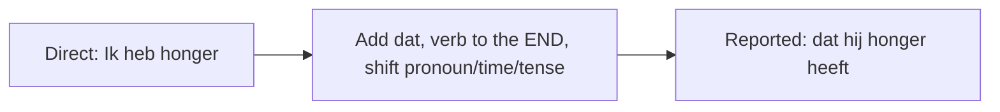

# Reported Speech with **dat**  *(B2)*

**Reported (indirect) speech** relays what someone said, asked, or thought. In Dutch it is built on the subordinator **dat** ("that") — and because **dat** is a subordinator, the verb of the reported clause moves to the **end**.

## 1. The basic pattern

| Direct | Reported |
|--------|----------|
| *Hij zegt: "Ik heb honger."* | *Hij zegt **dat** hij honger **heeft**.* |
| *Ze zei: "Ik kom morgen."* | *Ze zei **dat** ze de volgende dag **zou komen**.* |
| *Ik denk: "Het is moeilijk."* | *Ik denk **dat** het moeilijk **is**.* |

> The finite verb (*heeft*, *zou komen*, *is*) sits at the very end — the subordinate-clause rule from [subordinating conjunctions](/#/grammar?doc=6-structures/03-subordinating.md).

## 2. Pronoun and time-word shifts

Switching from direct to reported speech, you re-anchor the utterance to the reporter's viewpoint:

- **Pronouns** shift with the new speaker: *ik* → *hij/zij*, *jij* → *ik*, *mijn* → *zijn/haar*.
- **Time and place words** shift away from the original "here and now":

| Direct | Reported |
|--------|----------|
| *gisteren* | *de dag ervoor* |
| *morgen* | *de volgende dag* |
| *nu* | *toen* |
| *hier* | *daar* |

| Direct | Reported |
|--------|----------|
| *Hij zei: "**Ik** kom **morgen**."* | *Hij zei dat **hij** **de volgende dag** zou komen.* |
| *Zij zei: "**Ik** was **gisteren** ziek."* | *Zij zei dat **ze** **de dag ervoor** ziek was geweest.* |

## 3. Tense backshift (optional but common)

When the reporting verb is in the past (*zei*, *vertelde*, *dacht*), Dutch usually — though not obligatorily — shifts the reported tense one step back:

| Direct tense | Reported tense | Example |
|--------------|----------------|---------|
| present | imperfect | *"Ik **werk**."* → *Hij zei dat hij **werkte**.* |
| perfect | past perfect | *"Ik **heb gegeten**."* → *Hij zei dat hij **had gegeten**.* |
| future (*zal*) | conditional (*zou*) | *"Ik **zal komen**."* → *Hij zei dat hij **zou komen**.* |

> Dutch is more flexible than English here: keeping the present is fine when the statement is still true — *Hij zei dat hij in Utrecht **woont*** (and he still does).

## 4. Reported questions

For **yes/no** questions, drop the inversion and use **of** ("whether"):

- *"Kom je morgen?"* → *Hij vraagt **of** je morgen **komt**.*

For **wh-** questions, keep the question word — it acts as the subordinator:

- *"Waar woon je?"* → *Hij vraagt **waar** je **woont**.*
- *"Wanneer komt hij?"* → *Ze wil weten **wanneer** hij **komt**.*

In both cases the verb still goes to the end.

## Worked example

*Ze zei: "Ik heb het gisteren gedaan."* → *Ze zei* **dat** *ze het* *de dag ervoor* **had gedaan**.

| Change | From → To |
|--------|-----------|
| pronoun | *ik* → *ze* |
| time word | *gisteren* → *de dag ervoor* |
| tense (backshift) | *heb gedaan* → *had gedaan* |
| word order | verb cluster **had gedaan** moves to the end after **dat** |

## Practice

- [ ] Hij zegt **dat** hij geen tijd heeft. — He says that he has no time.
- [ ] Ze vroeg **of** ik kon helpen. — She asked whether I could help.
- [ ] Ik dacht **dat** je al weg was. — I thought that you had already left.
- [ ] Hij vroeg **waar** ik woonde. — He asked where I lived.

## Common mistakes

- ❌ *Hij zegt dat hij **heeft** honger* → ✅ *Hij zegt dat hij honger **heeft*** — verb to the end.
- ❌ Dropping **dat**: Dutch generally keeps **dat**, unlike English "he says he's tired".
- ❌ *Hij vraagt **kom je** morgen* → ✅ *Hij vraagt **of** je morgen **komt*** — no inversion in a reported yes/no question.
- Forgetting to shift pronouns and time words when the speaker or moment changes.
