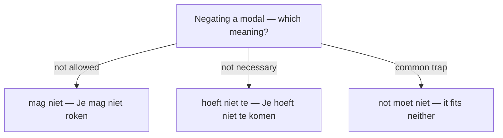

# The Modalities  *(B1)*

Dutch expresses *modality* — desire, ability, possibility, obligation, permission, and the speaker's stance — mostly through six **modal verbs** (*willen, kunnen, mogen, moeten, zullen, hoeven*), backed up by adverbs (*misschien, waarschijnlijk, vast, wel*) and fixed phrases. The same modal often covers several meanings, and each meaning has more than one form. The table maps *meanings* to *forms*; the sections that follow give examples.

> For how the modal verbs *conjugate* and stack (double infinitives, IPP), see [modal verbs](/#/grammar?doc=5-verbs/23-modal_verbs.md). This page is about *which form expresses which meaning*.

| Modality | Primary verb(s) | Alternative phrasings |
|----------|-----------------|-----------------------|
| Desire / wish | **willen** | *graag (willen), zin hebben in, trek hebben in, verlangen naar, wensen* |
| Intention / plan | **gaan**, **zullen** | *van plan zijn, voornemens zijn, de bedoeling hebben om te, denken te* |
| Ability | **kunnen** | *in staat zijn om te, weten te, lukken (het lukt … te)* |
| Possibility | **kunnen** | *misschien, wellicht, mogelijk, eventueel, het kan (zijn) dat* |
| Probability / deduction | **moeten**, **zullen** + *wel* | *vast (wel), waarschijnlijk, ongetwijfeld, wel* |
| Prediction | **zullen**, **gaan**, present + time word | *morgen, straks, volgende week, op het punt staan om te* |
| Permission | **mogen** | *toestaan, het is toegestaan om te, toestemming hebben om te* |
| Prohibition | **mogen** + *niet* | *verboden zijn, niet toegestaan, verbieden* |
| Obligation / necessity | **moeten** | *dienen te, horen te, behoren te, verplicht zijn om te, het is nodig* |
| Absence of necessity | **hoeven** + *niet/geen* | *niet nodig zijn, het hoeft niet* |
| Advice / recommendation | **moeten**, **zou(den)** + *moeten* | *horen te, je kunt beter, aanraden, er goed aan doen om te* |
| Offer / proposal | **zullen** | *zal ik…, zullen we…, laten we…, wil je…* |
| Politeness / request | **zou(den)**, **willen** | *graag, alstublieft, zou je kunnen…* |
| Hearsay / report | **zou(den)**, **moeten**, **schijnen** | *naar verluidt, het schijnt dat* |

## Desire / wish — *willen*

- Ik **wil** koffie. (I want coffee.)
- Ik **wil graag** komen. (I'd like to come. — softer)
- Ik **heb zin in** een wandeling. (I feel like a walk.)
- Ik **heb trek in** iets zoets. (I fancy something sweet. — food/drink)
- Zij **verlangt naar** rust. (She longs for rest. — strong, literary)
- **Wilt** u suiker? (Would you like sugar?)

## Intention / plan — *gaan*, *zullen*

- Ik **ga** morgen **studeren**. (I'm going to study tomorrow.)
- We **gaan** in juni **trouwen**. (We're going to marry in June.)
- We **zullen** dat regelen. (We'll arrange that.)
- Ik **ben van plan om** te blijven. (I plan to stay.)
- Ik **denk** volgend jaar **te** verhuizen. (I'm thinking of moving next year.)
- Zij **is voornemens** te stoppen. (She intends to quit. — formal)

For choosing between *gaan*, *zullen*, and the plain present, see [talking about the future](/#/grammar?doc=7-modes/02-future.md).

## Ability — *kunnen*

- Ik **kan** zwemmen. (I can swim.)
- Zij **weet** hem **te** overtuigen. (She manages to convince him. — pulls it off, knows how)
- Hij **is in staat om** dit **te** repareren. (He's able to repair this.)
- Het **lukt** me niet om dit **te** openen. (I can't manage to open this. — outcome-focused)

## Possibility — *kunnen*

- Het **kan** regenen. (It might rain.)
- **Misschien** komt hij later. (Maybe he'll come later.)
- Het is **mogelijk dat** de trein vertraging heeft. (It's possible the train is delayed.)
- **Eventueel** kom ik later. (I might come later, if need be.)
- Het **kan zijn dat** ze het vergeten is. (It may be that she forgot.)

Note the overlap with ability: *Ik kan zwemmen* = I have the skill, but *De rivier kan bevriezen* = it is possible (the river may freeze).

## Probability / deduction — *moeten*, *zullen wel*

*Moeten* marks confident deduction; *zullen wel* a plausible guess; *vast (wel)* is colloquial.

- Dat **moet** een vergissing zijn. (That must be a mistake.)
- Hij **zal** wel moe zijn. (He's probably tired.)
- Ze is **vast** thuis. (She's surely at home.)
- **Waarschijnlijk** regent het morgen. (It'll probably rain tomorrow.)

## Prediction — *zullen*, *gaan*, present + time word

- Het **zal** regenen. (It will rain. — prediction)
- Hij **gaat** winnen. (He's going to win.)
- Morgen **vertrek** ik. (I leave tomorrow. — present + time word)
- De trein **staat op het punt** te vertrekken. (The train is about to leave. — imminent)
- Ik **zal** het niet **vergeten**. (I won't forget it. — promise)

## Permission — *mogen*

- Je **mag** gaan. (You may go.)
- U **mag** hier parkeren. (You may park here.)
- Het **is toegestaan om** foto's **te** maken. (Photos are permitted.)
- Ik **heb toestemming om** hier **te** werken. (I have permission to work here.)

## Prohibition — *mogen* + *niet*

- Je **mag** hier **niet** roken. (You may not smoke here.)
- Het **is verboden** te zwemmen. (Swimming is forbidden.)
- Roken **is niet toegestaan**. (Smoking is not permitted.)
- De wet **verbiedt** dit. (The law forbids this. — active verb)

> **English contrast:** "you must not" is *not* *je moet niet*. Dutch forbids with *mogen niet*: *Je mag hier niet roken* = you must not smoke here.

## Obligation / necessity — *moeten*

- Ik **moet** werken. (I must work.)
- We **moeten** op tijd zijn. (We have to be on time.)
- U **dient** zich **te** legitimeren. (You are required to show ID. — formal)
- Je **hoort** dat niet **te** doen. (You're not supposed to do that. — propriety / moral norm)
- Men **behoort** stil **te** zijn. (One ought to be quiet. — formal, written)
- Het **is nodig** dat je belt. (It's necessary that you call.)

## Absence of necessity — *hoeven* + *niet/geen*

*Hoeven* is the negative counterpart of *moeten*. It almost always appears with *niet*, *geen*, or *nauwelijks*, and takes *te + infinitive*.

- Je **hoeft niet te** komen. (You don't need to come.)
- Dat **hoefde niet**. (That wasn't necessary.)
- Je **hoeft** je niet **te** haasten. (You needn't hurry.)

> The negative of *moeten* is *hoeven … niet*, **not** *moeten niet*. *Ik moet niet komen* sounds wrong; say *Ik hoef niet te komen*.

## Advice / recommendation — *moeten*, *zou(den) moeten*

*Moeten* softens to advice in the right context; *zou(den) moeten* is gentler still.

- Je **moet** even rusten. (You should rest a bit.)
- Je **zou** dat **moeten** lezen. (You should read that.)
- Je **kunt beter** met de trein gaan. (You'd better take the train.)
- Je **kunt het beste** nu gaan. (You'd best go now.)
- Ik **raad** je **aan** te wachten. (I advise you to wait.)
- Je **doet er goed aan** te reserveren. (You'd do well to book.)

## Offer / proposal — *zullen*, *laten we*

- **Zal** ik je helpen? (Shall I help you?)
- **Zullen** we beginnen? (Shall we start?)
- **Laten we** beginnen. (Let's begin.)
- **Wil** je een kopje thee? (Would you like a cup of tea?)

For the *laten we* and *"Zullen we…?"* patterns in full, see [imperatives](/#/grammar?doc=7-modes/04-imperatives.md) and [the future](/#/grammar?doc=7-modes/02-future.md).

## Politeness / request — *zou(den)*, *willen*

The conditional forms *zou(den)* (from *zullen*) and *zou(den) kunnen* make a request polite.

- **Zou** je me kunnen helpen? (Could you help me?)
- Ik **zou graag** een tafel willen reserveren. (I'd like to reserve a table.)
- **Mag** ik even? (May I have a moment?)
- **Kunt** u dat herhalen, alstublieft? (Could you repeat that, please?)

## Hearsay / report — *zou(den)*, *moeten*, *schijnen*

Dutch also uses modal verbs to mark information taken from **someone else** (evidentiality) rather than from the speaker's own reasoning. Unlike deduction above, here the speaker *reports* a claim instead of weighing how likely it is.

- Hij **zou** ziek **zijn**. (He's reportedly ill. — reportative *zou*)
- Die film **moet** erg goed zijn. (That film is said to be very good.)
- Het **schijnt** te gaan regenen. (Apparently it's going to rain.)
- **Naar verluidt** vertrekt de directeur. (Reportedly, the director is leaving. — formal)

Contrast the two *moeten*: *Dat moet een vergissing zijn* is the speaker's own conclusion (deduction), while *Die film moet goed zijn* reports others' opinion (hearsay). Context and topic tell them apart.

## Common mistakes

- ❌ *Je moet niet roken* (for "you're not allowed to") → ✅ *Je mag niet roken* — prohibition is *mogen niet*; *moeten niet* doesn't forbid.
- ❌ *Ik moet niet komen* (for "I don't have to") → ✅ *Ik hoef niet te komen* — the negative of *moeten* is *hoeven … niet + te*.
- ❌ *Ik wil te gaan* → ✅ *Ik wil gaan* — modals take a **bare** infinitive, no *te* (only *hoeven* takes *te*).
- ❌ *Ik kan spreken Nederlands* → ✅ *Ik kan Nederlands **spreken*** — the infinitive lands at the **end**.
- ❌ *Ik zal morgen naar de dokter* (a routine plan) → ✅ *Ik ga morgen naar de dokter* — everyday plans use *gaan*; *zullen* sounds stiff (see [the future](/#/grammar?doc=7-modes/02-future.md)).
