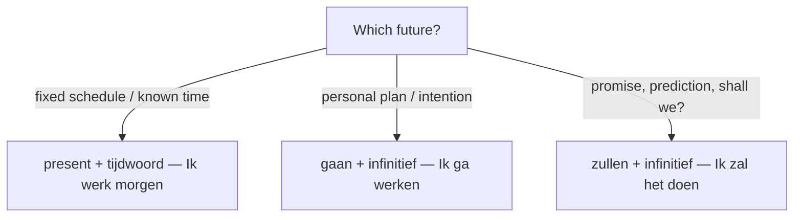

# Talking about the future  *(A2)*

Dutch has **no future-tense conjugation**. Three patterns cover it, each with a different feel — and in everyday speech the plain present does most of the work.

## Present tense + time marker (most common)

If the time is clear from context, just use the **present tense** with a time word. This is the everyday way to talk about the future — natural for plans, schedules, and near-future events.

| Time marker | Example | English |
|-------------|---------|---------|
| **straks** | Ik **bel** je straks. | I'll call you in a bit. |
| **morgen** | Hij **komt** morgen. | He's coming tomorrow. |
| **vanavond** | Wij **eten** vanavond bij oma. | We'll eat at grandma's tonight. |
| **volgende week** | Ze **vertrekken** volgende week. | They leave next week. |
| **over een uur** | Ik **ben** er over een uur. | I'll be there in an hour. |
| **volgend jaar** | Volgend jaar **werk** ik in Brussel. | Next year I'll be working in Brussels. |

## *gaan* + infinitive (intention / near future)

Use **gaan** + infinitive for something you intend or are about to do — like English "I'm going to …". Structure: **subject + *gaan* + … + infinitive (at the end)**.

| Pronoun | *gaan* |
|---------|--------|
| ik | ga |
| jij / hij / zij / het | gaat |
| wij / jullie / zij | gaan |

- *Hij **gaat** een nieuwe auto **kopen**.* — He's going to buy a new car.
- *Wat **ga** je vanavond **doen**?* — What are you going to do tonight?

> Don't double up: ❌ *Ik ga gaan winkelen* → ✅ *Ik ga winkelen*.

## *zullen* + infinitive (promise / prediction / suggestion)

**zullen** carries a promise, a prediction, or a polite suggestion. It is more formal than *gaan*.

- *Ik **zal** het morgen **doen**.* — I'll do it tomorrow. *(promise)*
- *Het **zal** wel **regenen**.* — It'll probably rain. *(hedged prediction)*
- ***Zullen** we **gaan**?* — Shall we go? *(suggestion)*

The *"Zullen we …?"* pattern is one of the most useful in Dutch:

- ***Zullen** we **eten**?* — Shall we eat?
- ***Zullen** we naar het strand **gaan**?* — Shall we go to the beach?

> **English contrast:** English "will" is *not* always *zullen*. For a plan, Dutch prefers the present or *gaan* (*Ik ga morgen werken*, not *Ik zal morgen werken*). Save *zullen* for promises, predictions, and "shall we?".

## Choosing between the three

| Situation | Best form | Example |
|-----------|-----------|---------|
| Fixed schedule / known time | present | *De trein **vertrekt** om acht uur.* |
| Personal plan / intention | *gaan* + inf. | *Ik **ga** morgen werken.* |
| Promise, prediction, formal | *zullen* + inf. | *Ik **zal** het niet vergeten.* |
| Suggestion ("shall we…?") | *zullen* + inf. | ***Zullen** we beginnen?* |

In casual speech, **present + time word** or **gaan + inf.** dominate; *zullen* sounds slightly bookish unless you're proposing or promising. For the fuller map of intention, prediction, and other stances, see [the modalities](/#/grammar?doc=7-modes/01-modalities.md).

## Stating plans explicitly

| Dutch | English | Example |
|-------|---------|---------|
| `Ik ben van plan om … te …` | I plan to … | *Ik ben van plan om volgend jaar **te** verhuizen.* |
| `Ik wil graag …` | I'd like to … | *Ik wil graag Nederlands leren.* |
| `Ik ga …` | I'm going to … | *Ik ga vanavond koken.* |

> *Ik ben van plan om* always pairs with **te + infinitive** at the end of the clause.

## Practice

- [ ] *Morgen **ga** ik naar de tandarts.* — intention with *gaan*.
- [ ] *De les **begint** om negen uur.* — fixed schedule → present.
- [ ] ***Zullen** we samen koken?* — suggestion with *zullen*.
- [ ] *Ik **zal** je niet vergeten.* — promise with *zullen*.
- [ ] *Volgende week **ben** ik op vakantie.* — present + time marker.

## Common mistakes

- ❌ *Ik ga gaan zwemmen* → ✅ *Ik ga zwemmen* — never stack *gaan* on *gaan*.
- ❌ *Ik zal morgen naar de winkel* (a routine plan) → ✅ *Ik ga morgen naar de winkel* — everyday plans use *gaan*; *zullen* sounds stiff.
- ❌ *Ik ga morgen kopen een auto* → ✅ *Ik ga morgen een auto **kopen*** — the infinitive lands at the **end**.
- ❌ *morgen* = "morning" → ✅ *morgen* on its own = **tomorrow**; "morning" is *de ochtend* (though *morgen* means "morning" inside fixed words: *goedemorgen*, *vanmorgen*).
