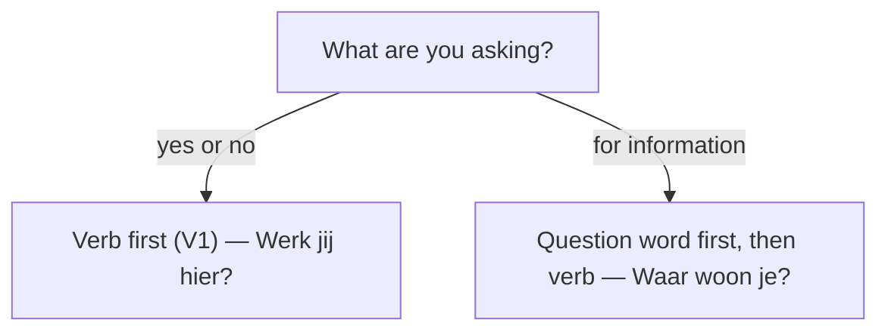

# Questions  *(A1)*

Dutch has exactly **two question shapes**: yes/no questions put the **verb first**; wh-questions put a **question word first**. Master those two skeletons and you can ask almost anything.

| Type | Pattern | Example |
|------|---------|---------|
| **Yes/No** | verb + subject + … ? | ***Werk** jij hier?* |
| **Wh- / information** | question word + verb + subject + … ? | ***Waar** woon je?* |

Any non-finite verb (infinitive, participle) or separable prefix still goes to the **end** of the clause. For the full inventory of question words (*wie, wat, welk(e), hoe, waarom, hoeveel …*), see [question words](/#/grammar?doc=1-auxilaries/60-vraag-worden.md).

## Yes/no questions — inversion (V1)

The conjugated verb moves to **slot 1**; the subject follows in slot 2.

| Statement | Question |
|-----------|----------|
| Jij **werkt** hier. | **Werk** jij hier? |
| Hij **komt** morgen. | **Komt** hij morgen? |
| We **hebben** koffie. | **Hebben** we koffie? |
| Het **is** koud. | **Is** het koud? |

> **Drop-t rule:** *jij / je* loses the verb's **-t** when it comes right *after* the verb: *Jij **werkt*** → ***Werk** jij?* This happens only with *jij/je*, and only in inversion.

The rest follows the subject in **time → manner → place** order (see [word order](/#/grammar?doc=6-structures/00-sentence.md)):

- ***Eet** je vanavond bij ons?*
- ***Gaat** hij morgen met de trein naar Brussel?*
- ***Heb** je dat al **gedaan**?* *(participle to the end)*

### Modal-verb questions

The modal takes slot 1 (or follows the question word); the main verb stays an **infinitive at the end**.

| Question | Type |
|----------|------|
| **Kun** je me **helpen**? | yes/no |
| **Mag** ik even **bellen**? | yes/no |
| **Zullen** we **eten**? | yes/no (suggestion) |
| **Waarom** moet ik dat **doen**? | wh- |
| **Wat** wil je **eten**? | wh- |

For modal conjugation and verb stacking, see [modal verbs](/#/grammar?doc=4-verbs/23-modal_verbs.md).

### Confirmation tags

Short tags seek agreement, like English "right?".

| Tag | Use | Example |
|-----|-----|---------|
| **toch?** | mild confirmation | *Het is mooi weer, **toch**?* |
| **hè?** | colloquial "right?" | *Lekker, **hè**?* |
| **niet(waar)?** | "isn't that so?" | *Je komt morgen, **niet**?* |
| **of niet?** | "or not?" | *Je gaat mee, **of niet**?* |

### Answering: *ja*, *nee*, *jawel*

| Answer | When |
|--------|------|
| **ja** | confirming a positive question |
| **nee** | denying it (or confirming a negative one) |
| **jawel** | contradicting a *negative* question — "yes, actually" |

> ***wel*** is the positive counterpart of *niet* and pairs with *jawel*: *"Je komt toch niet?" — "**Jawel**, ik kom **wel**."*

Form a negative question by adding *niet* or *geen* in the usual slots — *Heb je **geen** tijd?*, *Werk jij vandaag **niet**?* Such questions often expect *jawel* when you contradict the implied negative.

## Prepositional questions

When the question asks about the object of a preposition, people and things behave differently.

**People — preposition + *wie*:** *Met wie?* / *Voor wie?* / *Aan wie?* / *Over wie?*

**Things — *waar* + preposition** (never *wat* after a preposition). Fuse them into one word, or split them:

| Joined | Split (spoken) | English |
|--------|----------------|---------|
| **Waarop** wacht je? | **Waar** wacht je **op**? | What are you waiting for? |
| **Waarover** praat hij? | **Waar** praat hij **over**? | What's he talking about? |
| **Waarmee** schrijf je? | **Waar** schrijf je **mee**? | What are you writing with? |
| **Waaraan** denk je? | **Waar** denk je **aan**? | What are you thinking about? |

> Two prepositions change shape here: *met → mee*, *tot → toe* (so *waarmee*, *waartoe*). The split form is more natural in speech; the joined form is more formal. This mirrors *er*-words — see [question words](/#/grammar?doc=1-auxilaries/60-vraag-worden.md).

## Indirect (embedded) questions

Wrap a question inside another clause to ask more politely. The embedded verb moves to the **end**.

**Wh-questions** keep the question word as the link:

| Direct | Embedded |
|--------|----------|
| **Waar** woont hij? | Ik weet niet **waar** hij **woont**. |
| **Hoeveel** kost dat? | Kun je me zeggen **hoeveel** dat **kost**? |
| **Waarom** kom je niet? | Ik begrijp niet **waarom** je niet **komt**. |

**Yes/no questions** swap inversion for **of** ("whether"):

| Direct | Embedded |
|--------|----------|
| **Komt** hij morgen? | Weet je **of** hij morgen **komt**? |
| **Mag** ik binnenkomen? | Ik wilde vragen **of** ik **binnen mag komen**. |

Common openers: *weten, vragen, zich afvragen, begrijpen, vertellen, zeggen*. When you *report* what someone asked, the tense may shift back too — see [reported speech](/#/grammar?doc=6-structures/05-reported_speech.md).

## Practice

- [ ] ***Werk** jij morgen?* — yes/no inversion, drop-t.
- [ ] ***Waar** kom je **vandaan**?* — origin needs *vandaan*.
- [ ] ***Waarop** wacht je?* / ***Waar** wacht je **op**?* — thing + preposition.
- [ ] *Weet je **of** de winkel open is?* — embedded yes/no with *of*.
- [ ] *Ik vraag me af **waarom** hij niet **komt**.* — embedded wh-, verb-final.

## Common mistakes

- ❌ *Waar jij woont?* → ✅ ***Waar woon jij?*** — the verb comes before the subject in wh-questions too.
- ❌ *Werkt jij hier?* → ✅ *Werk jij hier?* — drop the **-t** with *jij/je* after the verb.
- ❌ *Hoe ben je?* → ✅ ***Hoe gaat het?*** — "How are you?" is idiomatic, not word-for-word.
- ❌ *Waar kom je?* → ✅ *Waar kom je **vandaan**?* — origin needs *vandaan*; destination needs *heen / naartoe*.
- ❌ *Op wat wacht je?* → ✅ ***Waarop** wacht je?* — no *wat* after a preposition; use *waar + preposition*.
- ❌ *Ik weet niet waar **woont hij*** → ✅ *Ik weet niet **waar hij woont*** — embedded questions are verb-final.
- ❌ Answering a negative question with *ja* to disagree → ✅ use ***jawel***.
- Confusing *of* = "or" with *of* = "whether" in embedded questions.
