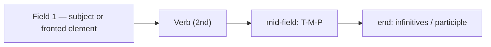

# Sentence  *(A2–B1)*

Dutch grammar is, above all, **word order**. One rule governs almost everything: the **finite (conjugated) verb sits second in a main clause** and **last in a subordinate clause**. Everything else fills slots around that verb.

## The V2 rule (main clauses)

In a main clause the **finite verb is always the second element**. Slot 1 holds exactly **one** thing — a subject, an object, an adverb, or a whole clause — and the verb follows immediately.

| Slot 1 | Slot 2 (verb) | Rest |
|--------|---------------|------|
| *Ik* | **werk** | morgen in Utrecht. |
| *Morgen* | **werk** | ik in Utrecht. |
| *In Utrecht* | **werk** | ik morgen. |
| *Wat* | **doe** | je vandaag? |

> When something other than the subject opens the sentence, the subject jumps to just **after** the verb. This is **inversion**.

English keeps subject and verb together (*Tomorrow I work…*); Dutch does not. Beginners often say ❌ *Morgen ik werk in Utrecht* — Dutch requires *Morgen **werk** ik in Utrecht*.

## The sentence frame (slots)

Picture a main clause as positions around two "verb poles":

| 1 front | 2 finite verb | 3 subject | 4 mid-field (time · manner · place · object) | 5 end (verb cluster) |
|---------|---------------|-----------|----------------------------------------------|----------------------|
| *Vandaag* | **heb** | ik | met mijn vriend in het park | **gewandeld.** |
| *Hij* | **wil** | — | morgen in Antwerpen | **werken.** |
| *Wij* | **hebben** | — | de film gisteren | **gezien.** |

- **Slot 1** — any single element (subject, time, place, or a whole clause).
- **Slot 2** — the finite verb. Always.
- **Slot 3** — the subject, if it didn't take slot 1.
- **Slot 4** — the **mid-field**: adverbs and objects, ordered **time → manner → place**.
- **Slot 5** — the **end field**: participles, infinitives, and separable prefixes.

> Slots 2 and 5 form the **sentence bracket** (*tangconstructie*): the finite verb opens it, the non-finite verbs close it, and the content sits in between.

## The mid-field: T-M-P

When several elements share the mid-field, Dutch orders them **Time → Manner → Place**.

| Time | Manner | Place |
|------|--------|-------|
| *morgen* | *met de trein* | *naar Amsterdam* |
| *gisteren* | *snel* | *naar huis* |

- *Ik ga **morgen met de trein naar Amsterdam**.*
- *Ik ben **gisteren snel naar huis** gegaan.*
- *Hij werkt **vandaag hard op kantoor**.*

> **English is the mirror image**: Place–Manner–Time (*home quickly yesterday*). Flipping it back to front is one of the most common interference errors.

Promote any element to slot 1 for emphasis — the verb still stays second:

- *Morgen ga ik met de trein naar Amsterdam.* (emphasises *time*)
- *Met de trein ga ik morgen naar Amsterdam.* (emphasises *manner*)

### Worked example

*Gisteren* **heb** *ik* *met mijn broer in de stad* **gewandeld**.

| Slot | Word(s) | Role |
|------|---------|------|
| 1 front | *Gisteren* | fronted **time** |
| 2 verb | **heb** | finite verb (V2) |
| 3 subject | *ik* | subject after the verb (inversion) |
| 4 mid-field | *met mijn broer* · *in de stad* | **manner**, then **place** |
| 5 end | **gewandeld** | past participle closes the bracket |

## The verb cluster at the end

Every **non-finite verb** (past participle, infinitive) and every **separable prefix** goes to the **end** of the main clause, closing the bracket.

| Example | English |
|---------|---------|
| *Ik heb gisteren een boek **gelezen**.* | I read a book yesterday. |
| *Hij wil morgen voetbal **spelen**.* | He wants to play football tomorrow. |
| *Ze staat om zeven uur **op**.* | She gets up at seven. (separable *opstaan*) |
| *Ik ga vanavond **werken**.* | I'm going to work tonight. |

> With two non-finite verbs, the **infinitive of the main verb comes last**: *Ik heb het **moeten doen*** (I had to do it); *Hij is gaan **zwemmen***.

## Mid-field order: pronouns, definite objects, negation

Light, already-known material moves left; new, heavy material stays right.

- **Pronouns** and **definite** noun objects come **early**, before a time adverb:
  - *Ik heb **het** gisteren gelezen.* (pronoun first)
  - *Ik heb **het boek** gisteren gelezen.* (definite NP first)
- **Indefinite** objects stay **later**:
  - *Ik heb gisteren **een boek** gelezen.*
- **niet** comes **late** — after definite objects, just before the end verbs:
  - *Ik heb het boek gisteren **niet** gelezen.*

See [negation](/#/grammar?doc=1-auxilaries/24-negators.md) for the full *niet* vs *geen* rules.

## Practice

- [ ] **Morgen** ga ik naar de tandarts. — Tomorrow I'm going to the dentist.
- [ ] Ik heb het boek nog niet **gelezen**. — I haven't read the book yet.
- [ ] **Om acht uur** staat hij op. — He gets up at eight.
- [ ] Ik ga **met de fiets** naar mijn werk. — I go to work by bike.
- [ ] Ze hebben de film gisteren **gezien**. — They saw the film yesterday.

## Building bigger sentences

The clause is the frame; the phrases that fill its slots each have their own page:

- Determiners and quantifiers → [determiners](/#/grammar?doc=3-nouns/14-determiners.md)
- Adjectives and the *-e* ending → [adjectives](/#/grammar?doc=4-bijworden/34-adjectives.md)
- Nouns and *de/het* → [nouns](/#/grammar?doc=3-nouns/02-nouns.md)
- Pronouns (subject vs object form) → [pronouns](/#/grammar?doc=2-pronouns/50-pronouns.md)
- Possession (*mijn boek*, *het boek van Jan*) → [possessives](/#/grammar?doc=4-bijworden/54-possesives.md)
- Prepositions and postpositions (*de berg op*) → [connectors](/#/grammar?doc=1-auxilaries/00-connectors.md)
- Replacing a thing after a preposition (*erover*) → [er-word](/#/grammar?doc=2-pronouns/70-er-word.md)

To join clauses: [coordinating](/#/grammar?doc=8-structures/02-coordinating.md) and [subordinating](/#/grammar?doc=8-structures/03-subordinating.md) conjunctions. To attach a clause to a noun: [relative clauses](/#/grammar?doc=8-structures/04-relative_clauses.md).

## Common mistakes

- ❌ *Morgen ik werk in Utrecht* → ✅ *Morgen **werk** ik in Utrecht* — V2: keep the verb second after a fronted element.
- ❌ *Ik heb **gelezen** het boek* → ✅ *Ik heb het boek **gelezen*** — the participle closes the bracket at the end.
- ❌ *Ik ga naar Utrecht met de trein morgen* → ✅ *Ik ga **morgen met de trein naar Utrecht*** — T-M-P, not English P-M-T.
- ❌ *Ik **opsta** om zeven uur* → ✅ *Ik **sta** om zeven uur **op*** — the separable prefix goes to the end.
- ❌ *Ik heb gisteren **het** gelezen* → ✅ *Ik heb **het** gisteren gelezen* — an object pronoun moves early in the mid-field.
