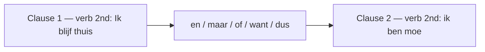

# Coordinating Conjunctions  *(A2)*

A **coordinating conjunction** joins two clauses of *equal grammatical rank* — neither is "inside" the other. The key consequence: **both clauses keep normal main-clause order**, and the finite verb stays in second position. The coordinator itself sits *outside* the count, in a "slot 0".

## The five coordinators

Memory hook: **en, maar, of, want, dus** are the only true coordinators. Everything else that "feels like because/so" (*omdat*, *daarom*, *zodat* …) is a subordinator or an adverb and changes the word order.

For more, see [connectors](/#/grammar?doc=1-auxilaries/00-connectors.md).

## Sharing a subject with `en`

When **en** links two clauses that share the **same subject**, Dutch normally omits the repeated subject in the second clause:

- *Hij komt **en** brengt zijn vriend mee.* — He comes and brings his friend along.

The shared subject *hij* still fills slot 1, so the verb *brengt* keeps its second position (and the separable *mee* goes to the end). Repeating it — *…en hij brengt…* — is not wrong, just heavier.

## The `want` vs `omdat` trap

Both translate English "because", but they belong to different families and behave oppositely:

| Form | Family | Word order | Example |
|------|--------|------------|---------|
| **want** | coordinator | main-clause (V2) | *Ik blijf thuis, **want** ik **ben** moe.* |
| **omdat** | subordinator | verb-final | *Ik blijf thuis **omdat** ik moe **ben**.* |

> Choose **want** to tack a justification onto a finished thought;
> choose **omdat** to fold the cause into a single thought.
> Native speakers feel **omdat** as tighter and more analytical.

Full verb-final treatment: [subordinating conjunctions](/#/grammar?doc=8-structures/03-subordinating.md).

## The two faces of `of`

The word *of* does double duty and trips up almost every learner:

| Use | Family | Meaning | Example |
|-----|--------|---------|---------|
| coordinator | links two main clauses | **or** | *Wil je koffie **of** thee?* |
| subordinator | introduces an embedded yes/no question | **whether** | *Ik weet niet **of** hij **komt**.* |

Tell them apart by what follows: coordinator-*of* is followed by another main clause; subordinator-*of* sends its verb to the end.

## Worked example

*Ik blijf thuis,* **want** *ik ben ziek.*

| Piece | Order |
|-------|-------|
| *Ik blijf thuis* | clause 1 — full main clause (verb *blijf* second) |
| **want** | coordinator, "slot 0" — does **not** count as a position |
| *ik ben ziek* | clause 2 — full main clause (verb *ben* second, **not** at the end) |

Compare the subordinator, which *does* pull the verb to the end: *Ik blijf thuis **omdat** ik ziek **ben**.*

## Practice

- [ ] Ik hou van thee **en** koffie. — I like tea and coffee.
- [ ] Hij belde, **maar** ik nam niet op. — He called, but I didn't answer.
- [ ] Wil je blijven **of** ga je naar huis? — Do you want to stay or go home?
- [ ] Ze is blij, **want** ze is geslaagd. — She's happy, because she passed.
- [ ] Ik heb honger, **dus** ik maak een boterham. — I'm hungry, so I'm making a sandwich.

## Common mistakes

- ❌ *…want ik moe **ben*** → ✅ *…want ik **ben** moe* — **want** keeps main-clause order; the verb stays second.
- Same meaning, opposite order: **want** (coordinator, verb second) vs **omdat** (subordinator, verb to the end). Don't swap their word orders.
- Don't mix the two *of*'s: coordinator **of** = "or" (links two options); subordinator **of** = "whether" (sends the verb to the end).
- Comma habits: **en** and **of** usually take *no* comma; **maar**, **want**, **dus** usually *do*.
