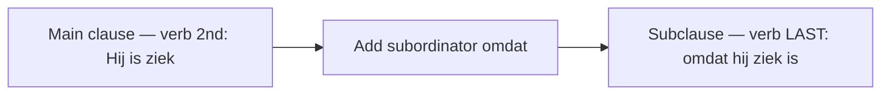

# Subordinating Conjunctions: Verb to the End  *(B1)*

A **subordinating conjunction** introduces a clause that is grammatically *dependent* on a main clause. The one rule that defines the family: in a Dutch subordinate clause, the **conjugated verb moves to the last position**. This V-final flip is the single biggest structural hurdle for English speakers, whose word order never changes inside a subclause.

Relative clauses, reported speech, and conditionals are all subordinate clauses too — the verb-final rule below applies to every one of them.

## The subordinators

For the full inventory of connectors and their meanings, see [connectors](/#/grammar?doc=1-auxilaries/00-connectors.md).

> **toen / als / wanneer** all cover English "when": use **toen** for a single event in the **past**, **als** for the present/future or something repeated (*Als het regent…* = whenever it rains), and **wanneer** in questions (*Wanneer kom je?*).

## Word order inside the clause

1. The **finite verb** moves to the end.
2. **Verb clusters** (modal + infinitive, *hebben/zijn* + participle) go to the end *together*.
3. The **subject** comes right after the subordinator.

| Main-clause version | Subordinated version |
|---------------------|----------------------|
| *Hij **is** ziek.* | *… omdat hij ziek **is**.* |
| *Ik **heb** het boek **gelezen**.* | *… dat ik het boek **gelezen heb**.* |
| *Hij **wil** morgen **komen**.* | *… dat hij morgen **wil komen**.* |
| *Hij **moet** het **doen**.* | *… dat hij het **moet doen**.* |

> Verb-cluster order at the end is flexible: *gelezen heb* and *heb gelezen* are both fine in the Netherlands; Belgians usually prefer *heb gelezen*. Pick one and be consistent.

### Worked example

*… omdat* *ik* *het boek gisteren* **gelezen heb**.

| Piece | Role |
|-------|------|
| **omdat** | subordinator — opens the clause |
| *ik* | subject, right after the subordinator |
| *het boek gisteren* | mid-field (definite object, then time) |
| **gelezen heb** | the whole verb cluster, pushed to the **end** |

## Subordinate clause in front position

A subordinate clause can fill slot 1 of the main clause. The main verb still comes second — the *whole* subordinate clause counts as one slot, so the main clause inverts.

| Example |
|---------|
| ***Omdat ik ziek ben**, blijf ik thuis.* |
| ***Toen hij thuiskwam**, was zij al weg.* |
| ***Als ik tijd heb**, kom ik langs.* |

> A comma between the front-loaded subordinate clause and the main clause is standard in writing.

## Practice

- [ ] Ik ga niet mee **omdat** ik moe ben. — I'm not coming along because I'm tired.
- [ ] Weet je **of** de winkel open is? — Do you know whether the shop is open?
- [ ] **Toen** ik jong was, woonde ik in Gent. — When I was young, I lived in Ghent.
- [ ] Ze zei **dat** ze later zou bellen. — She said that she would call later.
- [ ] **Als** je klaar bent, gaan we weg. — When you're ready, we'll leave.

## Common mistakes

- ❌ *…omdat ik **ben** moe* → ✅ *…omdat ik moe **ben*** — the verb goes to the end.
- ❌ *…dat hij **komt** morgen* → ✅ *…dat hij morgen **komt*** — nothing follows the final verb.
- ❌ *…dat ik **heb** het boek **gelezen*** → ✅ *…dat ik het boek **gelezen heb*** — keep the verb cluster together at the end.
- ❌ *Als het regent, ik blijf thuis* → ✅ *Als het regent, **blijf** ik thuis* — a fronted subclause triggers inversion in the main clause.
- Confusing **omdat** (subordinator) with **want** (coordinator), or **of** "whether" (subordinator) with **of** "or" (coordinator).
