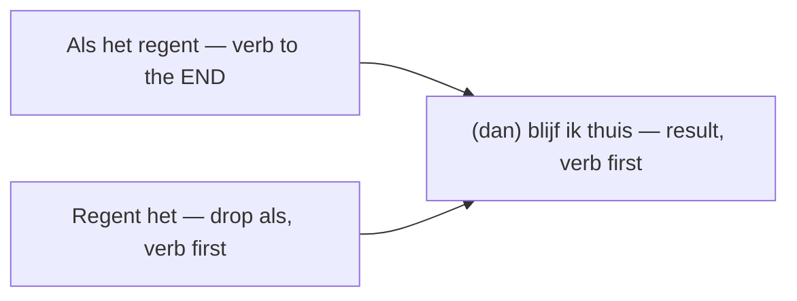

# Conditionals (If… then…)  *(B1)*

Conditionals say that one thing depends on another. Dutch uses **als** ("if") for the condition and often **dan** ("then") to open the result clause. There are three levels — from real and likely, through hypothetical, to impossible (past).

> **Word order rule:** *als* is a [subordinating conjunction](/#/grammar?doc=8-structures/03-subordinating.md), so the verb in the *als*-clause goes to the **end**. When the *als*-clause comes first, it fills slot 1 of the main clause, so the result clause starts with its **verb** (or with **dan** + verb).

Two ways to state the condition, one inverted result:

## 1. Real / open condition (likely to happen)

Condition and result both in the **present tense**. Use it for plausible,
everyday "if this, then that".

Structure: **Als** + … + verb(end) **, (dan)** + verb + …

| Dutch | English |
|-------|---------|
| **Als** het **regent**, blijf ik thuis. | If it rains, I stay home. |
| **Als** je nu **vertrekt**, haal je de trein. | If you leave now, you'll catch the train. |
| **Als** je honger **hebt**, **dan** maak ik iets. | If you're hungry, then I'll make something. |
| Ik bel je **als** ik **aankom**. | I'll call you when I arrive. |

> The result clause can also use the future: *Als het regent, **zal** ik thuisblijven.*
> The plain present is far more common in speech.

### Worked example

***Als** het* **regent**, **blijf** *ik thuis.*

| Piece | Role |
|-------|------|
| **Als** het **regent** | condition — subordinate clause, verb *regent* at the **end** |
| (comma) | the whole *als*-clause fills slot 1 of the main clause |
| **blijf** | main-clause verb, second → **inversion** |
| *ik thuis* | subject + rest |

## 2. Unreal / hypothetical condition (present-future)

Something imaginary or unlikely *now*. The *als*-clause uses the **simple past**;
the result clause uses **zou(den)** + infinitive.

Structure: **Als** + … + past-verb **, … zou(den)** + … + infinitive.

| Dutch | English |
|-------|---------|
| **Als** ik rijk **was**, **zou** ik een huis **kopen**. | If I were rich, I would buy a house. |
| **Als** we tijd **hadden**, **zouden** we langer **blijven**. | If we had time, we would stay longer. |
| Wat **zou** je **doen** **als** je **kon** kiezen? | What would you do if you could choose? |
| **Als** hij hier **was**, **zou** hij ons **helpen**. | If he were here, he would help us. |

> With **zijn**, hypothetical *als*-clauses take **was/waren** (the simple past),
> e.g. *als ik jou **was*** — "if I were you".

### *zou* + infinitive on its own

**zou(den)** + infinitive also expresses a hypothetical result without a stated
*als*-clause — a polite or softened "would".

- Ik **zou** dat niet **doen**. (I wouldn't do that.)
- Dat **zou** leuk **zijn**. (That would be nice.)
- **Zou** je me kunnen **helpen**? (Could you help me? — very polite)

## 3. Impossible condition (past, contrary to fact)

Something that *didn't* happen — regret or "what could have been". The
*als*-clause uses the **past perfect** (had + participle); the result uses
**zou(den) hebben/zijn** + participle.

Structure: **Als** + … + **had(den)** + participle **, … zou(den) hebben/zijn** + participle.

| Dutch | English |
|-------|---------|
| **Als** ik het **had geweten**, **zou** ik je **hebben gebeld**. | If I had known, I would have called you. |
| **Als** we eerder **waren vertrokken**, **zouden** we op tijd **zijn geweest**. | If we'd left earlier, we would have been on time. |
| **Als** je **had geluisterd**, **was** dit niet **gebeurd**. | If you had listened, this wouldn't have happened. |

> In speech the second clause often drops **zou** and just uses the past perfect:
> *Als ik het had geweten, **had** ik je **gebeld**.* Both are correct.

### Dropping *als*: conditional inversion

You can drop **als** and instead start the condition with its **verb** (like a yes/no question). The result clause then usually opens with **dan**. This is common with the hypothetical and impossible levels and sounds a touch more formal or dramatic.

| With *als* | Inverted (no *als*) |
|------------|---------------------|
| *Als ik het had geweten, had ik je gebeld.* | ***Had** ik het geweten, **dan** had ik je gebeld.* |
| *Als ik jou was, zou ik gaan.* | ***Was** ik jou, **dan** zou ik gaan.* |
| *Als je meer oefent, lukt het.* | ***Oefen** je meer, **dan** lukt het.* |

## 4. Choosing the level

| Situation | *als*-clause | Result clause | Example |
|-----------|--------------|---------------|---------|
| Real, likely (now/future) | present | present / *zal* | *Als het kan, kom ik.* |
| Hypothetical (now) | simple past | *zou(den)* + inf. | *Als ik kon, kwam ik / zou ik komen.* |
| Impossible (past) | past perfect | *zou(den) hebben/zijn* + part. | *Als ik had gekund, was ik gekomen.* |

## 5. Other ways to say "if"

| Word | Use | Example |
|------|-----|---------|
| **als** | real or hypothetical "if" | **Als** je wilt, ga ik mee. |
| **wanneer** | "when/whenever" (also conditional) | **Wanneer** je klaar bent, beginnen we. |
| **of** | "whether" (indirect question, *not* condition) | Ik weet niet **of** hij komt. |
| **tenzij** | "unless" | Ik ga, **tenzij** het regent. |
| **mits** | "provided that" (formal) | Je slaagt, **mits** je oefent. |
| **stel dat** | "suppose that" | **Stel dat** je wint — wat dan? |

> Don't confuse **als** (if/when) with **of** (whether). "I don't know **if** he's
> coming" is *Ik weet niet **of** hij komt*, never *als*.

## Practice

- [ ] **Als** het morgen mooi weer is, gaan we fietsen. — If the weather is nice tomorrow, we'll go cycling.
- [ ] **Als** ik meer tijd had, zou ik Spaans leren. — If I had more time, I would learn Spanish.
- [ ] **Als** je had gebeld, was ik gekomen. — If you had called, I would have come.
- [ ] Ik ga naar het strand, **tenzij** het regent. — I'm going to the beach, unless it rains.

## Common mistakes

- Using **of** for "if + condition": ❌ *Of het regent, blijf ik thuis* → ✅ *Als het regent…*
- Keeping normal word order in the *als*-clause: ❌ *Als het regent het…* → ✅ *Als het **regent**, …* (verb to the end).
- Forgetting the verb-first result after a fronted *als*-clause: ❌ *Als je komt, ik ben blij* → ✅ *Als je komt, **ben** ik blij.*
- Using present in a hypothetical: ❌ *Als ik rijk **ben**, zou ik…* → ✅ *Als ik rijk **was**, zou ik…*
- Doubling the past marker: ❌ *Als ik het zou weten* (for a present hypothetical) → ✅ *Als ik het **wist***.
